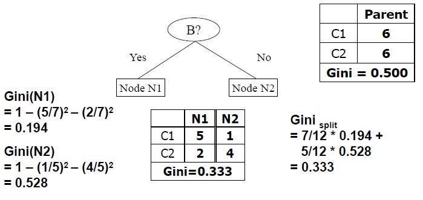
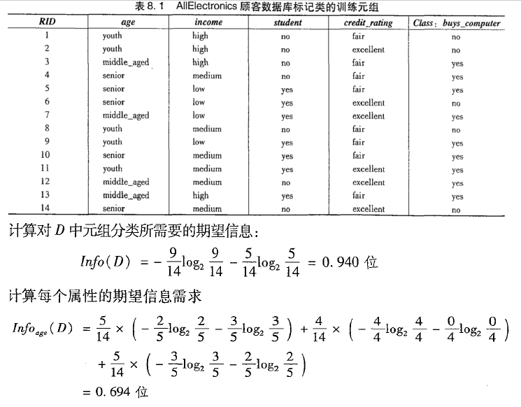
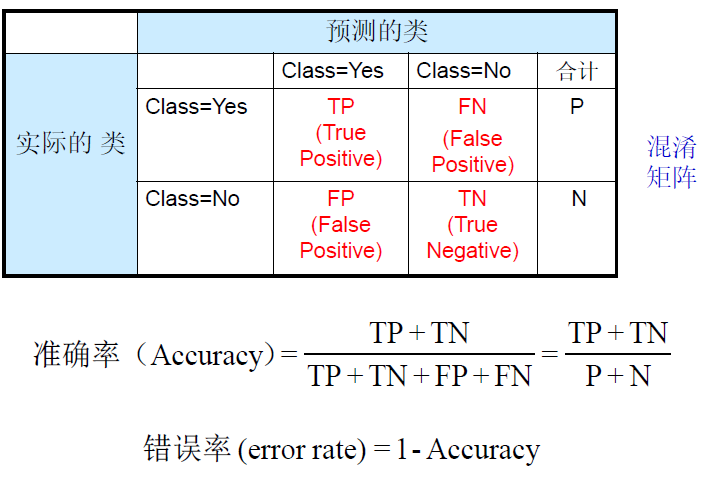
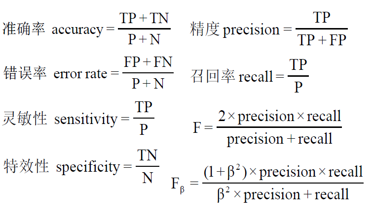

# 5 关联分析

## 5.1 关联规则

### 基本概念

**项目**：集合$I=\{i_1,i_2,...,i_m\}$称为项集合，$i_k$称为项目。

**事务**：所有事务的集合构成关联规则挖掘的数据集，称为事务数据库。每个事务由事务标识符TID标识。

**项集**：若项集包含的项目数为k，则称此项集为k-项集。任意的项集U和事务T，若满足$T\supseteq U$，则称**事务T包含项集U**。

**关联规则**：是形如$U\rightarrow V$的规则，其中U，V为项集，且$U\cap V = \varnothing$

**支持度**：是事务集D中包含$A\cup B$的百分比：$support(A\Rightarrow B)=P(A\cup B)$

**置信度**：是指D中包含A的事务同时也包含B的百分比：$confidence(A\Rightarrow B)=P(B|A)=P(A\cup B)/P(A)$

关联规则也可写作：$A\rightarrow B[s,c]$

其中，s为最小支持度，c为最小置信度。

**频繁项集**：项集的**出现频度**是指包含项集的事务数。若项集的出现频度大于（最小支持度*D中的事务总数），则称该项集为频繁项集。

### 关联规则的挖掘过程

大型数据库中的关联规则挖掘包含两个过程：

- 找出所有频繁项集
- 由频繁项集产生强关联规则（即满足最小支持度和最小置信度的规则）

## 5.2 频繁项集挖掘方法

### Apriori算法

- 该算法是挖掘布尔关联规则频繁项集的算法。

- **Apriori性质**：频繁项集的所有非空子集也必须是频繁的。
  - $A\cup B$模式不可能比A更频繁地出现
  - Apriori算法是反单调的，即一个集合如果不能通过测试，则该集合的所有超集也不能通过相同的测试。
  - Apriori性质通过减少搜索空间，来提高频繁项集逐层产生的效率
- Apriori算法利用频繁项集性质的先验知识，通过逐层搜索的迭代方法，即将k项集用于探察(k+1)项集，来穷尽数据集中的所有频繁项集。
  - 即先找到频繁1项集集合L1,然后用L1找到频繁2项集集合L2，接着用L2找L3，直到找不到频繁k项集，找每个Lk需要一次数据库扫描。

#### 算法步骤

- 由**连接**和**剪枝**两个步骤组成。

- **连接**：为了找$L_k$ ，通过$L_{k-1}$与自己连接产生候选k项集的集合，该候选k项集记为$C_k$
  $$
  \begin{align}
  & L_{k-1}中的两个元素L_1和L_2可以执行连接操作的条件是 \\
  & (l_1[1]=l_2[1])\and (l_1[2]=l_2[2])\and ... \and (l_1[k-2]=l_2[k-2])\and (l_1[k-1]<l_2[k-1])
  \end{align}.
  $$

- **剪枝**：扫描数据库，计算每个k项集的支持度来得到$L_k$利用Apriori性质，即如果一个k项集的(k-1)子集不在$L_{k-1}$中，则该候选不可能是频繁的，可直接从$C_k$删除

- 再计算置信度，满足最小置信度的才是强关联规则。

### 频繁模式增长算法（FP增长算法）

- 将代表频繁项集的数据库压缩到一颗频繁模式树（FPtree），该树仍保留项集的关联信息。

- 把这种压缩后的数据库分解成一组条件数据库, 每个数据库关联一个频繁项或“模式段”并且分别挖掘每个条件数据库。

#### 算法步骤

1. 规定最小支持度计数，例子中最小支持度计数是2。

   数据库的第一次扫描和Apriori算法一样，它导出频繁项的集合并得到它们的支持度计数。

   频繁项的集合按支持度计数的递减排序，删除小于最小支持度的项。结果集或表记为L。

2. 构造频繁模式树。

   

   

   - 以Null为头结点，按照L集合的顺序，对每个事务建立Null的子树。
     - 本例中L集合为（l2，l1，l3，l4，l5）.
     - 对事务T100，则结点建立顺序为：l2, l1, l5，如图中Null最左边的子树。每个结点包含项ID和当前支持度计数。
   - 对每个事务建立子树时，若有共同前缀项，则将其支持度计数加一，将不同的项建立新的子树。

3. 频繁模式树挖掘（例子在书P142）

   - 由长度为1的频繁模式（初始后缀模式）开始，构造它的条件模式基。
   - 构造它的（条件）FP树, 并递归地在该树上进行挖掘。
   - 模式增长通过后缀模式与条件FP树产生的频繁模式连接实现。

### 垂直数据格式法

# 6 分类

## 6.1 决策树

- 多路划分：划分数（输出数）取决于该属性不同属性值的个数
- 二元划分：划分数为2。需要考虑创建k个属性值的二元划分的所有$2^{k-1}-1$种方法

### 结点不纯性的测量

- 选择最佳划分的度量通常是，根据划分后**子结点的不纯性程度**。不纯性程度越低，类分布就越倾斜。（不纯性越大，类与类之间的差距就越小，越难划分）

#### 基尼值

$$
GINI(t)=1-\sum_j[p(j|t)]^2 \\
(p(j|t)是在结点t中，类j发生的概率)
$$

- 当类分布均衡时，Gini值达到最大值$(1-1/n_c)$

- 当只有一个类时，Gini值达到最小值0

- **基于GINI的划分**：

  - 当一个结点p分割成k个部分（孩子结点），划分的质量可由下面公式计算：
    $$
    GINI_{split}=\sum^k_{i=1}\frac{n_i}{n}GINI(i) \\
    n_i=孩子结点i的记录数\\
    n=父结点p的记录数
    $$

  - **GINI值越小，划分越可行**

- 连续属性计算Gini：
  - 降低计算复杂性的方法：
    - 将记录进行排序
    - 从两个相邻的属性值之间选择中间值作为划分点
    - 计算每个候选点的Gini值

#### 决策树中的Entropy

- 给定结点t的Entropy值计算：
  $$
  Entropy(t)=-\sum_jp(j|t)log\ p(j|t)
  $$

  - 熵Entropy识别D中元组的类标号所需平均信息量
  - 当类分布均衡时，Entropy值达到最大值$log\ n_c$，只有一个类时，值达到最小值0

#### 信息增益

- 信息增益：
  $$
  GAIN_{split}=Entropy(p)-(\sum_{i=1}^k\frac{n_i}{n}Entropy(i)) \\
  n_i=孩子结点i的记录数 \quad n=结点p的记录数
  $$
  

- 基于信息增益的划分

  - 增益率：
    $$
    GainRATIO_{split}=\frac{GAIN_{split}}{SplitINFO} \\
    SplitINFO=-\sum_{i=1}^k\frac{n_i}{n}log\frac{n_i}{n}
    $$

## 6.2 朴素贝叶斯分类

- 目的：求出最大的后验概率$P(C_i|X)$，则X属于i类

- 计算公式：
  $$
  P(C_i|X)=P(X|C_i)P(C_i) \\
  P(X|C_i)=\prod^n_{k=1}P(x_k|C_i)
  $$

  - 若为连续值，则：
    $$
    P(X_K|C_i)=g(x_k,\mu_{C_i}\sigma_{C_i}) \\
    g(x,\mu,\sigma)=\frac{1}{\sqrt{2\pi}\sigma}e^{-\frac{(x-\mu)^2}{2\sigma^2}}
    $$

- 避免0概率问题：
  - 使用拉普拉斯校准：
    - 每个类别的元组加1

## 6.3 评估分类器性能的度量

**灵敏性**：
$$
sensitivity=\frac{TP}{P}
$$
**特效性：**
$$
specificity=\frac{TN}{N}
$$
**精度**：
$$
precision=\frac{TP}{TP+FP}
$$

- 表示的是标记为某一类的元组是正确的概率

**召回率：**
$$
recall=\frac{TP}{P}
$$

- 表示的是：实际是某一类元组的元组，被正确标记的概率
- 精度和召回率存在逆关系，可以降低其中一个提高另一个
- 一般同时使用精度和召回率，固定召回率，而比较精度

**F度量和$F_\beta$度量**：
$$
F=\frac{2\times precision \times recall}{precision+recall}\\
F_\beta=\frac{(1+\beta^2)\times precision\times recall}{\beta^2\times precision+recall}
$$

- F度量赋予精度和召回率相同的权重
- $F_\beta$度量赋予召回率权重是精度的$\beta$倍

# 7 聚类分析

## 7.1 k-均值算法

## 7.2 k-中心点算法

- 与k-均值算法的区别：将样本放入簇中之后，更新簇中心的方法不同，**k-均值用簇均值代表簇中心，k-中心点用距各样本点距离的绝对误差最小的点**

## 7.3 层次聚类

### 凝聚层次聚类算法AGNES

- 方法：计算各类之间的距离（欧氏距离等），将距离最近的两个类合并，迭代计算，直到最小距离超过阈值T时，算法结束。

### 分裂层次聚类算法DIANA

- 算法：所有的对象用于形成一个初始簇，根据某种原则（如，簇中最近的相邻对象的最大欧氏距离），将该簇分裂。

簇间距离度量的方法：

- 用**树状图**表示层次聚类的过程。
- 算法使用最小距离时，称为**最近邻聚类算法**，若设置阈值，则称为**单连接算法**（例子：“聚类分析” P.32）
- 算法使用最大距离时，称为**最远邻聚类算法**，若设置阈值，则称为**全连接算法**（例子：“聚类分析” P.32）

#### 7.4 基于密度的聚类

（例子：“聚类分析” P.37）

