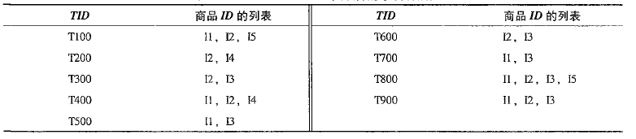

# 5 关联分析

## 5.1 关联规则

### 基本概念

**项目**：集合$I=\{i_1,i_2,...,i_m\}$称为项集合，$i_k$称为项目。

**事务**：所有事务的集合构成关联规则挖掘的数据集，称为事务数据库。每个事务由事务标识符TID标识。

**项集**：若项集包含的项目数为k，则称此项集为k-项集。任意的项集U和事务T，若满足$T\supseteq U$，则称**事务T包含项集U**。

**关联规则**：是形如$U\rightarrow V$的规则，其中U，V为项集，且$U\cap V = \varnothing$

**支持度**：是事务集D中包含$A\cup B$的百分比：$support(A\Rightarrow B)=P(A\cup B)$

**置信度**：是指D中包含A的事务同时也包含B的百分比：$confidence(A\Rightarrow B)=P(B|A)=P(A\cup B)/P(A)$

关联规则也可写作：$A\rightarrow B[s,c]$

其中，s为最小支持度，c为最小置信度。

**频繁项集**：项集的**出现频度**是指包含项集的事务数。若项集的出现频度大于（最小支持度*D中的事务总数），则称该项集为频繁项集。

### 关联规则的挖掘过程

大型数据库中的关联规则挖掘包含两个过程：

- 找出所有频繁项集
- 由频繁项集产生强关联规则（即满足最小支持度和最小置信度的规则）

## 5.2 频繁项集挖掘方法

### Apriori算法

- 该算法是挖掘布尔关联规则频繁项集的算法。

- **Apriori性质**：频繁项集的所有非空子集也必须是频繁的。
  - $A\cup B$模式不可能比A更频繁地出现
  - Apriori算法是反单调的，即一个集合如果不能通过测试，则该集合的所有超集也不能通过相同的测试。
  - Apriori性质通过减少搜索空间，来提高频繁项集逐层产生的效率
- Apriori算法利用频繁项集性质的先验知识，通过逐层搜索的迭代方法，即将k项集用于探察(k+1)项集，来穷尽数据集中的所有频繁项集。
  - 即先找到频繁1项集集合L1,然后用L1找到频繁2项集集合L2，接着用L2找L3，直到找不到频繁k项集，找每个Lk需要一次数据库扫描。

#### 算法步骤

- 由**连接**和**剪枝**两个步骤组成。

- **连接**：为了找$L_k$ ，通过$L_{k-1}$与自己连接产生候选k项集的集合，该候选k项集记为$C_k$
  $$
  \begin{align}
  & L_{k-1}中的两个元素L_1和L_2可以执行连接操作的条件是 \\
  & (l_1[1]=l_2[1])\and (l_1[2]=l_2[2])\and ... \and (l_1[k-2]=l_2[k-2])\and (l_1[k-1]<l_2[k-1])
  \end{align}.
  $$

- **剪枝**：扫描数据库，计算每个k项集的支持度来得到$L_k$利用Apriori性质，即如果一个k项集的(k-1)子集不在$L_{k-1}$中，则该候选不可能是频繁的，可直接从$C_k$删除

- 再计算置信度，满足最小置信度的才是强关联规则。

### 频繁模式增长算法（FP增长算法）

- 将代表频繁项集的数据库压缩到一颗频繁模式树（FPtree），该树仍保留项集的关联信息。

- 把这种压缩后的数据库分解成一组条件数据库, 每个数据库关联一个频繁项或“模式段”并且分别挖掘每个条件数据库。

#### 算法步骤

1. 规定最小支持度计数，例子中最小支持度计数是2。

   数据库的第一次扫描和Apriori算法一样，它导出频繁项的集合并得到它们的支持度计数。

   频繁项的集合按支持度计数的递减排序，删除小于最小支持度的项。结果集或表记为L。

2. 构造频繁模式树。

   

   

   - 以Null为头结点，按照L集合的顺序，对每个事务建立Null的子树。
     - 本例中L集合为（l2，l1，l3，l4，l5）.
     - 对事务T100，则结点建立顺序为：l2, l1, l5，如图中Null最左边的子树。每个结点包含项ID和当前支持度计数。
   - 对每个事务建立子树时，若有共同前缀项，则将其支持度计数加一，将不同的项建立新的子树。

3. 频繁模式树挖掘（例子在书P142）

   - 由长度为1的频繁模式（初始后缀模式）开始，构造它的条件模式基。
   - 构造它的（条件）FP树, 并递归地在该树上进行挖掘。
   - 模式增长通过后缀模式与条件FP树产生的频繁模式连接实现。

### 垂直数据格式法

# 6 分类

## 6.1 决策树

基尼值：
$$
GINI(t)=1-\sum_j[p(j|t)]^2 \\
(p(j|t)是在结点t中，类j发生的概率)
$$
