# 1 Windows程序设计基础

## 1.1 Windows简介

- Windows的主要特点

  - 面向对象：窗口、菜单、事件皆是对象。

    - 对话框与与各种控件是一些特殊的窗口
    - 对界面元素的操作和消息/事件的处理都按照对象进行。对这些对象的属性和操作，由相关数据结构和API调用函数（或由其封装的MFC和.NET框架中的类）提供。

  - 消息/事件驱动

    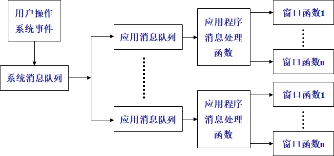

  - 资源共享与数据交换

    - 抢先式多任务操作系统，应用程序之间共享系统资源。
    - Windows编程时，必须时刻记住尽早释放不再使用的系统资源，避免系统资源耗尽而造成效率急剧降低

  - 设备无关的GDI

    - Windows提供了与设备无关的GDI，应用程序可以通过调用GDI函数，在不同显卡、打印机和显示器上输出图形或文本

- XAML：
  - eXtensible Application Markup Language
  - 是一种XML


## 1.3 Windows Form与WPF应用程序

### WPF应用程序

- Windows Presentation Foundation，用于生成较好视觉体验的 Windows 应用程序

- 既可创建独立桌面应用程序，也可创建浏览器承载的应用程序

- WPF 的核心是一个与分辨率无关并且基于向量的呈现引擎

- WPF 包含在 .NET Framework 中，作为 .NET Framework 的一个子集存在，其类型大多位于 System.Windows 命名空间

- 界面设计使用可扩展应用程序标记语言 (XAML)

- 使用C# 或 VB实例化类、设置属性、调用方法以及处理事件


## 1.4 字节编码

- 字节编码方式：
  - ASCII码
  - 多字节编码
  - UNICODE编码

## 1.5 文件合并

- 步骤：
  - 设定要合并的文件的文件名特点
  - 搜索符合标准的文件，得到源文件集合
  - 文件顺序调整
  - 设定目标文件名，创建目标文件；
  - 根据文件集合，依次读入源文件，并写入到目标文件中。
  - 关闭文件资源。

# 2 动态链接库

## 2.1 动态链接与静态链接

### 分别编译与链接

- 大多数高级语言都支持分别编译（separate compiling）

- 程序员可以显式地把程序划分为独立的模块或文件，然后由编译器（compiler）对每个独立部分分别进行编译

- 编译后，由链接器（Linker）把独立编译单元链接（Linking）到一起

- 链接方式有两种：**静态链接、动态链接**

### 链接方式

- **静态链接方式**：在程序**开发中**，将各种目标模块（.OBJ）文件、静态库（.LIB）文件，以及已编译的资源（.RES）文件链接在一起，以便创建Windows的.EXE文件
- **动态链接方式**：在程序**运行时**，Windows把一个模块中的函数调用链接到库模块中的实际函数上的过程

- 静态链接库（简称LIB）与动态链接库（简称DLL）都是共享代码的方式

- 如果使用静态链接库（也称静态库），.LIB文件中的指令**都会被直接包含**到最终生成的.EXE文件中

- 若是使用.DLL文件，该.DLL文件中的代码**不必被包含**在最终的.EXE文件中，.EXE文件执行时可以“动态”地载入和卸载与.EXE文件**独立**的.DLL文件

#### 动态链接方式

链接一个DLL有两种方式：

1. 载入时动态链接（Load-Time Dynamic Linking）
   - 在**链接时**将函数所在的DLL的**导入库**链接到可执行文件中
     - 导入库向系统提供了载入DLL时所需的信息，及用于定位DLL函数的地址符号（相当于注册，使其当作API函数使用）
   - 调用模块可以像调用本模块中的函数一样直接使用导出函数名调用DLL中的函数
2. 运行时动态链接（Run-Time Dynamic Linking）
   - **运行时**可以通过LoadLibrary或LoadLibraryEx函数载入DLL，DLL载入后，模块可以通过调用GetProcAddress获取DLL函数的入口地址，然后就可以通过返回的函数指针调用DLL中的函数了。如此即可避免导入库文件。

#### 静态链接与动态链接二者优点及不足

- 静态链接库的优点：
  - 代码**装载速度快**，执行速度略比动态链接库快； 
  - 只需保证在开发者的计算机中有正确的.LIB文件，在以二进制形式发布程序时不需考虑在用户的计算机上.LIB文件是否存在及版本问题，可**避免DLL地狱**等问题。

- 动态链接库的优点： 

  - 更加**节省内存**并减少页面交换； 
  - DLL文件与EXE文件独立，只要输出接口不变（即名称、参数、返回值类型和调用约定不变），更换DLL文件不会对EXE文件造成任何影响，因而极大地提高了**可维护性和可扩展性**； 
  - 不同编程语言编写的程序只要按照函数调用约定就可以调用同一个DLL函数。

- 不足：

  - 使用静态链接生成的可执行文件体积较大，包含相同的公共代码，造成浪费； 

  - 使用动态链接库的应用程序不是自完备的，它依赖的DLL模块也要存在，如果使用载入时动态链接，程序启动时发现DLL不存在，系统将终止程序并给出错误信息。而使用运行时动态链接，系统不会终止，但由于DLL中的导出函数不可用，程序会加载失败； 

  - 使用动态链接库可能造成DLL地狱。

### C#托管程序集

## 2.2 DLL地狱

- 是指因为系统文件被覆盖而让整个系统像是掉进了地狱。

  简单地讲，DLL地狱是指当多个应用程序试图共享一个公用组件时，如某个DLL或某个组件对象模型（COM）类，所引发的一系列问题。

  - 如，应用程序安装的新版本共享组件与机器上现有版本不向后兼容，导致依赖旧版本共享组件的应用程序无法再工作。

- .Net平台中采用**自我描述与版本管理功能**，实现**Side by Side**技术，解决DLL地狱问题：

  - 它允许一个DLL的多个编译版本在同一台机器上运行，每个应用程序可使用指定的DLL编译版

## 2.3 动态链接库原理

### 基本原理

- DLL: Dynamic Link Library 动态链接库。DLL就是一个包含可由多个程序**同时使用**的代码和数据的库
- 用户可以将独立的程序模块创建为较小的DLL(Dynamic Linkable Library)文件，并可对它们单独编译和测试
- DLL的编制与具体的编程语言及编译器无关，不同编程语言生成的DLL函数可以互相调用
- 减少了EXE文件的大小和对内存空间的需求，是一种软件复用技术

### Windows中主要的dll

- Windows API主要以dll的形式封装并提供底层功能调用

|     DLL      |                             功能                             |
| :----------: | :----------------------------------------------------------: |
| KERNEL32.DLL |       低级内核函数，用于内存管理、任务管理、资源控制等       |
|  USER32.DLL  | windows管理有关的函数，消息、菜单、光标、计时器、通信，钩子等 |
|  GDI32.DLL   |                       图形设备接口库。                       |
|  ODBC32.DLL  |                           ODBC功能                           |
|  Ws2_32.dll  |                        socket通信功能                        |

### dll的引用计数

- DLL在内存中只有一个实例，系统为每个DLL维护一个线程级的引用计数

- 一个线程载入了某DLL，其引用计数将会加 1

- 程序终止或者引用计数变为0（仅指运行时载入动态链接库），DLL就会释放占用程序的虚地址空间

### Windows的虚地址映射

- Windows 提供内部的地址映射的工作，一个DLL文件被加载后在物理内存中只占一个固定区域，有多个进程使用同一个DLL文件，Windows将这个DLL的内存地址空间通过地址映射后提供给各个进程

- 进程代码地址与DLL映射后地址构成的是进程的虚地址空间，进程在自己的虚地址空间中好像是自己独自在使用这个DLL文件，使用DLL中的函数与程序自身的函数没有区别

### DLL文件的定位

- 包含EXE文件的目录

- 进程的当前工作目录

- Windows系统目录

- Windows目录
- Path环境变量中的一系列目录 

## 2.4 托管与非托管

- 托管代码
  - **由公共语言运行库CLR(Common Language Runtime)环境（而不是直接由操作系统）执行的代码**。托管代码应用程序可以获得公共语言运行库服务，例如自动垃圾回收、运行库类型检查和安全支持等。这些服务帮助提供**独立于平台和语言**的、统一的托管代码应用程序行为。

- 非托管代码
  - 非托管代码与公共语言运行库环境无关。编写这些程序代码使用专用语言编译工具如C++与VB，生成的非托管代码与公共语言运行库环境无关。编写这些程序代码使用专用语言编译工具如C++与VB，生成的是机器可以直接执行的二进制代码，在这些程序中，**用户必须自己提供内存的申请和释放，要保证指针引用的正确性，进行类型检查等功能**，稍有不慎即容易发生地址越界，内存泄露等错误，而且机器也难由这些错误中恢复回来。

- 托管与非托管区别：
  - 托管代码中不推荐使用指针
  - 非托管代码可以使用指针来直接读取内存
- 调用托管的动态链接库
  - 应用反射机制，可以得到托管dll文件中的类方法和属性。

### 反射

- 通过 System.Reflection（C#） 命名空间中的类以及 System.Type，可以获取有关已加载的程序集和在其中定义的类型（如类、接口和值类型）的信息
- 可以使用反射在运行时创建类型实例，调用和访问这些实例
- 用途：
  - 使用 **Assembly** 定义和加载程序集，加载在程序集清单中列出的模块，以及从此程序集中查找类型并创建该类型的实例。
  - 使用 **Module** 发现以下信息：包含模块的程序集以及模块中的类等。您还可以获取在模块上定义的所有全局方法或其他特定的非全局方法。
  - 使用 **ConstructorInfo** 发现以下信息：构造函数的名称、参数、访问修饰符（如 public 或 private）和实现详细信息（如 abstract 或 virtual）等。
  - 使用 **Type** 的 **GetConstructors**或**GetConstructor**方法来调用特定的构造函数
  - 使用 **MethodInfo** 发现以下信息：方法的名称、返回类型、参数、访问修饰符（如 public 或 private）和实现详细信息（如 abstract 或 virtual）等。
  - 使用 **Type** 的 **GetMethods** 或 **GetMethod** 方法来调用特定的方法。
  - 使用 **FieldInfo** 发现以下信息：字段的名称、访问修饰符和实现详细信息（如 static）等；并获取或设置字段值。
  - 使用 **EventInfo** 发现以下信息：事件的名称、事件处理程序数据类型、自定义属性、声明类型和反射类型等；并添加或移除事件处理程序。
  - 使用 **PropertyInfo** 发现以下信息：属性的名称、数据类型、声明类型、反射类型和只读或可写状态等；并获取或设置属性值。
  - 使用 **ParameterInfo** 发现以下信息：参数的名称、数据类型、参数是输入参数还是输出参数，以及参数在方法签名中的位置等。

### 调用非托管的动态链接库

- 控件不能满足用户所有需求，可通过Windows的API实现
- 部分功能用框架类不太合适，也可以依赖Windows的API
- 调用其他语言（如C++）所编写的动态链接库

### DllImport属性

```C#
[DllImport("kernel32.dll", EntryPoint="GetVersionEx")]
```

- “DllImport”用来从不可控代码中调用一个方法，它指定了DLL的相对/绝对地址
- EntryPoint指示要调用的DLL的入口点名称或序号（DLL中的函数指针）
- CharSet控制调用函数的名称版本
- CallingConvention指示向非托管实现传递方法参数

### DllImport函数wrapper

- 调用非托管的动态链接库需要使用 Interop 服务
- extern 修饰符用于声明在外部实现的方法，与 DllImport属性一起使用，且将方法声明为static

```c#
[DllImport("User32.dll")]
public static extern int MessageBox(int h,string m,string c,int type)
```

- 函数返回值及函数参数类型与创建动态链接库中的函数参数保持一致

- Blittable Data：在托管代码与非托管代码中的数据类型具有相同的计算机表示，这些数据在参数传递时无须转化即可使用。


# 3 COM原理与技术

## 3.1 COM原理与技术简介

- COM是组件对象模型（Component Object Model）
- 遵循COM规范
- COM组件隐藏（封装）其内部实现细节
- COM提供接口调用
- 在运行时刻同其他组件连接起来构成应用程序

### COM方法

- COM是开发软件组件的一种方法

  - 组件是一些模块化的二进制可执行程序，为应用程序、操作系统或其它组件提供服务
  - 开发COM组件如同开发动态的、[面向对象](https://baike.baidu.com/item/%E9%9D%A2%E5%90%91%E5%AF%B9%E8%B1%A1)的API
  - 多个COM对象可以连接起来形成应用程序或组件系统
  - 组件在运行时能够在不被重新链接或编译应用程序的情况下被卸下或替换

- COM所含的概念并不止是在Microsoft Wondows操作系统下才有效

  - COM并不是一个大的API，而是一种**编程方法**，如同[结构化](https://baike.baidu.com/item/%E7%BB%93%E6%9E%84%E5%8C%96%E7%BC%96%E7%A8%8B)[编程](https://baike.baidu.com/item/%E7%BB%93%E6%9E%84%E5%8C%96%E7%BC%96%E7%A8%8B)及面向对象编程方法

  - 在任何一种操作系统中，开发人员均可以遵循“COM方法”即组件的思想

### COM组件

- COM组件是以动态链接库（DLL）或可执行文件（EXE）形式发布的**可执行代码**
  - COM组件并不是DLL，只是利用DLL来给组件提供动态链接的能力
  - COM不是API也不是类

- COM组件是遵循COM规范编写的

- COM组件可以给应用程序、操作系统以及其他组件提供服务

- 自定义的COM组件可以在运行时刻同其他组件连接起来构成某个应用程序

- COM组件运行时可以动态的插入或卸出应用

- COM组件必须是动态链接的

- COM组件必须隐藏（封装）其内部实现细节

- COM组件必须将其实现的语言隐藏

- COM组件必须以二进制的形式发布

### 接口

- 接口是不同对象间的连接方法
- 程序通过一组函数进行连接，从而定义了程序不同部分间的接口
  - DLL的接口是其所输出的函数
  - C++类的接口是该类的成员函数集
  - COM接口是一组由组件实现的提供给客户使用的函数
- 组件可以支持任意数目的接口
- 接口应具有不变性，p组件升级时不应该修改原来的接口，而是添加新的接口
  - COM接口在C++中是用纯抽象基类实现
  - 一个COM组件可以支持多个接口
  - 一个C++类可以使用多重继承来实现一个支持多个接口的组件

### COM与DLL的区别

- DLL是对静态链接的改进，带来了更细的开发分工，包括二进制如何交互的问题，尤其是当DLL输出类时的二进制交互问题
- COM的各种努力都是在规定一种二进制交互协议
  - COM组件以接口对功能分类，便于组织；DLL特别是大的DLL，函数一大堆，难以组织
  - COM组件便于升级维护，功能扩充，只需添加接口就行；DLL升级困难，函数不能随意改变
  - COM创建调用有很好的安全性，DLL没有
  - COM组件可轻松实现进程间调用，DLL很困难
  - COM组件可轻松实现分布式调用，DLL不可能
  - COM组件具有封装、继承、多态的面向对象特征，DLL只有封装
  - 在COM组件的基础上实现了大量功能：ActiveX，OLE等
- DLL是以**函数集合**的方式来调用的，是编程语言相关的。如：VC必须加上`extern "C"`
- DLL是基于名字导入的，名字就是符号，DLL有符号表
- COM是以interface的方式，提供给用户使用的是一种二进制的调用规范，**与编程语言无关**
- DLL只有DLL一种形式，可任意定义函数，但只能运行在本机上
- COM有DLL和EXE两种存在形式，DCOM可以RPC
- COM所在的DLL中必须导出四个函数：
  - dllgetobjectclass
  - dllregisterserver
  - dllunregisterserver
  - dllunloadnow
- COM的载体：DLL, EXE, OCX（用于activeX控件）
- DLL不需在系统中注册，COM必须注册

### ActiveX、OLE、COM之间的关系

PPT P.11

COM和ActiveX区别：

- 没有质的区别，COM用于**服务器端**，ActiveX用于客户端
- COM没有界面，ActiveX可以有界面
- ActiveX的作用：可轻松方便的在 Web页中插入多媒体效果、 交互式对象、以及复杂程序，ActiveX插件安装的一个前提是必须经过用户的同意及确认

### COM的注册

- ActiveX注册：
  - Windows自带ActiveX注册与反注册工具regsvr32.exe
  - 注册：`regsvr32 /s DLLName`
  - 反注册：`regsvr32 /u DLLName`
- COM注册：
  - 32位系统下：%systemroot%\System32\regsvr32.exe
  - 64位系统下：%systemroot%\SysWoW64\regsvr32.exe
  - 一般要将dll/exe文件拷贝至系统目录System32/SysWoW64
  - .Net环境包含Regasm：`Regasm DLLName`


## 3.2 COM创建与调用实例

### COM实例

- 接口定义：

  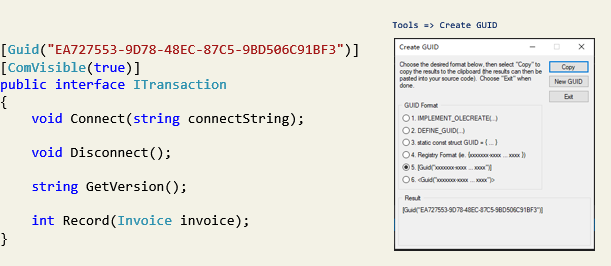

- 接口实现：

  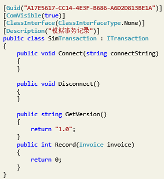

- 创建COM接口对象：

  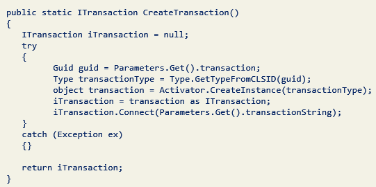

## 3.3 COM技术与OFFICE对象

### Word对象模型概述

- Application对象：

  - 表示整个word应用程序的进程
  - 使用该对象的属性和方法来控制Word环境

- Document对象：

  - Microsoft.Office.Interop.Word.Document 
  - 代表一个文档

- Selection对象：

  - 表示当前选择的区域

    - 在 Word 用户界面中执行某项操作（例如，对文本进行加粗）时，应首先选择或突出显示文本，然后应用格式设置

  - Selection 对象始终存在于文档中

    - 如果当前未选中任何对象，则它表示插入点

    - 也可以是不连续的多个文本块

- Paragraph对象：

  - 单个文本段落

- Range对象：

  - 文档中的一个连续的区域，由一个起始字符位置和一个结束字符位置定义
  - 通过Range对象设置段落格式

- Section对象

  - section即节，它将word文档划分为不同的部分，每部分可以有其独立的页眉、页脚，页码，页面设置（纸张大小）
  - 节对象是不可视对象，打印时不会显示

- Bookmark对象：

  - 书签用于在文档中标记一个位置，或者用作文档中的文本容器
  - Microsoft.Office.Interop.Word.Bookmark 对象可以小到只有一个插入点，也可以大到整篇文档
  - 可以在设计时命名书签
  - Bookmark 对象随文档一起保存，因此当代码停止运行或文档关闭时，它不会被删除
  - 书签编辑时可以隐藏或可见，只要将 View 对象的 ShowBookmarks 属性设置为 True 或 False


## 3.4 COM技术操作Word对象

- 流程：
  - 安装Office产品
  - 用户程序中添加引用：COM对象库
  - `using MsWord = Microsoft.Office.Interop.Word`
  - 程序中使用COM对象操作
  - 关闭COM组件
- COM中对象方法使用特色：
  - 接口方法在不同Office版本中有变化
  - COM接口是桥梁，方法的实现来自Office产品
  - .NET平台垃圾回收机制不处理COM对象
  - COM方法参数采用引用方式
  - COM中变量类型统一为object
  - 参数缺省值指定为
     `object missing = System.Reflection.Missing.Value;`
- Word对象操作方法：
  - 创建文档、保存文档、打开文档、设置标题、设置文本格式、插入表格、插入图片等
- 在Word文档中插入文本
  - 使用Range
  - 使用替换方法
  - 使用Selection对象的TypeText方法

## 3.5 COM技术操作Excel对象

### Excel对象模型

- Application对象：

  - 代表当前运行的Excel实例

  - 包含大量属性及方法，用于操作Excel表格

    - Cells属性

    - Columns属性

    - Rows属性

- Workbooks对象（工作簿）：
  - 代表Excel应用程序中当前打开的一个工作簿，包含在Workbooks集合中
  - 可以通过Workbooks集合或表示当前活动工作簿的Active Workbook对象访问Workbook对象

- Worksheet对象（工作表）：

  - Sheets集合表示工作簿中所有的工作表。可以通过Sheets集合来访问、激活、增加、更名和删除工作表。一个Worksheet对象代表一个工作表。

  - 引用Worksheets：

    ```C#
    Worksheets(1).Activate;
    //或
    Worksheets("Sheet1").Activate;
    ```

- Range对象：

  - 代表工作表的某一单元格、某一行、某一列、某一选定区域或者某一三维区域。

  - 引用单元格范围：

    ```C#
    Workbooks("Book1").Sheets("Sheet1").Range("A1:D5");
    ```

- Charts对象：

  - 代表工作簿中的图表。该图表既可为嵌入式图表(包含于ChartObject对象中)也可为分立的图表工作表。

- WorksheetFunction对象

  ```C#
  myRange=Workshees("Sheet1").Ragnge("A1:C10");
  answer = Application.WorksheetFunction.Min(myRange);
  ```


## 4 进程与线程

## 4.1 程序进程与进程间通信

### 4.1.1 进程与程序

- 进程是执行中的程序
- 创建一个进程后，操作系统就将程序的一个副本装入计算机内存中，然后启动一个线程执行该程序
- 操作系统中的进程：
  - 操作系统中的进程与用户进程并发运行，用户进程是由操作系统创建和调用的
  - 用户进程也可以创建和调用别的进程
  - 被创建的进程与创建者就构成了父子关系

#### 进程

- 进程可以理解为一个程序的基本边界。是应用程序的一个运行例程，是应用程序的一次动态执行过程
-  可以通过任务管理器查看Windows系统中当前运行的程序和进程

#### 线程

- 对于同一个进程，可以分成若干个独立的执行流，这样的流称为**线程**
- 线程是操作系统分配处理器时间的基本单位，可以独立占用处理器的时间片
- 同一进程中的线程可以共享进程的资源和内存空间
- 每个进程至少包含一个线程
- 在.NET应用程序中，都是以Main( )方法作为入口的，当调用此方法时系统就会自动创建一个主线程

#### 并发与并行

- 进程和线程技术是实现系统或应用程序并行性的重要基础 
- 并发：指系统或应用程序在某一时间段内同时处理多个事务的过程
  - 对于单核单处理器的计算机系统，并发实际上是通过操作系统在各个正在执行的线程之间切换CPU，以分时处理的方式实现表现形式的并发
- 对于多处理器或多核的计算机系统，其多个CPU之间或多个核之间既有相互协作，又有独立分工，它们在各自执行一个相应线程时可以互不影响同时进行，实现并行处理
- 除了CPU之外，GPU也是多核系统，通常其并发计算能力非常强


#### 创建进程过程

1. 打开文件映像（.exe）
2. 创建windows进程对象
3. 创建初始线程对象，包括上下文，堆栈
4. 通知内核系统为进程运行作准备
5. 执行初始线程
6. 导入需要的DLL，初始化地址空间，由程序入口地址开始执行进程

#### 进程的创建与启动代码

- C#的System.Diagnostics命名空间下的Process类专门用于完成系统的进程管理任务，通过实例化一个Process类，就可以启动一个独立进程。

  ```C#
  Process cmdP = new Process();
  cmdP.StartInfo.FileName = "cmd.exe";
  cmdP.StartInfo.CreateNoWindow = true;
  cmdP.StartInfo.UseShellExecute = false;
  cmdP.StartInfo.RedirectStandardOutput = true;
  cmdP.StartInfo.RedirectStandardInput = true;
  cmdP.Start();
  ```

#### 进程其他操作

- 打开应用程序：

  ```C#
   Process.Start("calc"); 	// 计算器
   Process.Start("mspaint");	// 画图工具
   Process.Start("notepad");	// 记事本
   Process.Start("iexplore","http://www.baidu.com");
  ```

- 关闭应用程序：

  ```C#
  // 得到程序中所有正在运行的进程
  Process[] preo = Process.GetProcesses(); 
  foreach (var item in preo)
  {
  Console.WriteLine(item);
  item.Kill(); //杀死进程 
  } 
  ```

### 4.1.2 进程间通信机制简介

- Windows进程间数据共享和通信的机制：
  - IPC（Inter-Process Communications）
  - IPC经常使用C/S模式
- 通信目的及数据传输量考虑
  - 高级通信（IPC）：传输的数据量大，超过几十个字节
  - 低级通信（同步控制）：传输的数据量小，少于数个字节，或仅是位单位

#### 进程间通信方法分类

1. 共享内存（剪贴板、COM、DLL、DDE、文件映射）

2. 消息 WM_COPYDATA

3. 邮槽：广播长度不超400字节，数据报会丢失

4. 管道，分有名管道与无名管道、进程重定向：相对简单的接口，但不宜多进程通信

5. Windows套接字

6. NetBIOS特殊的网络应用

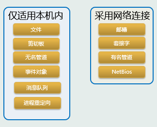

### 4.1.3 消息机制实现进程通讯

```C#
[DllImport("User32.dll", EntryPoint = "SendMessage")]
private static extern int SendMessage(IntPtr wnd,int msg,IntPtr wP,IntPtr lP);

// 或
[DllImport("User32.dll", EntryPoint = "SendMessage")]
private static extern int SendMessage(IntPtr wnd,int msg,IntPtr wP, ref COPYDATASTRUCT lParam);

[DllImport("User32.dll", EntryPoint = "PostMessage")]
private static extern int PostMessage(IntPtr wnd,int msg,IntPtr wP, ref COPYDATASTRUCT lParam);

#region 定义结构体
public struct COPYDATASTRUCT
{
       public IntPtr dwData;
       public int cbData;
    [MarshalAs(UnmanagedType.LPStr)]
           public string lpData;
}
#endregion

```

- SendMessage和PostMessage，这两个函数虽然功能非常相似，都是负责向指定的窗口发送消息
- SendMessage() 函数发出消息后**一直等到接收方的消息响应函数处理完之后才能返回**，并能够得到返回值，在此期间发送方程序将被阻塞，SendMessage() 后面的语句不能被继续执行，即是说此方法是**同步的**。
- PostMessage() 函数**在发出消息后马上返回**，其后语句能够被立即执行，但是无法获取接收方的消息处理返回值，即是说此方法是**异步的**
- 只能由SendMessage()来发送，而不能使用PostMessage()
  - 因为系统必须管理用以传递数据的缓冲区的生命期，如果使用了PostMessage()，数据缓冲区会在接收方（线程）有机会处理该数据之前，就被系统清除和回收。此外如果lpData指向一个带有指针或某一拥有虚函数的对象时，也要小心处理
  - 如果传入的句柄不是一个有效的窗口或当接收方进程意外终止时，SendMessage()会立即返回，因此发送方在这种情况下不会陷入一个无穷的等待状态中

#### Winform进程通信实例

- 在发送进程app1，接收进程app2中定义相同的消息类型WM_COPYDATA=0x004A

- 在app1中，通过窗体标题找到app2，并调用SendMessage，向app2窗体句柄发送指定消息类型和内容

- 在app2中，通过**重载函数DefWndProc**实现对消息的接收和处理

  ```C#
  protected override void DefWndProc(ref System.Windows.Forms.Message m)
  {
      switch(m.Msg)
      {
          case WM_COPYDATA:
              COPYDATASTRUCT mystr = new COPYDATASTRUCT();
              Type mytype = mystr.GetType();
              mystr =(COPYDATASTRUCT)m.GetLParam(mytype);
              this.textBox1.Text =mystr.lpData;
              break;
          default:
              base.DefWndProc(ref m);
              break;
      }
  }
  
  ```

#### WPF进程通信实例

- 在发送进程app1，接收进程app2中定义相同的消息类型WM_COPYDATA=0x004A
- 在app1中，通过窗体标题找到app2，并调用SendMessage，向app2窗体句柄发送指定消息类型和内容
- 在app2中，通过**自定义窗体钩子程序**截获消息，并进行处理

```C#
// 页面加载时，添加消息处理钩子函数
private void ChildPage_Loaded(object sender, RoutedEventArgs e)
{
            HwndSource hWndSource;
            WindowInteropHelper wih = new WindowInteropHelper(this.parentWindow);
            hWndSource = HwndSource.FromHwnd(wih.Handle);
            // 添加处理程序 
            hWndSource.AddHook(MainWindowProc);
}
// 钩子函数，处理所收到的消息
private IntPtr MainWindowProc(IntPtr hwnd, int msg, IntPtr wParam, IntPtr lParam, ref bool handled)
{         switch (msg)
          {
               case WM_COPYDATA:
                        COPYDATASTRUCT mystr = new COPYDATASTRUCT();
                        Type mytype = mystr.GetType();
                        COPYDATASTRUCT MyKeyboardHookStruct = (COPYDATASTRUCT)Marshal.PtrToStructure ( 
									lParam, typeof(COPYDATASTRUCT));
                        showComment(MyKeyboardHookStruct.lpData);
                        break;
               default:
                        break;
             }
            return hwnd;
}
```

### 4.1.4 进程重定向实现进程通讯

#### 概述

- 普通进程从键盘接收输入，输出到屏幕

- 使用文件作为进程的输入称为**输入重定向**

- 使用重定向符方法：

  ```
  dir > list.txt
  cmd >> file
  cmd < file
  ```

- 进程重定向意义：

  - 调用控制台进程
    - ping远程主机
    - 获取MAC地址：`getmac`
    - 关机：`shutdown`
    - 服务管理

#### 重定向应用程序示例

- 重定向的两种方式

  - 同步
  - 异步

- 同步读写：

  ```C#
  Process process = new Process();
  process.StartInfo.FileName = "cmd.exe";
  // 是否使用外壳程序   
  process.StartInfo.UseShellExecute = false;
  // 是否在新窗口中启动该进程的值   
  process.StartInfo.CreateNoWindow = true;
  // 重定向输入流  
  process.StartInfo.RedirectStandardInput = true;
  // 重定向输出流
  process.StartInfo.RedirectStandardOutput = true;  
  //使ping命令执行九次 
  string strCmd = "ping www.whu.edu.cn -n  9";
  process.Start();
  process.StandardInput.WriteLine(strCmd);
  process.StandardInput.WriteLine("exit");
  // 获取输出信息   
  textBox2.Text = process.StandardOutput.ReadToEnd(); 
  process.WaitForExit();  
  process.Close(); 
  ```

  - 若造成窗体没有响应：
    - 不得在窗体线程中构造耗时的操作
    - 窗体控件事件函数都属于窗体线程

- 异步读取

  ```C#
  Process process = new Process();
  process.StartInfo.FileName = "cmd.exe";
  // 是否使用外壳程序   
  process.StartInfo.UseShellExecute = false;
  // 是否在新窗口中启动该进程的值   
  process.StartInfo.CreateNoWindow = true;
  // 重定向输入流  
  process.StartInfo.RedirectStandardInput = true;
  // 重定向输出流
  process.StartInfo.RedirectStandardOutput = true;  
  //使ping命令执行九次 
  string strCmd = "ping www.whu.edu.cn -n  9";
  process.Start();
  process.StandardInput.WriteLine(strCmd);
  process.StandardInput.WriteLine("exit");
  
  // 与同步不同的部分
  process.OutputDataReceived += new DataReceivedEventHandler(strOutputHandler);
  process.Start();
  ```

  回调函数：

  ```C#
  private  void strOutputHandler(object sendingProcess,
              DataReceivedEventArgs outLine)
  {
      cmdOutput.AppendLine(outLine.Data);
      // 通过FindWindow API的方式找到目标进程句柄，然后发送消息
      IntPtr WINDOW_HANDLER = FindWindow(null, "demo");
      if (WINDOW_HANDLER != IntPtr.Zero)
      {
          COPYDATASTRUCT mystr = new COPYDATASTRUCT();
          mystr.dwData = (IntPtr)0;
          if (MyStringUtil.isEmpty(outLine.Data))
          {
              mystr.cbData = 0;
              mystr.lpData = "";
          }
          else
          {
              byte[] sarr = System.Text.Encoding.Unicode.GetBytes(outLine.Data);                   mystr.cbData = sarr.Length + 1;
              mystr.lpData = outLine.Data;
          }
          SendMessage(WINDOW_HANDLER, WM_COPYDATA, 0, ref mystr);
      }
  }
  
  ```


### 4.1.5 管道机制实现进程通讯

- 管道机制是一种进程间通信（IPC）方式
  - 操作系统创建管道对象
  - 发送进程向管道写入数据
  - 接收进程由管道中读出数据
- 管道可进行跨计算机的通信，可使用网络，也可使用文件等，它屏蔽低层实现机制提供给进程通信机制
- 有两种形式的管道：
  - 有名管道
  - 无名管道

#### 命名管道通信模式

- 字节模式
- 消息模式

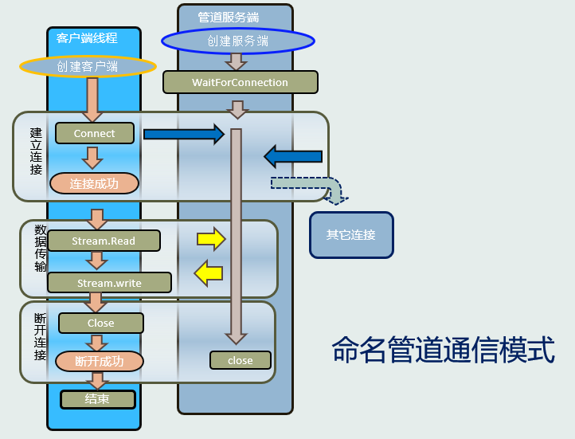


## 4.2 线程间通信与同步

### 4.2.1 线程及其创建过程

- **进程**是计算机分配资源的单位，**线程**是运行调度单位
- 进程中的线程也具有线程控制块，包含内容有所属进程ID，创建和退出时间，线程启动地址等

#### 线程创建过程

1. 在进程的地址空间中为线程创建用户态堆栈
2. 初始化线程硬件上下文

3. 创建线程对象

4. 通知内核系统为线程运行准备

5. 新创建线程handle和线程ID值返回到调用者

6. 线程进入调度准备执行

#### 工作线程的结束

- 线程正常结束：自动消亡，OS清理

  线程非正常结束，被kill：OS无法控制，造成系统损失或破坏

- 控制线程正常终止的方法：低级事件对象ManualResetEvent


- 线程非正常结束的后果：
  - 内存无法回收－内存泄漏
  - 文件缓冲没写入－文件被破坏
  - 文件句柄未回收－被占用
  - 共享资源的占用(网络端口，管道，DLL)

#### 线程的创建和启动代码

- C#的System.Threading命名空间下的Thread类和ThreadStart类用于完成的线程创建和管理

- 使用Thread类创建线程时，只需要提供线程入口，线程入口告诉程序让这个线程做什么
  - 通过实例化一个Thread类的对象就可以创建一个线程
  - 创建新的Thread对象时，将创建新的托管线程
  - Thread类接收一个ThreadStart委托或ParameterizedThreadStart委托的构造函数，该委托包装了调用Start方法时由新线程调用的方法

```C#
// 创建无参数方法的托管线程
// 创建线程
Thread thread1=new Thread(new ThreadStart(method));
// 启动线程
thread1.Start();                                                         
// 定义无参方法 
static void method() {                                                
  Console.WriteLine("这是无参的静态方法"); 
} 

class ThreadTest
{
public void MyThread()
{
	Console.WriteLine("这是一个实例方法");
}
}
ThreadTest test= new ThreadTest();
// 创建线程
Thread thread2 = new Thread (new ThreadStart 				(test.MyThread()));
// 启动线程
thread2.Start(); 

// 还可以通过匿名委托或Lambda表达式来创建线程

// 通过匿名委托创建
Thread thread1 = new Thread(delegate() { Console.WriteLine("我是通过匿名委托创建的线程"); });
thread1.Start();

// 通过Lambda表达式创建
Thread thread2 = new Thread(() => Console.WriteLine("我是通过Lambda表达式创建的委托"));
thread2.Start();

// 还可以利用有参的委托ParameterizedThreadStart来创建线程
class Program
{
    static void Main ( string[] args)
    {
        // 通过ParameterizedThreadStart创建线程
        Thread thread = new Thread (new ParameterizedThreadStart(Thread1));
        // 给方法传值
        thread.Start("这是一个有参数的委托");
        Console.ReadKey();
    }
    /// 创建有参的方法，方法里面的参数类型必须是Object类型
    static void Thread1(object obj)
    {
        Console.WriteLine(obj);
    }
}
```

#### 前台线程与后台线程

- 前台线程：只有所有的前台线程都结束，应用程序才能结束。默认情况下创建的线程都是前台线程
- 后台线程：只要所有的前台线程结束，后台线程自动结束。
  - 通过Thread.IsBackground设置后台线程。
  - 且必须在调用Start方法之前设置线程的类型，否则一旦线程运行，将无法改变其类型
- 一般后台线程用于**处理时间较短的任务**，如在一个Web服务器中可以利用后台线程来处理客户端发过来的请求信息。
- 前台线程一般用于**处理需要长时间等待的任务**，如在Web服务器中的监听客户端请求的程序，或是定时对某些系统资源进行扫描的程序

#### 线程的优先级与线程调度

- windows中的线程按照优先级进行调度

- 具有最高优先权的线程一直被执行
- 相同优先级的线程按时间片轮转执行，时间片在windows系统中通常20ms
- 当更高优先级的线程就绪时，高优先的线程会抢占执行低优先级的线程

#### 线程状态

1. 初始化--线程处于创始中

2. 就绪--等待由CPU执行

3. 待命--只能有一个线程处于待命状态，离执行状态最近

4. 运行--在CPU的当前时间片内执行

5. 等待--线程同步需要等待

6. 接转--准备执行，但是它的内核堆栈不在内存，需要内存页面调入，调入后进入就绪状态

7. 终止--线程执行完4.2.2 线程跨域访问

#### 多线程

- CPU运行速度太快，硬件处理速度跟不上，所以操作系统进行分时间片管理
  - 从宏观角度来说是多线程并发的，因CPU速度太快，看起来是同时执行不同操作
  - 从微观角度来讲，同一时刻通常只能有一个线程在一个核上处理

- 目前电脑都是多核的，一个核在同一时刻运行一个线程，超线程技术处理两个线程，目前最常见的CPU是8核16线程

- 多线程的优点：
  - 线程机制使可以同时完成多个任务；可以使程序的响应速度更快；可以让占用大量处理时间的任务或当前没有进行处理的任务定期将处理时间让给别的任务；可以随时停止任务；可以设置每个任务的优先级以优化程序性能
  - 程序具有异步执行能力以充分发挥机器计算能力，程序还可以利用其他计算机的处理能力
  - 合理的线程分工使得数据计算与用户交互得到均衡

#### 线程的并发

- 机器采用时间片轮转算法轮流执行线程，形成并发执行
- 线程可以很好平衡程序响应与数据处理，还能通过网络利用其它处理机资源
- 线程同步控制非常复杂，调试困难

#### 线程应用场合

1. 网络通信程序

2. 与Web服务器和数据库操作

3. 执行占用大量时间的操作

4. 有不同优先级的任务

5. 用户响应效能与数据运算均衡

#### 线程缺点

- 线程上下文信息消耗计算机资源

- 线程上下文切换过程，线程会带来资源特殊要求和潜在冲突。如果线程过多，系统管理线程的负担会加大，则其中大多数线程都不会产生明显的进度

- 线程控制代码非常复杂，并可能产生许多bug

- 线程的非正常终结会造成资源浪费影响系统的运行性能


### 4.2.2 线程跨域访问

- 界面中的控件（textBox1等）是由主线程创建的，thread线程是另外创建的一个线程，在.NET上执行的是托管代码。C#强制要求代码必须是线程安全的，即不允许跨线程访问Windows窗体控件。

- 跨域访问的实现形式：使用C#的方法回调机制

  ```C#
  // 定义回调 
  private delegate void DoSomeCallBack ( Type para ); 
  // 声明回调 
  DoSomeCallBack doSomeCallBack;
  
  // 初始化回调方法
  doSomeCallBack = new DoSomeCallBack(DoSomeMethod);
  //或
  doSomeCallBack = DoSomeMethod;
  
  // 触发对象操作
  控件obj.Invoke(doSomeCallBack,arg);
  //或
  控件obj.Dispatcher.Invoke(doSomeCallBack,arg);
  
  ```


### 4.2.3 线程同步与异步

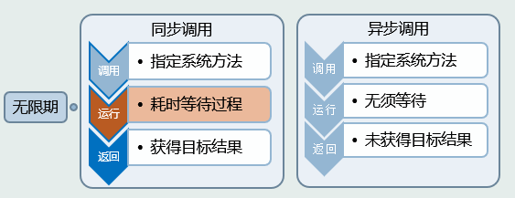

- 同步方法执行是有序的，异步方法执行是无序的
- 异步方法的无序包括启动无序和结束无序
  - 启动无序是因为同一时刻向操作系统申请线程，操作系统收到申请以后，返回执行的顺序是无序的，所以启动是无序的
  - 结束无序是因为虽然线程执行的是同样的操作，但是每个线程的耗时是不同的，所以结束的时候不一定是先启动的线程就先结束

-  同步方法由于主线程忙于计算，所以会卡住界面

- 异步方法由于主线程执行完了，其他计算任务交给子线程去执行，所以不会卡住界面，用户体验性好
- 同步方法由于只有一个线程在计算，所以执行速度慢
- 异步方法由多个线程并发运算，所以执行速度快，但并不是线性增长的（资源可能不够）。多线程也不是越多越好，只有多个独立的任务同时运行，才能加快速度

**解决线程的异步无序问题**：

- 使用回调来解决异步线程的无序问题

  ```C#
  // 定义一个回调
  AsyncCallback callback = p =>
  {
      Console.WriteLine($"到这里计算已经完成了.{Thread.CurrentThread.ManagedThreadId.ToString("00")}。");
      update($"到这里计算已经完成了。" + Thread.CurrentThread.ManagedThreadId.ToString("00") + "。");
  };
  // 异步调用回调
  for (int i = 0; i < 5; i++)
  {
  string name = string.Format($"btnSync_Click_{i}");
  asyncResult = action.BeginInvoke(name, callback, null);
  }
  
  ```


### 4.2.4 线程间同步模式/通信机制

- 工作线程可以很容易用SendMessage来发消息

- 窗体线程可以发送ManualResetEvent事件给工作线程

 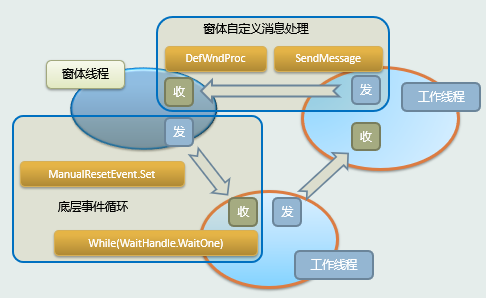


**线程如何接收消息？**

- 工作线程没有消息队列，无法用窗体模式
- 接收方法是线程主动循环检查一些变量，但不能使用"忙检"，因为太耗CPU，要使用ManualResetEvent.WaitOne这样的方法，以最低的代价耗费cpu资源。

**工作线程响应前打发时间的两种方法：**

- IsOut+Sleep打法时间的方法
- ManualResetEvent.WaitOne打法时间的方法
  - 事件对象可实现并发执行中的前趋控制。当线程调用Wait方法时，如果等待对象状态没有激活，则调用线程暂停。对象被激活则线程继续执行

#### 低级事件对象

- 事件对象声明

```C#
public static ManualResetEvent User_Terminate_listen;
```

- 全局静态使得线程与窗体可以访问

- `User_Terminate_listen.WaitOne(); `
- 代表最小的信息量(1bit)

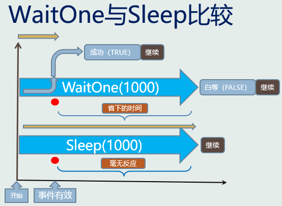

（待补充说明）

#### 工作线程运行逻辑

#### 工作线程间的通信

- WaitOne方法等待当前事件(信号)有效
- WaitAny方法等待事件(信号)数组中任一事件有效，对应或关系实现同步
- WaitAll方法等待事件（信号）数组中所有事件有效，对应与关系实现同步

#### ManualResetEvent.WaitOne要点

- 一是时间效果上阻止线程继续

- 二是在获得信号状态后返回值为true，而超时未获得返回值为false

- 三是获得信号状态将不再继续未等待完的时间。

- 它的使命是完成信号传递，至于功能是启动操作还是终止操作，程序得到的状态都是信号的true

- ManualResetEvent比AutoResetEvent要可靠，它可将信号传给多个线程，而线程会重置AutoResetEvent的状态，即中断信号的传递。

### 4.2.5 线程的同步与死锁

- 多个线程对共享资源访问会造成冲突。为了避免冲突，必须对共享资源进行同步或控制对共享资源的访问。
- 如果在相同或不同的应用程序域中未能正确地使访问同步，则会导致出现一些问题，这些问题包括**死锁**和**争用条件**等。
  - **死锁**是指两个线程都停止响应，并且都在等待对方完成
  - **争用条件**是指由于意外的出现，对两个事件的执行时间的临界依赖性而发生反常的结果。

- 需要同步的资源：
  - 系统资源（如通信端口）
  - 多个进程所共享的资源（如文件句柄）
  - 由多个线程访问的单个应用程序域的资源（如全局、静态和实例字段）

#### 互斥量Mutex

- 最多只能有一个线程可以获取并拥有它，它适合不同线程对同一共享资源互斥访问的应用场合
  - 例如对全局变量，同一个文件或者是数据库同一个对象的访问等，设置程序先获得互斥量再访问共享资源。
- 互斥量的使用：
  - 线程可调用多次的`WaitOne`方法重复对其所有，使用`ReleaseMutex`方法释放对互斥量所属权，而每一个成功的`WaitOne`方法对应一次`ReleaseMutex`
  - `WaitOne`方法不仅等待互斥量的状态，还使线程拥有它
  - 互斥量最好不要使用`WaitAny`,`WaitAll`方法
  - 线程运行终止 mutex 被放弃，互斥量仍可被其它线程取得所属权，但会获得 AbandonedMutexException 异常


# 5 Windows消息与事件机制

## 5.1 Windows简介

- Windows程序特点：消息驱动的可视化界面，支持鼠标键盘，实时响应
- 窗体程序运行特点：
  - 实时响应
  - 任务并发
  - 实时输入
  - 状态切换
  - 通信

## 5.2 窗体程序与消息机制

- VS使用C++语言建立MFC窗体程序
- C#语言建立WinForm窗体程序
- VB/Delphi可以建立自己的窗体程序


- 窗体程序的输入与输出：
  - 输入：消息队列
  - 输出：刷新显示

#### 窗体的输入

- 消息队列
- 消息循环

#### 消息队列

- Windows能够为每个窗体应用程序维护一个消息队列。应用程序必须从消息队列中获取消息，然后分派给某个窗口。

#### MSG消息结构
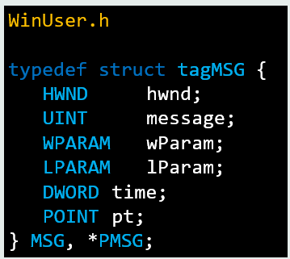

- 窗体程序解析消息：
  - 不区分是驱动生成的或软件构成
  - 其他程序可复制或修改消息结构


### 5.2.1 C++窗体程序

- 入口函数`_tWinMain`

  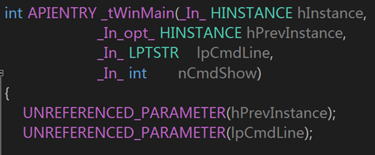

- `GetMessage`：不是死循环

  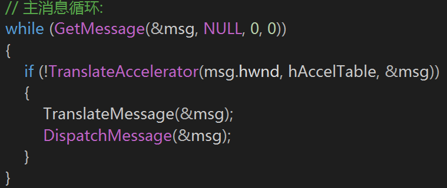

- 消息循环

  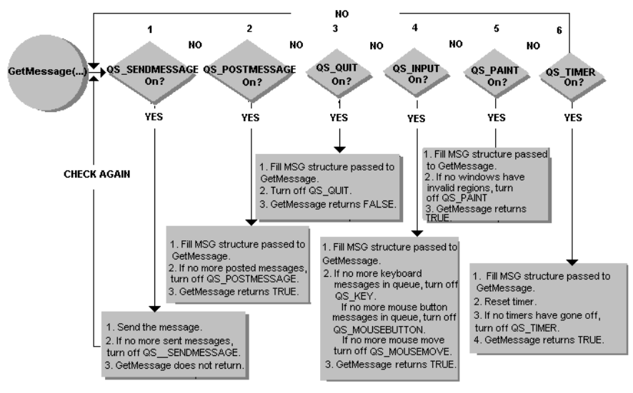

- 系统消息分配

  - 系统将消息分配到线程队列中

#### 窗体的输出

- 客户区域
- OnDraw函数

#### WinMain函数结构

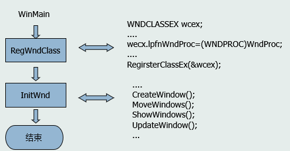

#### WndProc函数

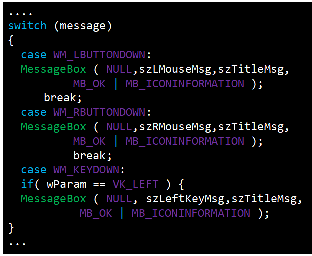

#### 注册窗口类

- RegWndClass类——注册窗口

  ```c++
  if(hPrevInstance)
  {
      RegWndClass(hInstance)
  }
  ```

#### Windows消息循环原理


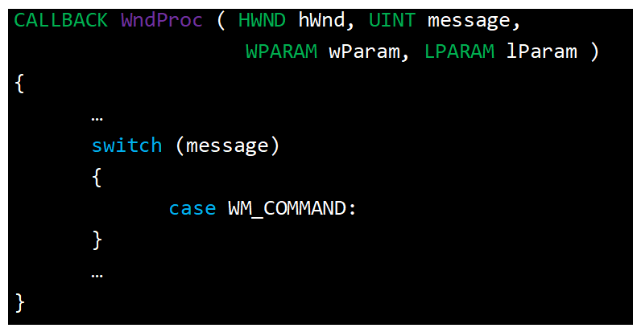

#### Windows窗体扩展

- Windows游戏程序结构

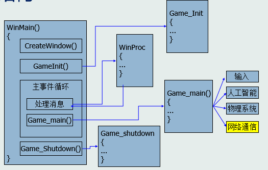

### 5.2.2 C#窗体程序

- 窗体是对基础窗体的继承，具有消息机制的一切特征
- 控件事件添加方式是对用户消息的映射
- 可以对窗体消息处理函数重载，添加新消息值处理
- **代理**与**回调**是消息机制在C#机制下的一种特殊表现，或者说回调的本质是循环

（PPT-5 P.28~）


## 5.3 窗体线程与工作线程

- 窗体程序
  - 一个主线程，也叫界面线程，界面控件属于这个线程
  - 工作线程
- 线程：任务时间长，实质性要求
- 窗体：接收用户响应，不做实质工作

### 窗体线程与工作线程任务分工

- 主窗体线程负责用户的输入与结果的显示
- 工作线程负责完成需要消耗较多运算时间而又没有用户交互的任务
- 窗体线程与工作线程并发执行
  - 机器执行工作任务的同时，窗体以异步方式响应用户的输入，也可异步对结果显示
- 主窗体线程创建工作线程，工作线程以后台方式运行
- 创建时，工作线程默认没有消息队列循环机制的

### 工作线程概述

- 工作线程完成一些比较耗时的任务。只有少量的同步控制、网络程序必须使用工作线程来处理时间上不可预测的任务
- **工作线程不能引用窗体控件**：
  - 所有的窗体控件属于窗体线程，窗体线程负责接收用户输入，更新显示信息到窗体上
  - 工作线程不允许使用窗体空间的属性和方法
  - 实现数据的线程安全，避免访问冲突
  - 各种回调函数也可看作是工作线程

### 线程间同步与通信

- 线程向窗体发送消息

  - SendMessage

    ```C#
    SendMessage(
        main_wnd_handle,//目标
        BEGIN_LISTEN,//消息值，自定义常量
        100, //消息参数1
        200 //消息参数2
    );
    ```

  - 消息参数值信息量太少，属字节级，但其最重要的

    意义是实现通知，信息体一般用静态变量传递

- 窗体接收消息

  - 对消息处理重载

  - 形式：protected override void DefWndProc

- 消息常量定义
  - 自定义常量可以在窗体和线程间共享，根据windows规定在特定取值范围内，不能与已有值相同


## 5.4 窗体自定义消息处理

- Windows本身事先定义的消息不能满足用户程序需要
- 线程需要安全地与窗体界面及时有效交互
- 工作线程不能直接访问窗体控件

#### 自定义消息应用流程

- 系统定义消息值常量
- 线程发送消息值到窗体对象
- 窗体消息匹配
- 执行相应任务，刷新显示等

### C#调用SendMessage

```C#
[DllImport("User32.dll", EntryPoint = "SendMessage")]
private static extern int SendMessage(
    IntPtr hWnd, // handle to destination window
    int Msg, // message 
    int wParam, // first message parameter 
    int lParam // second message parameter 
);

```

### 应用过程

1. 线程与窗体约定消息常量
2. 线程发送消息
3. 窗体消息匹配
4. 窗体控件属性修改


## 5.5 窗体事件机制

### 事件介绍

- 对象调用方法，可由其它对象方法来实现

- 允许一个对象的某个行为可以有多个独立的方法执行

- 多路广播委托实现事件机制
- 回调是由系统执行循环函数，事件是被系统封装的函数指针

### 函数指针

- 代码段的入口地址
- 将函数作为参数或变量使用

### 委托

- 它是一个引用类型，内容是方法名称，规定了参数列表

- 参照C\C++语言的函数指针

- 委托保证安全，避免越界与地址无效

- 委托的基类是System.Delegate（抽象类，不能直接实例化）
- 委托是异步（回调）操作和事件处理的重要环节

### 事件的实现步骤

1. **定义事件参数自定义类**，此类必须由 System.EventArgs 类派生
   - `Public FireEventArgs：EventArgs`
2. 用delegate 关键字**定义事件对象类型**（含事件发起者以及事件参数）
   - `Public delegate void FireEventHandler(object sender,FireEventArgs fe);`
3. 用 event 关键字**定义事件对象**，它同时也是一个 delegate 对象（引用）
   - `Public event FireEventHandler FireEvent；`
4. **定义事件发起者类**

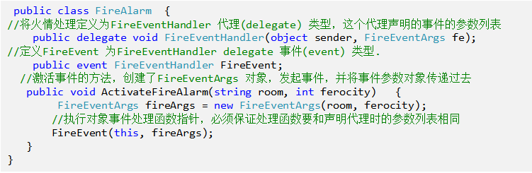

5. **定义事件处理方法**，也就是普通的类的方法，但要求这个方法应当与 delegate 对象具有相同的参数和返回值类型。
   - `void ExtinguishFire(object sender, FireEventArgs fe)`
6. 用 += 操作符**添加事件到事件队列**中， -= 操作符能够将事件从队列中删除。
   - `fireAlarm.FireEvent += new FireAlarm.FireEventHandler(ExtinguishFire);`
7. 触发事件的地方**调用 delegate 的方式写事件触发方法**。
   - `fireAlarm.FireEvent(this, fireArgs);`
8. **调用事件方法触发事件**。
   - `fireAlarm.ActivateFireAlarm(string room, int ferocity)`


# 6 数据库应用程序

## 6.1 数据库

- 存放数据的仓库，按照一定的数据结构（数据的组织形式或数据之间的联系）来组织、存储数据
- 可以通过数据库提供的多种方法来管理数据库里的数据
- 常见数据库：
  - Excel、Access、SQLite/MySQL/PostgreSQL
  - Sybase、Microsoft SQL Server
  - Oracle、DB
  - Memcached、Redis、MemcacheDB、BerkeleyDB、Cassandra（Facebook）、Hbase(Apache)、MorgoDB、CouchDB

### 关系数据库-行式数据库

- 关系型数据库模型是把复杂的数据结构归结为简单的二元关系（即二维表格形式）

- 采用SQL结构化查询语言存取数据

- 保持数据强一致性

### 非关系数据库-列式数据库

- 非关系型数据库也被称为NoSQL数据库，NoSQL的本意是“Not Only SQL” 
  - 指的是非关系型数据库，而不是“No SQL”的意思，因此，NoSQL的产生并不是要彻底地否定非关系型数据库，而是作为传统关系型数据库的一个有效补充。NoSQL数据库在特定的场景下可以发挥出难以想象的高效率和高性能。 

- 非关系型数据库模型是**基于键值对的hash数据结构**（即Map形式）
- 高性能、高并发
- 对数据一致性要求不高

#### 键值数据库

- 键值数据库就类似传统语言中使用哈希表，可以通过key来添加、查询或删除数据，因为使用key主键访问，所以会获得很高的性能及扩展性
- 典型产品：Memcached、Redis、MemcacheDB、BerkeleyDB

#### 列存储数据库

- 这部分数据库通常用来分布式存储的海量数据，键仍然存在，但是他们的特点是**指向了多个列**。 
- 典型产品：Cassandra,HBase

#### 面向文档数据库

- 面向文档数据库以文档的形式存储
- 每个文档都是自包含的数据单元，是一系列数据项的集合。每个数据项都有一个名称与对应的值，值既可以是简单的数据类型，如字符串、数字和日期等；也可以是复杂的类型，如有序列表和关系对象。
- 数据存储的最小单位是文档，同一个表中存储的文档属性可以是不同的，数据可以使用XML、JSON或者JSONB等多种形式存储
- 典型产品：MorgoDB、CouchDB

####  图形（Graph）数据库

- 在数据结构中, 图是顶点(Vertex)与边(Edge)的集合. 顶点与边可以有各自的属性.   
  在互联网的个性化推荐、知识图谱、社交网络等场景下,
- 用图来存储数据是直观而高效的. 图的规模可以很大, 百亿个节点, 千亿个关系
- 典型产品：neo4、OrientDB、titanDB、iGraph（阿里巴巴） 

## 6.2 数据库访问技术

- ODBC
  - 开放式数据库连接，是一种用来在数据库管理系统（DBMS）中存取数据的标准应用程序接口。有ODBC API和MFC ODBC两种开发技术
- DAO
  - 数据访问对象集，是Microsoft提供的基于一个数据库对象集合的访问技术。和ODBC一样，他们都是Windows API的一部分，可以独立于（DBMS）进行数据库的访问
- OLE DB
  - 非常底层，基于COM接口技术；功能强大灵活，但编程非常非常非常麻烦，使用ADO只需要3-5行代码的事情，用OLEDB却需要将近200-300行代码才能完成
- ADO
  - 建立在OLE DB之上的高层数据库访问技术，是对OLEDB的封装， 微软为我们提供了丰富的COM组件（包括ActiveX）来访问各种关系型/非关系型数据库。
  - ADO以Recordset存储
  - ADO使用COM技术，要求所使用的数据类型必须符合COM规范
- ADO.NET
  - ADO.NET基于微软的.NET体系架构，拥有自己的ADO.NET数据库访问接口
  - ADO.NET则以DataSet存储
  - ADO.NET基于XML格式，数据类型更为丰富并且不需要再做COM编排导致的数据类型转换
- JDBC
  - Java数据库连接，是一种用于执行SQL语句的Java API，可以为多种关系数据库提供统一访问，它由一组用Java语言编写的类和接口组成。
  - JDBC与ODBC一样，也是很底层的接口，可以直接调用SQL命令

|  访问接口  | 易用性 | 运行能力 | 可扩展性 | 技术层次 |               突出特点               |
| :--------: | :----: | :------: | :------: | :------: | :----------------------------------: |
|    ODBC    |   差   |   较高   |    差    |   底层   |            可进行底层控制            |
| MFC   ODBC |   好   |          |   一般   |   高层   |          商用标准，应用广泛          |
| MFC   DAO  |   好   |   较高   |   一般   |   高层   |           访问JET性能最好            |
|  OLE   DB  |  很难  |    高    |    好    |   底层   |         可访问非关系型数据库         |
|    ADO     |  最好  |    高    |    好    |   高层   | 可访问非关系型数据库，有多种编程接口 |

## 6.3 .NET环境下使用ODBC访问数据库

## 6.4 .NET环境下使用OLEDB方式访问数据库

## 6.5 .NET环境下使用ADO.NET方式访问数据库

- ADO.NET的架构

  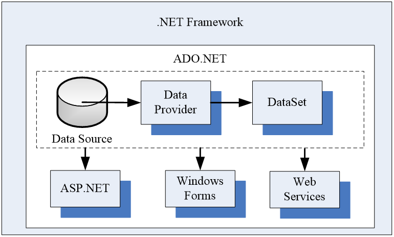

### 6.5.1 DataProvider

- Data Provider提供了DataSet和数据库之间的联系，同时也包含了**存取数据库**的一系列接口。

- .NET Data Provider 包括：
  - System.Data.SqlClient 
  - System.Data.OleDb 
  - System.Data.Odbc 
  - System.Data.OracleClient 

- .NET Data Provider有4个核心对象：
  - Connection：用于与数据源建立连接；
  - Commmand：用于对数据源执行指定命令；
  - DataReader：指向数据源的仅向前的只读数据流；
  - DataAdapter：自动将各种操作变换到相应的SQL语句

### 6.5.2 DataSet

- ADO.NET的核心组件是**DataSet**，可以将DataSet想像成内存中的数据库，它是不依赖于数据库的独立数据集，这里的独立是指即使断开数据连接或关闭数据连接，DataSet依然可用。
- 在ADO.NET中，DataSet是专门用来处理从数据源获得数据，无论底层的数据是什么，都可以使用相同的方式来操作从不同数据源取得的数据
- DataSet内部是用XML来描述数据的。

### 6.5.3 ADO.NET访问数据库思路

- 使用using添加System.Data及其相关子命名空间的引用（如System.Data.SqlClient）。
- 使用Connection对象连接数据源；
- 视情况使用Command对象、DataReader对象或DataAdpter对象操作数据库；
- 将操作结果返回到应用程序中，进行进一步处理。


### 6.5.4 使用Connection连接数据库

- Connection对象的成员

  - ConnectionString：用来设置将要访问的数据库的连接字符串

  - Open()：用来打开数据库；

  - Close()：用来关闭与数据库的连接。

- Windows集成验证的连接字符串：
  - Data Source=服务器名; Initial Catalog=xxx; Integrated Security=true
  - SQL Server身份验证的连接字符串：
  - Data Source=服务器名; Initial Catalog=xxx; User ID=用户名; Pwd=密码

### 6.5.5 使用Command访问数据库

- Command对象用来封装将要发送给数据源的操作命令。

- Command对象的常用成员：

  - CommandText属性：用来设置将要执行的SQL语句或将要调用的存储过程名。

  - CommandType属性：用来设置命令类型，其值=Text时表示执行SQL语句（默认），= StoredProcedure时表示调用存储过程。

  - Connection属性：用来指定所要使用的数据连接。
  - ExcuteNonQuery方法：执行操作，返回受影响的行数。该方法一般用来执行SQL中的Update、Insert和Delete等操作
  - ExcuteReader方法：执行操作，返回DataReader对象。
  - ExcuteScalar方法：执行操作，返回执行结果。该方法只能执行Select语句，通常用于统计。

### 6.5.6 使用DataReader对象访问数据库

- DataReader提供了**仅向前**和**只读**的操作方式，一次只读取一条记录，因此可提高应用程序的性能，大幅度减轻对内存的需求。

- 主要成员包括：

  - HasRows属性：表示是否包含一行或多行的数据。

  - Read ()方法：指向下一行记录，如果下一行有记录，则读出该行并返回true；否则返回false。
  - GetName()方法：返回当前行的某一字段的名称。
  - GetValue()方法：返回当前行的某一字段的值。相似有GetString、GetDateTime、GetBoolean、GetFloat、GetInt32等。
  - Close ()方法：关闭DataReader对象。

### 6.5.7 使用DataAdapter和DataSet对象访问数据库

- DataAdapter（数据适配器）用于检索和保存数据

- DataSet是数据缓存

1. 首先DataAdapter使用Connection连接数据库，
2. 然后使用Command所封装的命令来获取数据，
3. 并把所获得数据填充到DataSet之中。方法：Fill();
4. 当DataSet的数据被更新时，反过来负责更新数据库。方法：Update();


### 6.5.8 在WinForm中使用DataGridView显示数据

- DataGridView控件用于显示数据，在使用时，首先需要指定其数据源（即DataSource 属性），步骤如下：
  - 在窗体中添加DataGridView控件；
  - 设置 DataGridView 控件和其中各列的属性；
  - 设置 DataSource 属性，指定数据源。

- 重要成员包括如下：

  - Columns属性：包含的列的集合，表11-9列出了DataGridView中各列的主要属性。

  - DataSource属性：DataGridView 的数据源

  - ReadOnly属性：指示是否可以编辑单元格 

  - Update()方法：把数据集的更新返回数据源保存。

### 6.5.9 在WPF中使用DataGrid显示数据

- DataGrid控件用于显示数据，在使用时，首先需要指定其数据源（即DataSource 属性），步骤如下：
  - 在窗体中添加DataGrid控件；
  - 设置 DataGrid 控件和其中各列的属性；
  - 设置 DataSource 属性，指定数据源。

- 重要成员包括如下：

  - Columns属性：包含的列的集合

  - DataSource属性：DataGrid 的数据源

