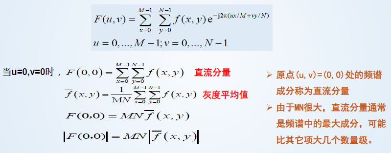
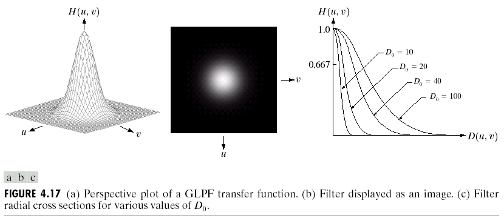

# 1 绪论

- 数字图像
  - 像素坐标和灰度值都是离散值的图像称为数字图像
- 数字图像处理
  - 借助于数字计算机来处理数字图像
- 数字图像的来源
  - 数字图像几乎覆盖了整个电磁波谱范围，并不仅限于可见光波段

# 2 数字图像基础

## 2.1 视觉感知要素

- 人眼的结构——光感受器
  - 视网膜表面的光接收器为锥状体和杆状体．
    - **锥状体**：对颜色灵敏，位于中央凹,细节感知，锥状体视觉被称为白昼视觉或亮视觉。
    - **杆状体**：给出视野总体图像，无彩色感觉，杆状视觉称为暗视觉或微光视觉。

## 2.2 光和电磁谱

- 光是一种特殊的电磁辐射，可以被人眼感知。可见光波长范围为0.43μm-0.79μm。
- 人感受到的物体颜色由物体反射的光的波长决定
- 描述光源通常用3个量：辐射强度、光通量、亮度。在光学中，常用几个量来表示光：
  - 光强：单位立体角的光通量
  - 光照度：单位面积的光通量
  - 光亮度：单位面积光强

## 2.3 图像感知和获取

- 常用传感器：

  - 单个成像Sensor
  - 线阵Sensor
  - 阵列Sensor

- 简单的图像形成模型：
  $$
  用f(x,y)表示图像。\\
  f(x,y)=i(x,y)r(x,y)，其中，i(x,y)为入射分量，r(x,y)为反射分量。
  $$

## 2.4 图像取样和量化

- 多数Sensor输出的是连接电压波形。

### 2.4.1 取样和量化的基本概念

- **量化**：把连续颜色值（用**实数**表示）映射到一个**整数**子类上。
  - **均匀量化**：值域上的整数是等间隔分布的。
  - **非均匀量化**：值域上的整数是非等间隔分布的。
- 采样越密集，量化级越多，图像分辨率越清晰，反之越模糊。

### 2.4.2 数字图像表示

**数字图像**：是指由被称作像素的小块区域组成的二维矩阵。将物理图像行列划分后，每个小块区域称为**像素**（pixel）

- 每个像素有两个属性：位置和亮度（或色彩）
- 对灰度图像而言，每个像素的亮度用一个数值（即灰度值）来表示，通常数值范围在0到255之间，即可用一个字节来表示，0表示黑、255表示白，而其它表示灰度级别。
- 彩色图像可以用红、绿、蓝三元组的二维矩阵来表示。

### 2.4.3 空间和灰度分辨率

取样值是决定一幅图像空间分辨的主要参数（空间分辨率、8位（256）灰度分辨率）。描述系统分辨率应该以MTF来描述，如数码相机、扫描仪、CCD摄像机。

### 2.4.4 图像内插

- 内插是用已知数据来估计未知位置的数值的处理。

**最近邻内插法**：

​	假设一个500\*500像素的图像，放大1.5倍到750\*750，创建一个750\*750的网格，与原图像有相同间隔，然后将其收缩，与原图像匹配，此时像素间隔小于原图像。每一个点的灰度值，用原图像中位置最接近的像素来赋予。

**双线性内插**：

​	用4个最近邻去估计给定位置的灰度。
$$
v(x,y)=ax+by+cxy+d
$$

### 2.4.5 放大和收缩数字图像

- **放大图像**：500×500图像，想放大1.5倍，即750×750 pixels。
  - 先在原图像上形成一个750×750的网格，栅格的间隔小于1，然后可采用最近邻内插法来添充。
  - 缺点：可能产生棋盘格效应。
  - 改进：采用双线性插值。

## 2.5 像素间的基本关系

### 2.5.1 相邻像素

- 位于坐标(x,y)处的像素p有4个水平和垂直的相邻像素，其坐标为：
  $$
  (x+1,y),(x-1,y),(x,y+1),(x,y-1)
  $$
  这组像素称为p的**4邻域**，用$N_4(p)$表示。

- p的4个**对角相邻像素**的坐标如下：
  $$
  (x+1,y+1),(x+1,y-1),(x-1,y+1),(x-1,y-1)
  $$
  并用$N_D(p)$表示

- 4邻域像素和4个对角相邻像素一起称为**8邻域**，用$N_8(p)$表示。

### 2.5.2 邻接性、连通性、区域和边界

- 令V是用于定于邻接性的灰度值集合。在二值图像中，把具有1值的像素归入V，在灰度图像中，V包含更多的元素。

  考虑三种类别的邻接：

  1. 4邻接：如果q在集合$N_4(p)$中，则具有V中数值的两个像素p和q是4邻接的。
  2. 8邻接：如果q在集合$N_8(p)$中，则具有V中数值的两个像素p和q是8邻接的。
  3. m邻接（混合邻接）：如果q在集合$N_4(p)$中，或q在集合$N_8(p)$中，且集合$N_4(p)\cap N_4(q)$中没有来自V中数值的像素，则具有V中数值的两个像素p和q是m邻接的。

  引入m邻接是为了消除8邻接的歧义性。

- **连通（通路）**：设像素p（x，y）到q（s，t）的通路是如下的特定像素序列：
  $$
  (x_0,y_0),(x_1,y_1),...,(x_n,y_n)
  $$
  这里$(x_0,y_0)=(x,y),(x_n,y_n)=(s,t)$，并且像素$(x,y),(x_{i-1},y_{i-1})$是邻接的。此时，n是通路长度，可根据邻接类型定义4、8或m通路。

- 令S是图像中的一个像素子集。对于S中的任何像素p，S中连通到该像素的像素集称为S**的连通分量**。如果S仅有一个连通分量，则集合S称为**连通集**，也称S为一个**区域**。

- 区域R**边界**是这样的点集合：这些点与R的补集中的点邻近。

### 2.5.3 距离度量

对于坐标分别为(x,y)，(s,t)和(v,w)的像素p，q和z，如果：

- $D(p,q)\ge 0,\quad 当且仅当p=q时，D(p,q)=0$
- $D(p,q)=D(q,p)$
- $D(p,z)\le D(p,q)+D(q,z)$

则D是**距离函数或度量**。

欧式距离：
$$
D_e(\gamma,q)=[(x-s)^2+(y-t)^2]^{\frac{1}{2}}
$$
距离D4（城市街区距离）：
$$
D_4(p,q)=|x-s|+|y-t|
$$
D8距离（棋盘距离）：
$$
D_8(p,q)=max(|x-s|,|y-t|)
$$
两点间的Dm距离用点间的最短通路定义，此时，两像素间的距离将依赖于**沿道路的像素值以内它们的邻点值**。如：

## 2.6 数字图像中的数学工具

### 2.6.1 阵列和矩阵操作

阵列乘法不同于矩阵乘法：

### 

### 2.6.2 线性和非线性操作

### 2.6.3 算术操作

- 图像间的算术操作是阵列操作

- 针对降噪的带躁图像相加（平均）P.43 例2.5

  

- 图像相减，增强图像之间的差别。

- 图像相乘或相除，可以校正阴影。

### 2.6.4 集合和逻辑操作

# 3 灰度变换与空间滤波

## 3.1 灰度变换和空间滤波基础

- 空间域：简单的包含图像像素的平面。

- **空间域技术**：灰度变换和空间滤波**直接对图像的像素**进行操作，属于空间域技术。空间域技术在计算上更有效，所需的处理资源更少。表示为：
  $$
  g(x,y)=T[f(x,y)]
  $$
  与频率域不同点在于：频率域在图像的傅里叶变换上执行，而不针对图像本身。

- **灰度变换**：灰度变换也称为灰度映射，就是将输入图像f(x,y)中的灰度r，通过映射函数T（·）映射成输出图像g(x,y)中的灰度s。

  - 灰度变换使得图像的灰度级得到拉伸，变换后的图像比原图像有更高的对比度，从而能显示更多细节。

## 3.2 一些基本的灰度变换函数

### 3.2.1 图像反转

- 对于灰度级范围为[0,L-1]的一幅图像进行反转，反转图像由下式给出：

$$
s=L-1-r
$$

- 作用：增强嵌入于图像暗区的白色或灰色细节。

- ### 3.2.2 对数变换

  - 通用形式：
    $$
    s=c\log(l+r)
    $$

  - 作用：

    - 扩展图像中的暗像素的值，同时压缩更高灰度级的值
    - 反对数变换的作用与此相反

  - 应用：

    - 缩小傅氏变换的谱范围

  

### 3.2.3 幂律（伽马）变换

- 基本形式：
  $$
  s=cr^\gamma
  $$

与对数变换情况类似，部分$\gamma$值的幂律曲线将较窄范围的暗色输入值映射到较宽范围的输入值，对高灰度级值也成立。

与对数不同的是，随着$\gamma $值的变换，将简单地得到一族可能的变换曲线

### 3.2.4 分段线性变换函数

- 优点：形式可任意组合
- 缺点：需要更多的用户输入

#### 对比度拉伸

- 这是最简单的分段线性函数之一，可以扩展图像灰度级动态范围。

- $$
  若r_1=s_1且r_2=s_2,则变换为一线性函数，将产生一个没有变化的灰度级
  $$

- $$
  若r_1=r_2,s_1=0且s_2=L-1,则变换编程阈值处理函数，并产生一幅二值图像。如图d
  $$

#### 灰度级分层

- 可以突出图像中特定灰度范围的亮度。应用包括增强特征。

- 可以有许多方法实现，但一般都是两种基本方法的变形：

  - 将感兴趣范围内的所有灰度值显示为一个值（如白色），而其他灰度值显示为另一个值（如黑色）。

    

  - 使感兴趣范围的灰度变亮（或变暗）。

    

#### 比特平面分层

- 比特平面分层：突出每个像素中特定比特来为整个图像外观做出贡献。

  - 如一幅8比特图像可考虑为由8个1比特平面组成，其中平面1包含图像中所有像素的最低阶比特，而平面8包含图像中所有像素的最高阶比特。

- 高阶比特平面，包含了视觉上很重要的大多数数据；低阶比特平面在图像中贡献了更精细的灰度细节。

- 获得比特平面分层的办法：

  - 可使用变换函数处理输入图像得到二值图像，变换函数如下：

    - 若要获得第n比特平面分层，则遍历图像的每一个像素，像素值用二进制表示。
    - 若像素的第n位为0，则像素灰度值映射为0，若像素第n位为1，则像素灰度值映射为1.

    （同理，若不是得到二值图像，而是得到原n比特图像，则为0时像素灰度值映射为0，为1则映射为该比特下最大值（如8比特图像，则为255））

- 比特平面分层的作用：

  - 对于分析图像中每个比特的相对重要性很有用，可帮助我们确定用于量化该图像的比特数的充分性。
  - 对图像压缩很有用。

## 3.3 直方图处理

- 直方图：
  - 是图像的一种统计表达，它描述了图像中各灰度值的像素个数，反映了该图中不同灰度级出现的概率
  - 灰度级范围为[0,L-1]的数字图像的直方图是离散函数$h(r_k)=n_k，其中r_k是第k级灰度值，n_k是图像中灰度为r_k的像素个数$
  - 归一化直方图：$p(r_k)=n_k/MN$
    - $p(r_k)$是灰度级$r_k$在图像中出现的概率的一个估计
    - 归一化直方图的所有分量之和应为1
- PDF：概率密度函数
- 直方图在图像增强中的应用
  - 若一幅图像的像素倾向于占据整个可能的灰度级范围并且**分布均匀**，则该图像会有高对比度的外观并展示灰色调的较大变化，最终效果将是一幅**灰度细节丰富且清晰**的图像
  - 一些图像由于其灰度分布集中在较窄的区间，对比度很弱，图像细节看不清楚。此时，可采用图像灰度直方图均衡化处理,使得图象的灰度分布趋向均匀，图像所占有的像素灰度间距拉开，加大了图像反差，改善视觉效果，达到增强目的

### 3.3.1 直方图均衡

- 基本原理：把原始图像的直方图变换为均匀分布，以增加像素灰度值的动态范围，从而达到增强图像的目的。

$$
s_k=T(r_k)=(L-1)\sum^k_{j=0}p_r(r_j)=\frac{(L-1)}{MN}\sum^k_{j=0}n_j,k=0,1,2,...,L-1
$$

- $s_k$为均衡化后的灰度值，$r_j$为原图像的灰度值
- $T(r_k)$称为**直方图均衡**或**直方图线性变换**

（书上大篇幅解释了为什么这样的变换可以使得直方图均衡化）

### 3.3.3 局部直方图处理

- 以一个像素的领域内进行计算（如直方图平衡化）

## 3.4 用算术/逻辑操作增强

## 3.5 空间滤波基础

- 空间滤波器由以下部分组成：
  - 一个领域（典型地是一个较小的矩形）
  - 对该邻域包围的图像像素执行的预定义操作
- 滤波产生一个新像素，新像素的坐标等于领域中心的坐标，像素的值是滤波操作的结果。
- 滤波器分为：
  - 线性空间滤波器：在图像像素上执行的是线性操作。
  - 非线性空间滤波器：在图像像素上执行的是非线性操作。

## 3.6 平滑空间滤波器

- 用于模糊处理和降低噪声。

### 3.6.1 平滑线性滤波器

- 平滑线性滤波器的输出是：包含在滤波器模板邻域内的像素的简单平均值。也叫**均值滤波器**。（可以归入低通滤波器）
- 平滑滤波器：用滤波器模板确定的邻域内像素的平均灰度值代替图像中每个像素的值。
- 加权均值滤波器：模板并不是都为1
- 模板尺寸越大，图像越模糊，图像细节丢失越多。
- 应用：为了对感兴趣的物体得到一个粗略的描述而模糊一幅图像，使得较小物体的灰度就与背景混合在一起，而较大物体变得像“斑点”而易于检测。

#### 高斯滤波

- 采用高斯函数作为加权函数。

- 使用高斯滤波的原因：

  - 二维高斯函数具有旋转对称性，保证滤波时各方向平滑程度相同
  - 离中心点越远权值越小，确保边缘细节不被模糊。

- $$
  G(x,y)=e^{\frac{x^2+y^2}{2\sigma^2}}=e^{-\frac{x^2}{2\sigma^2}}
  $$

- 设计离散高斯滤波器的方法：

  - 设定$\sigma^2$和n，确定高斯模板权值
  - 整数化和归一化

### 3.6.2 统计排序滤波器

- 是一种非线性空间滤波器。
- 输出：以滤波器包围的图像区域中所包含的像素的排序（排队）为基础，然后使用统计排序结果决定的值**代替中心像素**的值。
- 常见：中值滤波器（对脉冲噪声（椒盐噪声）非常有效，这种噪声是以黑白点的形式叠加在图像上的）
- 最大值滤波
  - 主要用途：寻找最亮点
- 最小值滤波器
  - 主要用途：寻找最暗点
- 中值滤波器
  - 钝化图像、去除噪音

## 3.7 锐化空间滤波

- 主要目的：突出灰度的过渡部分。
- 锐化可用微分来完成，而微分算术的响应强度与图像在该点的突变成程度有关。
- 对一维函数，其一阶微分的基本定义：

$$
\frac{\partial f}{\partial x}=f(x+1)-f(x)
$$

- 二阶微分定义：
  $$
  \frac{\partial ^2f}{\partial x^2}=f(x+1)+f(x-1)-2f(x)
  $$

- 一些结论：
  - 一阶微分产生的边缘宽（如：沿斜坡很长一段非0）
  - 二阶微分对细节反应强烈，如细线、孤立点（斜坡起止点为非0）
  - 一阶微分对灰度阶跃反应强烈
  - 二阶微分对灰度阶梯变化产生双响应，在大多数应用中，**对图像增强来说，二阶微分比一阶微分好一些**

### 3.7.2 使用二阶微分进行图像锐化——拉普拉斯算子

- 关注各向同性滤波器（响应与滤波器作用的图像的突变方向无关，即旋转不变的，即将原图像旋转后进行滤波处理给出的结果与先对图像滤波然后再旋转的结果相同）。

- 拉普拉斯算子是最简单的各向同性微分算子

- 一个二维图像函数的拉普拉斯算子定义为：
  $$
  \nabla ^2f=\frac{\partial^2f}{\partial x^2}+\frac{\partial ^2f}{\partial y^2}
  $$

  - 在x方向上：
    $$
    \frac{\partial ^2f}{\partial x^2}=f(x+1,y)+f(x-1,y)-2f(x,y)
    $$

  - 在y方向上：
    $$
    \frac{\partial ^2f}{\partial y^2}=f(x,y+1)+f(x,y-1)-2f(x,y)
    $$

  - 所以有：
    $$
    \nabla ^2f(x,y)=f(x+1,y)+f(x-1,y)+f(x,y+1)+f(x,y-1)-4f(x,y)
    $$

  该公式可以用下图的滤波模板来实现：（4邻域拉普拉斯模板）

  

- 对45°增幅的结果是各向同性的：（8邻域拉普拉斯模板）
  $$
  \nabla ^2f(x,y)=f(x+1,y)+f(x-1,y)+f(x,y+1)+f(x,y-1)\\+f(x-1,y+1)+f(x+1,y+1)+f(x-1,y-1)+f(x+1,y-1)-8f(x,y)
  $$
  即下图模板：

  

- 使用拉普拉斯对图像增强的基本方法可表示为：
  $$
  g(x,y)=f(x,y)+c[\nabla ^2f(x,y)]
  $$

  - 若模板中心为负数，则常数c=-1，否则c=1

- 图像相减时，可能出现负数，解决方案：（以0~255为例）

  - 方案一：每一像素+255，然后除以2
    - 优点：简单、快速
    - 缺点：无法保证覆盖0~255全范围
  - 方案二：先提取最小值取反后加在差图像中然后用乘每一像素可保证结果

### 3.7.3 使用一阶微分对（非线性）图像锐化——梯度法

- 对于函数$f(x,y)$，f在坐标(x,y)处的梯度定义为二维列向量：
  $$
  \nabla f=grad(f)=
  \left[
  \begin{aligned}
  g_x \\
  g_y
  \end{aligned}
  \right]
  =
  \left[
  \begin{align}
  \frac{\partial f}{\partial x} \\
  \frac{\partial f}{\partial y}
  \end{align}
  \right].
  $$

  - 该向量指出了在位置(x,y)处f的最大变化率的方向。

- 向量$\nabla f$的幅度值（长度）表示为M(x,y)，即
  $$
  M(x,y)=mag(\nabla f)=\sqrt{g_x^2+g_y^2}
  $$

  - 它是梯度向量方向变化率在(x,y)处的值。

  - M(x,y)是与原图像大小相同的图像，它是当x和y允许在f中的所有像素位置变化时产生的。该图像通常称为**梯度图像**（或含义很清楚时，可简称为**梯度**）

  - 为了减少计算量，用下式算近似：
    $$
    M(x,y)\approx |g_x|+|g_y|
    $$

    - 运算简单，但是各向同性就不存在了（只对90°才保持）

#### Roberts交叉梯度算子

- 令中心点$z_5$表示任意位置(x,y)处的$f(x,y)$，$z_1$表示为$f(x-1,y-1)$

- 在Roberts算子中：
  $$
  g_x=(z_9-z_5)和g_y=(z_8-z_6)
  $$

  - 可用以下模板实现：

    

- 梯度图像为：
  $$
  M(x,y)=[(z_9-z_5)^2+(z_8-z_6)^2]^{1/2}
  $$

- 简化运算为：
  $$
  M(x,y)\approx |z_9-z_5|+|z_8-z_6|
  $$

#### Soble算子

- 使用以$z_5$为中心的一个3*3邻域对$g_x$和$g_y$的近似如下：
  $$
  \begin{align}
  & g_x=\frac{\partial f}{\partial x}=(z_7+2z_8+z_9)-(z_1+2z_2+z_3) \\
  & 和 \\
  & g_y=\frac{\partial f}{\partial y}=(z_3+2z_6+z_9)-(z_1+2z_4+z_7)
  \end{align}
  $$
  ​	可用以下模板来实现：

  ​	

- 中心系数使用权重2的思想是通过突出中心点的作用而达到平滑的目的。

- Roberts算子和Soble算子的模板中的系数总和为0，这正如微分算子的期望值那样，表明灰度恒定区域的响应为0

#### 应用

- 使用梯度可以进行边缘增强。

# 4 频率域滤波

**奈奎斯特采样定理**：

对一个有限带宽的连续信号进行采样，当采样频率大于信号最高频率的两倍时，可以由所获得的离散样本完全恢复原始的连续信号

## 4.1 背景

- **傅氏级数**：任何周期函数都可以表示为不同频率的正弦或余弦的和的形式。

  - 物理意义：
    - 周期信号可展开成直流和无穷多个频率为基频整数倍的、且具有不同幅度和初相位的正弦信号的叠加。

- **傅氏变换**：对于非周期函数，则用正线和余弦及加权函数的积分来表示。

## 4.2 傅里叶变换

### 4.2.1 一维傅里叶变换（DFT）及其反变换

- 非周期离散信号的DFT得到的频谱仍然是离散的
- 每一根谱线代表对应谐波成分的强度
- 变换长度不同，频谱包络相同
- 变换长度越大，则谱线间隔越小，即谱线密度与变换长度成反比

#### 离散变量函数

$$
\begin{aligned}
& F(u)=\frac{1}{M}\sum^{M-1}_{x=0}f(x)e^{-j2\pi ux/M}，\\
& 其中u=0,1,2,...,M-1 \\
& f(x)=\sum^{M-1}_{u=0}F(u)e^{j2\pi ux/M}， x=0,1,2,...,M-1
\end{aligned}
$$

#### 连续变量函数的傅立叶变换

$$
f(t)的傅里叶变换：F(\mu )=\int _{-\infty}^\infty f(t)e^{-j2\pi \mu t}dt \\
傅里叶反变换获得f(t)：f(t)=\int_{-\infty}^\infty F(\mu)e^{j2\pi \mu t}d\mu
$$

- 以上被称为傅里叶变换对

### 4.2.2 二维傅里叶变换及其反变换

#### 二维DFT的性质

- **平移性**

  - 平移操作：

    

  - 空间位移：

    当空域信号f(x,y)产生移动时，在频域中只发生相移，并不影响其**傅里叶变换（F(x，y)）的幅度**

  - 频率位移：

    当频域信号F(u,v)产生移动时，在空域中只发生相移，并不影其**反傅里叶变换（f(u,v)）的幅度**

- **旋转性**

  当空域信号f(x,y)旋转一定角度时，频域信号F(u,v)也旋转相同的角度

- **周期性**

  二维DFT及其逆变换都是以变换的点数为周期的

- **共轭对称性**

  二维DFT是以原点为中心的共轭对称函数

### 4.2.3 空间域滤波和频率域滤波之间的对应关系

离散卷积计算：图像区域和滤波器对应位置相乘，所求得结果相加后除以滤波器元素总数。

- 空间域和频率域中的滤波器组成了一个傅立叶变换对
- 一般空间域更适合使用小的滤波器。

s

## 4.3 频率域滤波基础

### 频域率滤波增强的原理

- 在频域空间，图像的信息表现为不同频率分量的组合。
- 频谱图像|F(u,v)|特点：
  - 低频部分集中了大部分能量，对应于图像中灰度变化缓慢的区域
  - 高频部分对应边缘和噪声等细节内容，灰度发生急剧变化
- 频域增强是通过改变图像中不同频率分量来实现的。
- 频域增强的工具是频域滤波器，不同的滤波器滤除的频率和保留的频率不同，因而可获得不同的增强效果。

**为什么要做图像变换？**

- 变换后的图像，大部分能量都分布在低频谱段，这对以后图像的压缩、传输都比较有利。使得运算次数减少、节省时间。

### 频率域滤波操作

- 图像频率域滤波增强的一般步骤：
  - 将图像从图像空间转换到频域空间（如傅里叶变换）
  - 通过频域滤波方法对图像进行增强
    - 将图像的傅里叶谱与频域滤波器相乘
  - 将增强后的图像从频域空间转换到图像空间
    - 进行傅立叶反变换
- 基本步骤：
  - $(-1)^{x+y}\times 原图像$
  - 傅里叶变换得到：F(x,y)
  - $滤波器H(u,v)\times F(u,v)$
  - 反DEF操作，仅选择实部
  - $(-1)^{x+y}\times 上一步的结果$

## 4.4 频率域平滑滤波——低通滤波器

- 高频包含图像的边缘以及其他尖锐的灰度转变（如噪声）的信息，所以可以通过对高频进行衰减来使得频率域平滑（模糊），即使用低通滤波。

### 4.4.1 理想低通滤波器（ILPF）

- “理想”是指小于截止频率$D_0$的频率可以完全不受影响地通过滤波器，而大于$D_{0}$的频率则完全通不过

- 函数：
  $$
  H(u,v)=
  \left\{
  \begin{aligned}
  1,\quad D(u,v)\le D_0 \\
  0,\quad D(u,v)>D_0
  \end{aligned}
  \right. \\
  D(u,v)是F(u,v)到频率矩形中心的距离
  $$
  表示，在以原点为圆心，以$D_{0}$为半径的圆内，无衰减地通过所有频率，其余的都消除。

- 缺点：容易出现“振铃”现象（指输出图像的灰度剧烈变化处产生的震荡，就好像钟被敲击后产生的空气震荡、波纹）

### 4.4.2 布特沃斯低通滤波器（Butterworth, BLPF）

- 函数：
  $$
  H(u,v)=\frac{1}{1+[D(u,v)/D_0]^{2n}} \\
  n:滤波器的阶数
  $$

- 与ILPF相比：
  - 没有明显的跳跃
  - 模糊程度降低
- 特点：
  - 一阶BLPF没有振铃显现，但随着阶数的增加，振铃现象会变得越来越明显
  - 对图像的平滑效果不如理想滤波器

### 4.4.3 高斯低通滤波器（GLPF）

- 函数：
  $$
  H(u,v)=e^{-D^2(u,v)/2\sigma^2} \\
  通常令\sigma=D_0
  $$

- 特点：

  - 没有振铃现象
  - 平滑效果不如前两种滤波器

## 4.5 频率域锐化滤波——高通滤波

- 一个高通滤波器是从给定的低通滤波器用下式得到：
  $$
  H_{HP}(u,v)=1-H_{LP}(u,v)
  $$

### 4.5.1 理想高通滤波器（IHPF）

- 函数：
  $$
  H(u,v)=
  \left\{
  \begin{aligned}
  0,\quad D(u,v)\le D_0 \\
  1,\quad D(u,v)>D_0
  \end{aligned}
  \right. \\
  $$

### 4.5.2 布特沃斯高通滤波器（BHPF）

- 函数：
  $$
  H(u,v)=\frac{1}{1+[D_0/D(u,v)]^{2n}} \\
  n:滤波器的阶数
  $$

### 4.5.3 高斯高通滤波器

- 函数：
  $$
  H(u,v)=1-e^{-D^2(u,v)/2\sigma^2} \\
  通常令\sigma=D_0
  $$

### 4.5.4 频率域的拉普拉斯算子

- 函数：
  $$
  H(u,v)=-4\pi^2(u^2+v^2)\quad 或 \\
  H(u,v)=-4\pi^2D^2(u,v)
  $$
  拉普拉斯图像由下式获得：

  

  增强：
  $$
  g(x,y)=f(x,y)-\nabla^2f(x,y)
  $$

### 4.5.5 钝化模板、高频提升滤波和高频加强滤波

P.180

## 4.6 同态滤波器

PPT P.41

# 5 图像复原与重建

- **图像的退化**：图像在形成、存储和传输过程中，由于成像系统、传输介质和设备的不完善，使图像的质量变坏。
- **图像复原**：在研究图像退化原因的基础上，以退化图像为依据，根据一定的**先验知识**建立一个退化模型，然后做相反的运算以恢复原始景物图像。

## 5.1 图像退化/复原过程

- 空间域中的退化图像：
  $$
  g(x,y)=h(x,y)\bigstar f(x,y)+\eta(x,y) \\ 
  \bigstar表示空间卷积，h(x,y)为退化函数，\eta(x,y)为噪声函数
  $$

- 频率域中的退化图像：
  $$
  G(x,y)=H(u,v)F(u,v)+N(u,v)
  $$

## 5.2 噪声模型

### 5.2.1 噪声的空间和频率特性

- 相关性：噪声是否与图像相关。
- 频率特性：噪声在傅里叶域的频率内容。
- 白噪声：噪声的傅里叶谱是常量。

### 5.2.2 重要噪声的概率密度函数

#### 高斯噪声

- 也称为：**正态噪声**
- 高斯随机变量z的PDF（概率密度函数）：

$$
p(z)=\frac{1}{\sqrt{2\pi}\sigma}e^{-(z-\overline{z})^2/2\sigma^2} \\
其中，z表示灰度值，\overline{z}表示z的平均值，\sigma表示z的标准差
$$

#### 瑞利噪声

- PDF:
  $$
  p(z)=
  \left\{
  \begin{aligned}
  \frac{2}{b}(z-a)e^{(z-a)^2/b},\quad z\ge a \\
  0,\quad z<a
  \end{aligned}
  \right.
  $$

  - 概率密度的均值和方差：
    $$
    \overline{z}=a+\sqrt{\pi b/4} \\
    \sigma^2=\frac{b(4-\pi)}{4}
    $$

#### 爱尔兰（伽马）噪声

- PDF：
  $$
  p(z)=
  \left\{
  \begin{aligned}
  \frac{a^bz^{b-1}}{(b-1)!}e^{-az},\quad z\ge a \\
  0,\quad z<a
  \end{aligned}
  \right.
  $$

  - 概率密度的均值和方差：
    $$
    \overline{z}=\frac{b}{a} \\
    \sigma^2=\frac{b}{a^2}
    $$

#### 指数噪声

- PDF：
  $$
  p(z)=
  \left\{
  \begin{aligned}
  ae^{-az},\quad z\ge a \\
  0,\quad z<a
  \end{aligned}
  \right.
  $$

  - 概率密度的均值和方差：
    $$
    \overline{z}=\frac{1}{a} \\
    \sigma^2=\frac{1}{a^2}
    $$

- 指数噪声PDF是当b=1时爱尔兰PDF的特殊情况

#### 均匀噪声

- PDF：

$$
p(z)=
\left\{
\begin{aligned}
\frac{1}{b-a},\quad a\le z\le b \\
0， \quad 其他
\end{aligned}
\right.
$$

- 概率密度的均值和方差：
  $$
  \overline{z}=\frac{a+b}{2} \\
  \sigma^2=\frac{(b-a)^2}{12}
  $$

#### 脉冲（椒盐）噪声

- PDF：

$$
p(z)=
\left\{
\begin{aligned}
&P_a,&z=a \\
&P_b, &z=b \\
&1-P_a-P_b, &其他
\end{aligned}
\right.
$$

​	如果b>a，则灰度级b在图像中将显示为一个两点；反之，a显示为一个暗点。

​	若$P_a$或$P_b$为0，则脉冲噪声称为**单极脉冲**。

​	若$P_a$或$P_b$都不为0，则脉冲噪声类似于在图像上随机分布的呼叫和盐粉微粒。

### 5.2.3 周期噪声

- 在图像获取中来自于电力或机电干扰而产生，是空间依赖型噪声

### 5.2.4 噪声参数的估计

- 周期噪声的参数是通过检测图像的傅里叶谱来估计的。
- 噪声PDF的参数一般可以从传感器的技术说明中得知。
- 当仅有通过传感器生成的图像时，可由合理的恒定灰度值的一小部分来估计PDF的参数。