# 3 灰度变换与空间滤波

##3.1 背景知识

-  图像坐标系的原点在最左上角

## 3.2 一些基本的灰度变换函数

### 3.2.1 图像反转

- 得到灰度级范围为[0,L-1]的一幅图像的反转图像，公式如下：
  $$
  s=L-1-r
  $$

- 适用于增强嵌入在一幅图像的暗区域中的白色或灰色细节，特别是当黑色面级在尺寸上占主导地位时。

### 3.2.2 对数变换

- 通用形式：
  $$
  s=c\log(l+r)
  $$

- 作用：

  - 扩展图像中的暗像素的值，同时压缩更高灰度级的值
  - 反对数变换的作用与此相反

- 应用：

  - 缩小傅氏变换的谱范围

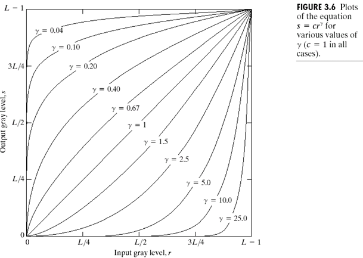

### 3.2.3 幂律（伽马）变换

- 基本形式：
  $$
  s=cr^\gamma
  $$

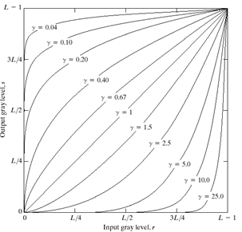

与对数变换情况类似，部分$\gamma$值的幂律曲线将较窄范围的暗色输入值映射到较宽范围的输入值，对高灰度级值也成立。

与对数不同的是，随着$\gamma $值的变换，将简单地得到一族可能的变换曲线

### 3.2.4 分段线性变换函数

- 优点：形式可任意组合
- 缺点：需要更多的用户输入

#### 对比度拉伸

- 这是最简单的分段线性函数之一，可以扩展图像灰度级动态范围。

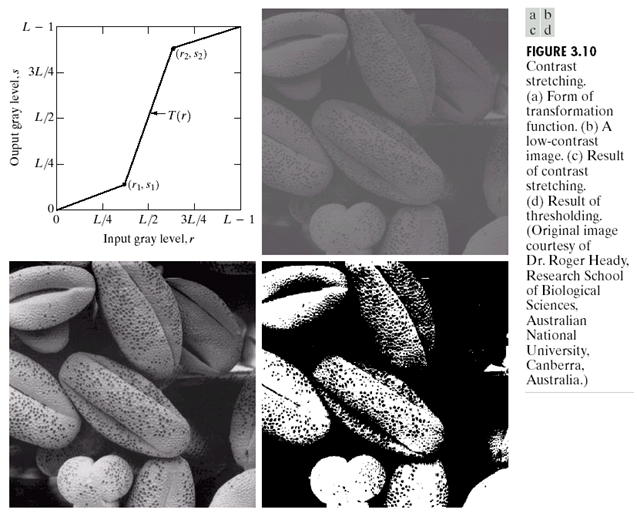

- $$
  若r_1=s_1且r_2=s_2,则变换为一线性函数，将产生一个没有变化的灰度级
  $$

- $$
  若r_1=r_2,s_1=0且s_2=L-1,则变换编程阈值处理函数，并产生一幅二值图像。如图d
  $$

#### 灰度级分层

- 可以突出图像中特定灰度范围的亮度。应用包括增强特征。

- 可以有许多方法实现，但一般都是两种基本方法的变形：

  - 将感兴趣范围内的所有灰度值显示为一个值（如白色），而其他灰度值显示为另一个值（如黑色）。

    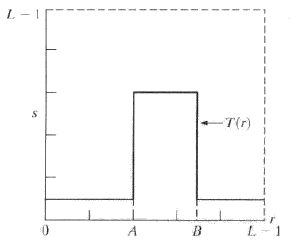

  - 使感兴趣范围的灰度变亮（或变暗）。

    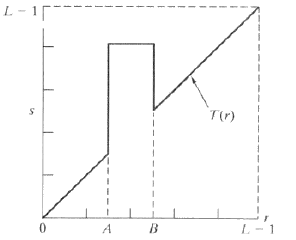

#### 比特平面分层

- 比特平面分层：突出每个像素中特定比特来为整个图像外观做出贡献。

  - 如一幅8比特图像可考虑为由8个1比特平面组成，其中平面1包含图像中所有像素的最低阶比特，而平面8包含图像中所有像素的最高阶比特。

- 高阶比特平面，包含了视觉上很重要的大多数数据；低阶比特平面在图像中贡献了更精细的灰度细节。

- 获得比特平面分层的办法：

  - 可使用变换函数处理输入图像得到二值图像，变换函数如下：

    - 若要获得第n比特平面分层，则遍历图像的每一个像素，像素值用二进制表示。
    - 若像素的第n位为0，则像素灰度值映射为0，若像素第n位为1，则像素灰度值映射为1.

    （同理，若不是得到二值图像，而是得到原n比特图像，则为0时像素灰度值映射为0，为1则映射为该比特下最大值（如8比特图像，则为255））

- 比特平面分层的作用：

  - 对于分析图像中每个比特的相对重要性很有用，可帮助我们确定用于量化该图像的比特数的充分性。
  - 对图像压缩很有用。

## 3.3 直方图处理

- 直方图：
  - 灰度级范围为[0,L-1]的数字图像的直方图是离散函数$h(r_k)=n_k，其中r_k是第k级灰度值，n_k是图像中灰度为r_k的像素个数$
  - 归一化直方图：$p(r_k)=n_k/MN$
    - $p(r_k)$是灰度级$r_k$在图像中出现的概率的一个估计
    - 归一化直方图的所有分量之和应为1
- PDF：概率密度函数

### 3.3.1 直方图均衡

$$
s_k=T(r_k)=(L-1)\sum^k_{j=0}p_r(r_j)=\frac{(L-1)}{MN}\sum^k_{j=0}n_j,k=0,1,2,...,L-1
$$

- $s_k$为均衡化后的灰度值，$r_j$为原图像的灰度值
- $T(r_k)$称为**直方图均衡**或**直方图线性变换**

（书上大篇幅解释了为什么这样的变换可以使得直方图均衡化）

### 3.3.2 直方图匹配（规定化）

- 用于产生处理后有特殊直方图的方法。（可以理解为变换是为了去匹配特定的直方图）

- 方法：

  1. 由输入图像得到$p_r(r)$，并由$s=T(r)=(L-1)\int^r_0p_r(w)dw$求得s的值

  2. 使用$G(z)=(L-1)\int_0^zp_z(t)dt=s$求得变换函数G(z)
  3. 求反变换函数$z=G^{-1}(s)$
  4. 用1.中式对输入图像进行均衡得到输出图像，该图像像素值为s。对均衡后的图像中具有s值的每个像素执行反映射（3.），得到输出图像中的相应像素，处理完的输出图像的PDF即指定的PDF

### 3.3.3 局部直方图处理

- 以一个像素的领域内进行计算（如直方图平衡化）

### 3.3.4 在图像增强中使用直方图统计

令r表示在区间[0,L-1]上代表灰度值的一个离散随机变量：

- r关于其均值的n阶矩定义为：
  $$
  \mu_n(r)=\sum ^{L-1}_{i=0}(r_i-m)^np(r_i)
  $$

  - m是r的均值（平均灰度）

- 二阶矩：
  $$
  \mu_2(r)=\sum^{L-1}_{i=0}(r_i-m)^2p(r_i)
  $$

  - 该表达式也称为**灰度方差**，通常用$\sigma^2$表示

- 均值是平均灰度（平均强度）的度量，二阶矩是图像对比度的度量。

## 3.4 用算术/逻辑操作增强

### 3.4.1 图像减法处理

$g(x,y)=f(x,y)-h(x,y)$

### 3.4.2 图像加法处理

## 3.5 空间滤波基础

- 空间滤波器由以下部分组成：
  - 一个领域（典型地是一个较小的矩形）
  - 对该邻域包围的图像像素执行的预定义操作
- 滤波产生一个新像素，新像素的坐标等于领域中心的坐标，像素的值是滤波操作的结果。
- 滤波器分为：
  - 线性空间滤波器：在图像像素上执行的是线性操作。
  - 非线性空间滤波器：在图像像素上执行的是非线性操作。

## 3.6 平滑空间滤波器

- 用于模糊处理和降低噪声。

### 3.6.1 平滑线性滤波器

- 平滑线性滤波器的输出是：包含在滤波器模板邻域内的像素的简单平均值。也叫**均值滤波器**。（可以归入低通滤波器）
- 平滑滤波器：用滤波器模板确定的邻域内像素的平均灰度值代替图像中每个像素的值。
- 加权均值滤波器：模板并不是都为1
- 模板尺寸越大，图像越模糊，图像细节丢失越多。
- 应用：为了对感兴趣的物体得到一个粗略的描述而模糊一幅图像，使得较小物体的灰度就与背景混合在一起，而较大物体变得像“斑点”而易于检测。

#### 高斯滤波

- 采用高斯函数作为加权函数。

- 使用高斯滤波的原因：

  - 二维高斯函数具有旋转对称性，保证滤波时各方向平滑程度相同
  - 离中心点越远权值越小，确保边缘细节不被模糊。

- $$
  G(x,y)=e^{\frac{x^2+y^2}{2\sigma^2}}=e^{-\frac{x^2}{2\sigma^2}}
  $$

- 设计离散高斯滤波器的方法：

  - 设定$\sigma^2$和n，确定高斯模板权值
  - 整数化和归一化

### 3.6.2 统计排序滤波器

- 是一种非线性空间滤波器。
- 输出：以滤波器包围的图像区域中所包含的像素的排序（排队）为基础，然后使用统计排序结果决定的值**代替中心像素**的值。
- 常见：中值滤波器（对脉冲噪声（椒盐噪声）非常有效，这种噪声是以黑白点的形式叠加在图像上的）

## 3.7 锐化空间滤波

- 主要目的：突出灰度的过渡部分。
- 锐化可用微分来完成，而微分算术的响应强度与图像在该点的突变成程度有关。
- 对一维函数，其一阶微分的基本定义：

$$
\frac{\partial f}{\partial x}=f(x+1)+f(x)
$$

- 二阶微分定义：
  $$
  \frac{\partial ^2f}{\partial x^2}=f(x+1)+f(x-1)+2f(x)
  $$

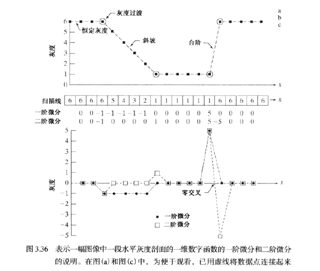

- 一些结论：
  - 一阶微分产生的边缘宽（如：沿斜坡很长一段非0）
  - 二阶微分对细节反应强烈，如细线、孤立点（胁迫起止点为非0）
  - 一阶微分对灰度阶跃反应强烈
  - 二阶微分对灰度阶梯变化产生双响应，在大多数应用中，对图像增强来说，二阶微分比一阶微分好一些

### 3.7.2 使用二阶微分进行图像锐化——拉普拉斯算子

- 关注各向同性滤波器（响应与滤波器作用的图像的突变方向无关，即旋转不变的，即将原图像旋转后进行滤波处理给出的结果与先对图像滤波然后再旋转的结果相同）。

- 拉普拉斯算子是最简单的各向同性微分算子

- 一个二维图像函数的拉普拉斯算子定义为：
  $$
  \nabla ^2f=\frac{\partial^2f}{\partial x^2}+\frac{\partial ^2f}{\partial y^2}
  $$

  - 在x方向上：
    $$
    \frac{\partial ^2f}{\partial x^2}=f(x+1,y)+f(x-1,y)-2f(x,y)
    $$

  - 在y方向上：
    $$
    \frac{\partial ^2f}{\partial y^2}=f(x,y+1)+f(x,y-1)-2f(x,y)
    $$

  - 所以有：
    $$
    \nabla ^2f(x,y)=f(x+1,y)+f(x-1,y)+f(x,y+1)+f(x,y-1)-4f(x,y)
    $$

  该公式可以用下图的滤波模板来实现：

  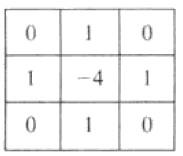

- 对45°增幅的结果是各向同性的：
  $$
  \nabla ^2f(x,y)=f(x+1,y)+f(x-1,y)+f(x,y+1)+f(x,y-1)\\+f(x-1,y+1)+f(x+1,y+1)+f(x-1,y-1)+f(x+1,y-1)-8f(x,y)
  $$
  即下图模板：

  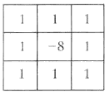

- 使用拉普拉斯对图像增强的基本方法可表示为：
  $$
  g(x,y)=f(x,y)+c[\nabla ^2f(x,y)]
  $$

  - 若模板中心为负数，则常数c=-1，否则c=1

- 图像相减时，可能出现负数，解决方案：（以0~255为例）
  - 方案一：每一像素+255，然后除以2
    - 优点：简单、快速
    - 缺点：无法保证覆盖0~255全范围
  - 方案二：先提取最小值取反后加在差图像中然后用乘每一像素可保证结果

### 3.7.3 反锐化模板与高提升滤波的处理

- **反锐化模板**：将图像的模糊形式从原图像中减去。也叫**反锐化换模**、**非锐化掩蔽**

- 步骤：

  1. 模糊原图像
  2. 从原图像中减去模糊图像（产生的差值图像称为模板）
  3. 将模板加到原图像上

- 公式形式描述：

  - 令$\overline{f}(x,y)$表示模糊图像：
    $$
    g_{mask}(x,y)=f(x,y)+\overline{f}(x,y)
    $$

  - 在原图像上加上该模板的一个权重部分：
    $$
    g(x,y)=f(x,y)+k*g_{mask}(x,y)
    $$

    - 当k=1（包括以下，k>=0）时，得到上面定义的非锐化掩蔽。
    - 当k>1时，该处理称为**高提升滤波**。
    - 当k<1时，则不强调非锐化模板的贡献。

例子如下：

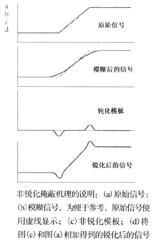

### 3.7.4 使用一阶微分对（非线性）图像锐化——梯度法

- 对于函数$f(x,y)$，f在坐标(x,y)处的梯度定义为二维列向量：
  $$
  \nabla f=grad(f)=
  \left[
  \begin{aligned}
  g_x \\
  g_y
  \end{aligned}
  \right]
  =
  \left[
  \begin{align}
  \frac{\partial f}{\partial x} \\
  \frac{\partial f}{\partial y}
  \end{align}
  \right].
  $$

  - 该向量指出了在位置(x,y)处f的最大变化率的方向。

- 向量$\nabla f$的幅度值（长度）表示为M(x,y)，即
  $$
  M(x,y)=mag(\nabla f)=\sqrt{g_x^2+g_y^2}
  $$

  - 它是梯度向量方向变化率在(x,y)处的值。

  - M(x,y)是与原图像大小相同的图像，它是当x和y允许在f中的所有像素位置变化时产生的。该图像通常称为**梯度图像**（或含义很清楚时，可简称为**梯度**）

  - 为了减少计算量，用下式算近似：
    $$
    M(x,y)\approx |g_x|+|g_y|
    $$

    - 运算简单，但是各向同性就不存在了（只对90°才保持）

#### Roberts交叉梯度算子

- 令中心点$z_5$表示任意位置(x,y)处的$f(x,y)$，$z_1$表示为$f(x-1,y-1)$

- 在Roberts算子中：
  $$
  g_x=(z_9+z_5)和g_y=(z_8-z_6)
  $$

  - 可用以下模板实现：

    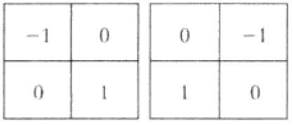

- 梯度图像为：
  $$
  M(x,y)=[(z_9-z_5)^2+(z_8-z_6)^2]^{1/2}
  $$

- 简化运算为：
  $$
  M(x,y)\approx |z_9-z_5|+|z_8-z_6|
  $$

#### Soble算子

- 使用以$z_5$为中心的一个3*3邻域对$g_x$和$g_y$的近似如下：
  $$
  \begin{align}
  & g_x=\frac{\partial f}{\partial x}=(z_7+2z_8+z_9)-(z_1+2z_2+z_3) \\
  & 和 \\
  & g_y=\frac{\partial f}{\partial y}=(z_3+2z_6+z_9)-(z_1+2z_4+z_7)
  \end{align}
  $$
  ​	可用以下模板来实现：

  ​	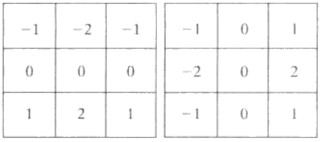

- 中心系数使用权重2的思想是通过突出中心点的作用而达到平滑的目的。

- Roberts算子和Soble算子的模板中的系数总和为0，这正如微分算子的期望值那样，表明灰度恒定区域的响应为0

#### 应用

- 使用梯度可以进行边缘增强。

# 4 频率域滤波

## 4.1 背景

- **傅氏级数**：任何周期函数都可以表示为不同频率的正弦或余弦的和的形式。
- **傅氏变换**：对于非周期函数，则用正线和余弦及加权函数的积分来表示。

## 4.2 傅里叶变换和频率域的介绍

### 4.2.1 一维傅里叶变换及其反变换

#### 离散变量函数

$$
\begin{aligned}
& F(u)=\frac{1}{M}\sum^{M-1}_{x=0}f(x)e^{-j2\pi ux/M}，\\
& 其中u=0,1,2,...,M-1 \\
& f(x)=\sum^{M-1}_{u=0}F(u)e^{j2\pi ux/M}， x=0,1,2,...,M-1
\end{aligned}
$$

#### 连续变量函数的傅立叶变换

$$
f(t)的傅里叶变换：F(\mu )=\int _{-\infty}^\infty f(t)e^{-j2\pi \mu t}dt \\
傅里叶反变换获得f(t)：f(t)=\int_{-\infty}^\infty F(\mu)e^{j2\pi \mu t}d\mu
$$

- 以上被称为傅里叶变换对

欧拉公式，表示为：
$$
F(\mu)=\int^\infty _{-\infty} f(t)[cos(2\pi \mu t)-jsin(2\pi \mu t)]dt
$$
