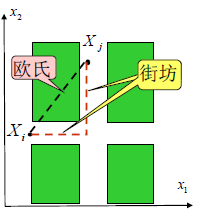
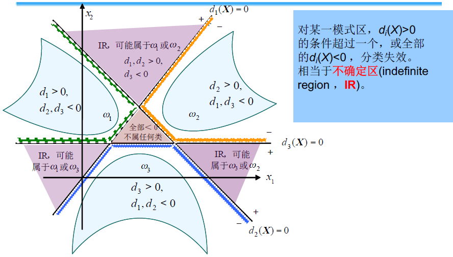
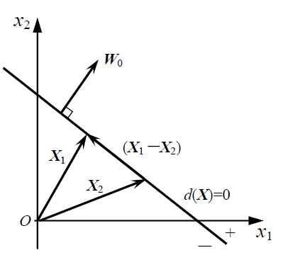
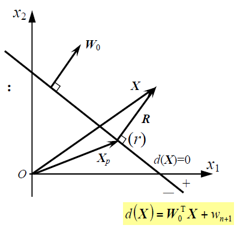

# 2 聚类分析

## 2.2 相似性测度和聚类准则

### 相似性测度

#### 欧氏距离

> 设$X_1$、$X_2$为两个n维模式样本，$X_1=[x_{11},x_{12},...,x_{1n}]^T, X_2=[x_{21},x_{22},...,x_{2n}]^T$ 
>
> 欧氏距离定义为：
>
> $D(X_1,X_2) = ||X_1-X_2||=\sqrt{(X_1-X_2)^T(X_1-X_2)}=\sqrt{(x_{11}-x_{21})^2+...+(x_{1n}-x_{2n})^2}$
>
> 距离越小，越相似。

注意：

- 各特征维上应当是相同的物理量（x11和x21应该是一样的物理量）
- 注意同类物理量的量纲应该一样

#### 马氏距离

> $D^2=(X-M)^TC^{-1}(X-M)$
>
> X：模式向量；M：均值向量；
>
> C：该类模式总体的协方差矩阵

#### 明氏距离

> $D_m(X_i,X_j)=[\sum^n_{k=1}|x_{ik}-x_{jk}|^m]^{1/m}$
>
> 也c称为m-范数。

- 当m=2时，明氏距离为欧氏距离

- 当m=1时，称为“街坊”距离：

  $D_1(X_i,X_j) = \sum^n_{k=1}|x_{ik}-x_{jk}|$

#### 汉明距离

> 设Xi和Xj为n维二值模式（分量取值1或-1）样本向量，则
>
> $D_h(X_i,X_j)=\frac {1}{2}(n-\sum^n_{k=1}x_{ik}·x_{jk})$

- 该式中的**求和式**，表达的是两个二值向量之间，同值分量（即值相等的分量）与不同值分量数之差，该差值越大，则两个向量越不相似。
- 当这个差值取值为：
  - 0：表示两模式向量的各个分量相同
  - n：表示两模式向量的各个分量都不同
  - n/2：表示两模式分量中，取值相同的分量数比取值不同的分量数多n/2

#### 角度相似性函数

> $S(X_i,X_j)=\frac{X^T_iX_j}{||X_i||·||X_j||}$
>
> 即两向量之间夹角的余弦。

#### Tanimoto测度

> 用于0-1型二值特征情况，定义：
>
> $S(X_i,X_j)=\frac{X_i^TX_j}{X^T_iX_i+X^T_jX_j-X^T_iX_j}=\frac{X_i,X_j之间具有某特征的数量}{X_i,X_j中有某种特征的分量总数}$

### 聚类准则

- 确定聚类准则的两种方式：

  - 阈值准则：根据规定的距离阈值进行判断
  - 函数准则：利用聚类准则函数进行判断

- 聚类准则函数：

  $J=\sum^c_{j=1}\sum_{X\in S_j}||X-M_j||^2$

  - c为聚类类别的数目
  - $M_j=\frac{1}{N_j}\sum_{x\in S_j}X$是属于$S_j$集的样本的均值向量，$N_j$为模式类$S_j$中样本数目

  适用于各类样本密集且数目相差不多，而不同类间的样本又明显分开的情况。

## 2.3 基于距离阈值的聚类算法

### 近邻聚类法

- 算法描述
  1. 任取样本Xi作为第一个聚类中心的初始值Z1
  2. 计算样本X2到Z1的欧氏距离D，若D>T，定义一新的聚类分析Z2=X2，否则X2属于以Zi为中心的聚类
  3. 设已有聚类中心Z1, Z2，计算D31和D32，若D31>T且D32>T，则建立第三个聚类中心
  4. 依次类推

### 最大最小距离算法

- 算法描述
  1. 选任意一模式样本作为第一聚类中心Z1
  2. 选择**离Z1距离最远的样本**作为第二聚类中心Z2
  3. 逐个计算各模式样本Xi与已确定的所有聚类中心Zi之间的距离，并选出其中最小的距离。
  4. 在**所有最小距离中选出最大距离**，如该最大值达到$||Z_1-Z_2||$的一定分数比值以上，则相应的样本点取为心得聚类中心
  5. 重复，直到没有新的聚类中心出现为止。
  6. 将剩余样本按最近距离划分到相应的聚类中心对应的类中

### 层次聚类法（系统聚类法、谱系聚类法）

- 算法描述

  1. N个初始模式样本自成一类，即建立N类：

     $G_1(0),G_2(0),...,G_N(0))$

     计算各类之间的距离，得一N*N维距离矩阵D(0)，0表示初始状态

  2. 假设已球的距离矩阵D(n)，找出D(n)中的最小元素，将其对应的两类合并为一类，由此建立新的分类：

     $G_1(n+1),G_2(n+1),...$

  3. 再次计算：经过合并后，各个类别之间的距离，得D(n+1)

  4. 跳至第2步，重复计算及合并

  5. 取距离阈值T，当D(n)的最小分量超过给定值T时，算法停止，所得即为聚类结果；

     若不取阈值，则直到全部样本聚为一类为止，输出聚类的分级树（得到全部可能的聚类结果——谱系聚类）

- 类间距离计算方法

  - 最短距离法：算出分别属于两个聚类中两个样本的欧氏距离，比较所有的欧氏距离，以最小的距离作为类间距离

  - 最长距离法：类比上

  - 中间距离法：若K类由I类和J类合并而成，则H和K类之间的距离为：

    $D_{HK}=\sqrt{\frac{1}{2}D^2_{HI}+\frac{1}{2}D^2_{HJ}-\frac{1}{4}D^2_{IJ}}$

  - 重心法

    $D_{HK}=\sqrt{\frac{n_I}{n_I+n_J}D^2_{HI}+\frac{n_J}{n_I+n_J}D^2_{HJ}-\frac{n_In_J}{(n_I+n_J)^2}D^2_{IJ}}$

  - 类平均距离法

    $D_{HK}=\sqrt{\frac{1}{n_Hn_K}\sum_{i\in H,j\in K}d^2_{ij}}$

    $d^2_{ij}$：H类任一样本Xi和K类任一样本Xj之间的欧氏距离平方

## 2.5 动态聚类法

### K-均值算法

- 算法描述

  1. 任选K个初始聚类中心：$Z_1(1),Z_2(1),...,Z_K(1)$（括号内为迭代的次序号）

  2. 按最小距离原则将其余样本分配到K个聚类中心中的一个

  3. 再次计算各个聚类中心的新向量值$Z_j(k+1)$

  4. 如果$Z_j(k+1) \ne Z_j(k)$，则回到2.，将模式样本逐个重新分类，重复迭代计算。

     如果$Z_j(k+1) = Z_j(k)$，算法收敛，计算完成。

- 根据$J_j-K$关系曲线，曲线拐点对应着接近最优的K值

# 3 判别函数分类法

## 3.1 判别函数

- 统计模式识别：按**任务类型**划分：
  - 聚类分析
  - 判别分析
    - 几何分类法
    - 概率分类法
    - 近邻分类法
- 判别函数定义：直接用来对模式进行分类的决策函数
- 判别函数正负值的确定：是在训练判别函数的权值时**人为确定的**

## 3.2 线性判别函数

- 一般形式：

  $d(X)=w_1x_1+w_2x_2+...+w_nx_n+w_{n+1}=W^T_0X+w_{n+1}$

  式中：$X=[x_1,x_2,...,x_n]^T$，$W_0=[w_1,w_2,...,w_n]^T$：权向量，即参数向量。

- 增广向量形式：

  $d(X)=w_1x_1+w_2x_2+...+w_nx_n+w_{n+1}·1=[w_1 w_2 ... w_n w_{n+1}]\left[\begin{matrix} x_1 \\ x_2 \\...\\x_n\\1 \end{matrix}\right]=W^TX$

### 3.2.2 线性判别函数的性质

1. 两类情况

$$
d(X)=W^TX \left\{
\begin{aligned}
>0,若X\in w_1 \\
<0,若X\in w_2
\end{aligned}
\right.
$$

2. 多类情况

   - 对M个线性可分模式类，$w_1,w_2,...,w_M$，有三种分类方式：

     - $w_i/\overline{w_i}$，是非两分法
     - $w_i/w_j$，成对两分法
     - $w_i/w_j$，成对两分法特例（没有不确定区）

   - **是非两分法**
     $$
     d_i(X)=W^T_iX\left\{
     \begin{aligned}
     >0, 若X\in w_i \\
     <0, 若X\in \overline{w_i}
     \end{aligned}
     \right.   i=1,..., M
     $$

     - 将某个待分类模式X 分别代入M 个类的d (X)中，
       **若只有$d_i(X)>0$，其他$d_j(X)$均<0，则判为$w_i$类**
     - 

   - **成对两分法**

     - 一个判别界面只能分开两个类别，不需要把其余所有的类别都分开。

     - 判决函数：$d_{ij}(X)=W^T_{ij}X$，这里$d_{ji}=-d_{ij}$

       $d_{ij}(X)>0, \forall j\ne i; i,j =1,2,...,M, 若X\in w_i$

     - 在M类模式中，**以i开始的**M-1个判决函数全为正时，$X\in w_i$，其中若有一个为负，则为IR区

     - 能用本方法分类的模式集称为：**成对线性可分的**

     - M类共需要$C^2_M=\frac{M(M-1)}{2!}$ 个判决函数

   - **成对两分法特例（没有不确定区）**

     - 若成对两分法中的判别函数，可以分解为
       $$
       d_{ij}(X)=d_i(X)-d_j(X)
       $$
       时，那么$d_i(X)>d_j(X)$就相当于成对两分法中的$d_{ij}(X)>0$

       此时，对M类情况，等价的判别函数性质为：

       $d_i(X)>d_j(X), \forall j\ne i; i,j =1,2,...,M, 若X\in w_i$

     - 能用本方法分类的模式集称为：**线性可分的**

     - 若在第三种情况下可分，则在第二种情况下也可分，但反之不一定成立

     - 除边界区外，**没有不确定区域**

   - $w_i/\overline{w_i}（是非两分法）与w_i/w_j（成对两分法）$两分法的比较：

     - $w_i/\overline{w_i}$两分法共需要**M**个判别函数，$w_i/w_j$需要M(M-1)/2个
     - 当M>3时，后者需要更多的判别式，但对模式集进行线性可分的可能性要更大一些
       - 一种类别模式$w_j$的分布要比M-1类模式$\overline{w_i}$的分布更为聚集，因
         此$w_i/w_j$两分法受到的限制比$w_i/\overline{w_i}$少，因此线性可分可能性大。

## 3.3 广义线性判别函数

- 广义线性判别的目的：

  - 通过某映射，把模式空间X编程X\*，以便将X空间中非线性可分的模式集变成在X\*空间中的线性可分的模式集

- 非线性多项式判别函数

  - 设一训练用模式集，{X}在模式空间X中线性不可分，非线性多项式判别函数形式如下：

    $d(X)=w_1f_1(X)+w_2f_2(X)+...+w_kf_k(X)+w_{k+1}=\sum^{k+1}_{i=1}w_if_i(X)$

    - $f_i(X)$取什么形式以及d(X)取多少项，取决于非线性边界的复杂程度

- 广义线性函数的模式向量定义为：

  $X^*=[x_1^*,x_2^*,...,x_k^*,1]^T=[f_1(X),f_2(X),...,f_k(X),1]^T$

- 存在的问题：

  - 非线性变换可能非常复杂
  - 维数大大增加，导致维数灾难

## 3.4 线性判别函数的几何性质

### 3.4.1 模式空间与超平面

概念：

- **模式空间**：以n维模式向量X的n个分量为坐标变量的欧氏空间。

- **模式向量**：点、有向线段。

- **线性分类**：用d(X)进行分类，相当于用超平面d(X)=0把模式空
  间分成不同的决策区域。

- **超平面的法向量**：

  - X1,X2在超平面上：

  

  ​	$W_0^T(X_1-X_2)=0$，W0即超平面d(X)的法向量

  ​	**超平面的单位法线向量为U：**

  ​	$U=\frac{W_0}{||W_0||}$，$||W_0||=\sqrt{w_1^2+w_2^2+...+w_n^2}$

  - X不在超平面上：

    

    **判别函数d(X)正比于点X到超平面的代数距离**

    $r=\frac{d(X)}{||W_0||}$

  - X在原点

    $r_0=\frac{w_{n+1}}{||W_0||}$

    **原点在超平面的正负侧位置由阈值权$w_{n+1}$决定**

### 3.4.2 权空间与权向量解

- 概念：

  - **权空间**：以$d(X)=w_1x_1+w_2x_2+...+w_nx_n+w_{n+1}$的权系数为坐标变量的（n+1）维欧氏空间，X为已知。
  - **增广权向量**：点、有向线段

- 线性分类

  设增广样本向量：
  $$
  w_1类：X_{11},X_{12},...,X_{1p} \\
  w_2类：X_{21},X_{22},...,X_{2q}
  $$
  使d(X)将w1和w2分开，需满足：
  $$
  d(X_{1i})>0,i=1,2,...,p \\
  d(X_{2i})<0,i=1,2,...,q
  $$
  g给w2的q个增广模式乘-1，统一为：
  $$
  d(X)>0,其中X=\left\{
  \begin{aligned}
  X_{1i},i=1,2,...,p \\
  -X_{2i},i=1,2,...,q
  \end{aligned}
  \right.
  $$
  这就是**样本的符号规范化**，X：**规范化增广样本向量**

