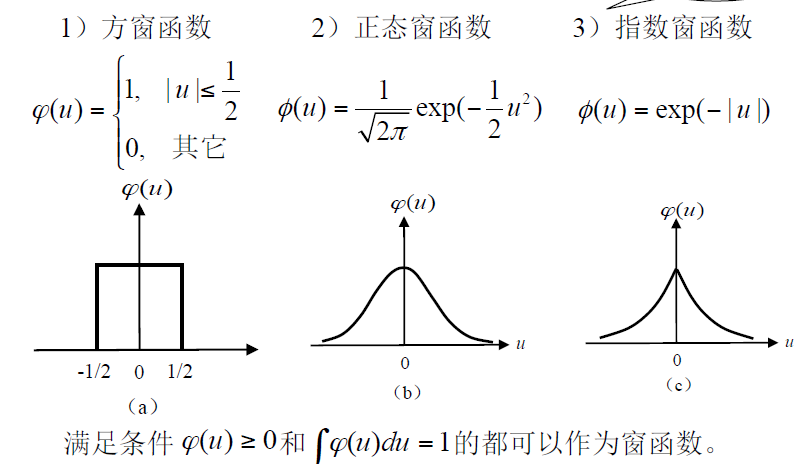

# 4 统计决策分类法

## 4.1 基础

**贝叶斯公式**：
$$
P(A_i|B)=\frac{P(A_i)P(B|A_i)}{\sum^n_{i=1}P(A_i)P(B|A_i)}
$$
**先验概率**：即$P(A_i)$，即未获得观察结果前，对原因Ai在未来产生结果的概率的认定

**后验概率**：即$P(A_i|B)$，获得观察结果B之后，结合先验知识，计算出的对结果B是由原因Ai引起的概率。

**贝叶斯公式的密度函数形式**：
$$
\pi(\theta|x)=\frac{h(x,\theta)}{m(x)}=\frac{p(x|\theta)\pi(\theta)}{\int p(x|\theta)\pi(\theta)d\theta}
$$

## 4.2 贝叶斯决策

### 4.2.1 最小错误率贝叶斯决策

#### 决策规则

> 设有M类模式，若$P(\omega_i|X)=max{P(\omega_i|X)},\ j=1,2,...,M$，则$X\in \omega_i$类

- $P(\omega_i|X)$可用贝叶斯公式求得

##### 对两类问题

- 若$p(X|\omega_1)P(\omega_1)>p(X|\omega_2)P(\omega_2)$，则$X\in\omega_1$
- 若$p(X|\omega_1)P(\omega_1)<p(X|\omega_2)P(\omega_2)$，则$X\in\omega_2$

即：
$$
l_{12}(X)=\frac{p(X|\omega_1)}{p(X|\omega_2)} \begin{matrix}
> \\
<
\end{matrix}
\frac{P(\omega_2)}{P(\omega_1)}，则X\in 
\left\{
\begin{aligned}
\omega_1 \\
\omega_2
\end{aligned}
\right.
$$
对数形式：
$$
h(X)=lnl_{12}(X)=lnp(X|\omega_1)-lnp(X|\omega_2)
\begin{matrix}
> \\
<
\end{matrix}
ln\frac{P(\omega_2)}{P(\omega_1)},\ 则X\in 
\left\{
\begin{aligned}
\omega_1 \\
\omega_2
\end{aligned}
\right.
$$

- $l_{12}$称为**似然比**，$\frac{P(\omega_2)}{P(\omega_1)}$为**似然比阙值**

### 4.2.2 最小风险贝叶斯决策

**基本思想**：

以各种错误分类所造成的条件风险（后验风险）最小为规则，进行分类决策。

#### 决策规则

$$
r_i 为X被判决为每一类的条件均风险，则决策规则： \\
若r_k(X)=min\{r_i(X),\ i=1,...,M\}\ \ 则X\in \omega_k
$$

其中：
$$
r_i(X)=\sum^M_{j=1}L_{ij}(X)P(\omega_j|X)
$$

- i：分类判决后指定的类号
- j：样本实际属于的类别号
-  $L_{ij}$：将自然属性是$\omega_j$类的样本决策为$\omega_i$类时的是非代价，即**损失函数**

##### 多类情况

设有M类，对于任一X对应M个条件风险：
$$
r_i(X)=\sum^M_{j=1}L_{ij}(X)P(\omega_j|X), \ i=1,2,...,M
$$
决策规则：
$$
若r_k(X)<r_i(X), \ i=1,2,...,M;\ i\ne k,则X\in \omega_k
$$

##### 两类情况

$$
\begin{aligned}
& 当样本X被判为\omega_1 类时：\\
& \quad r_1(X)=L_{11}p(X|\omega_1)P(\omega_1)+L_{12}p(X|\omega_2)P(\omega_2) \\
& 当X被判为\omega_2类时：\\
& \quad r_2(X)=L_{21}p(X|\omega_1)P(\omega_1)+L_{22}p(X|\omega_2)P(\omega_2) \\
& 决策规则：\\
& \quad 若r_1(X)<r_2(X) \quad 则X\in \omega_1 \\
& \quad 若r_1(X)>r_2(X) \quad 则X\in \omega_2
\end{aligned}
$$

定义：
$$
l_{12}(X)=\frac{p(X|\omega_1)}{p(X|\omega_2)}，称为似然比 \\
\theta_{12}=\frac{(L_{12}-L_{22})P(\omega_2)}{(L_{21}-L_{11})P(\omega_1)}，称为阈值
$$
**判别步骤：**

1. 定义损失函数$L_{ij}$

2. 计算似然比阈值$\theta_{12}$

3. 计算似然比$l_{12}(X)$

4. 若$l_{12}(X)>\theta_{12}$，则$X\in \omega_1$

   若$l_{12}(X)<\theta_{12}$，则$X\in \omega_2$

   若$l_{12}(X)=\theta_{12}$，任意判决

#### （0-1）损失最小风险贝叶斯决策

即损失函数为：$L_{ii}=0,\ \ L_{ij} = 1,\ i\ne j$

##### 多类情况

判决函数的等价形式：$d_i(X)=p(X|\omega_i)P(\omega_i),i=1,2,...,M$

决策规则的等价形式：
$$
若d_k(X)>d_i(X),i=1,2,...,M,i\ne k \quad ,则X\in \omega_k
$$

##### 两类情况

以多类情况类推

### 4.2.3 正态分布模式的贝叶斯决策

#### 正态分布的最小错误率贝叶斯决策规则

##### 多类情况

具有**M**种模式类别的**多变量**正态密度函数为：
$$
p(X|\omega_i)=\frac{1}{(2\pi)^{n/2}|C_i|^{1/2}}exp\{-\frac{1}{2}(X-M_i)^TC_i^{-1}(X-M_i)\}, \quad i=1,2,...,M
$$
定义：

均值向量：$M_i=E_i[X]$（表明了区域中心的位置）

协方差矩阵：$C_i=E_i[(X-M_i)(X-M_i)^T]$（反映样本分布区域的形状）

**判决则带入最小错误率贝叶斯决策的判别函数中**

##### 两类问题

判别函数：
$$
d_i(X)=lnP(\omega_i)-\frac{1}{2}ln|C_i|-\frac{1}{2}\{(X-M_i)^TC^{-1}_i(X-M_i)\}
$$
决策规则：
$$
若d_1(X)-d_2(X)
\left\{
\begin{aligned}
>0,\quad 则X\in\omega_1 \\
<0,\quad 则X\in \omega_2
\end{aligned}
\right.
$$

## 4.3 贝叶斯分类器的错误率

### 4.3.1 概念

- 错误率：将应属于某一类的模式错分到其他类中的概率。是衡量分类器性能优劣的重要参数。
  $$
  P(e)=\int^\infty_{-\infty}P(e|X)p(X)dX \\
  其中，X=[x_1,...,x_n]^T,P(e|X)是X的条件错误概率
  $$

- 错误率计算或估计方法：

  - 按理论公式计算
  - 计算错误率上界
  - 实验估计

### 4.3.2 错误率分析

#### 两类问题的错误率

有两种错误：

1. 将来自w1类的模式错分到R2中去
2. 将来自w2类的模式错分到R1中去

错误率为两种错误之和：
$$
P(e)=\int_{R_2}P_1(e|X)p(X)dX+\int_{R_1}P_2(e|X)p(X)dX
$$

##### 最小错误率贝叶斯决策规则

用后验概率密度表示为
$$
\left\{
\begin{aligned}
&若\quad P(\omega_1|X)>P(\omega_2|X),\quad 则X\in \omega_1 \\
&若\quad P(\omega_1|X)<P(\omega_2|X),\quad 则X\in \omega_2
\end{aligned}
\right.
$$
判别界面为：
$$
P(\omega_1|X)=P(\omega_2|X) \\
或\quad p(X|\omega_1)P(\omega_1)=p(X|\omega_2)P(\omega_2)
$$

#### 多类情况错误率

总错误率
$$
P(e)=\sum^M_{i=1}\sum^M_{j=1}\int_{R_i}p(X|\omega_j)P(\omega_j)dX
$$
正确分类概率
$$
P(c)=\sum^M_{i=1}\int_{R_i}p(X|\omega_i)P(\omega_i)dX
$$

### 4.3.3 正态分布贝叶斯决策的错误率计算

#### 正态分布的对数似然比

（第5讲 待继续）

## 4.4 耐曼-皮尔逊决策

- 基本思想：限制某一类错误率为一个确定值，求取使得另一类错误率最小的判决规则与判决阈值

- 两类错误率：
  $$
  P_1(e)=\int_{R_2}p(X|\omega_1)dX \;\; \omega_1类模式被误判为\omega_2类的错误率\\
  P_2(e)=\int_{R_1}p(X|\omega_2)dX \;\; \omega_2类模式被误判为\omega_1类的错误率
  $$

- **耐曼-皮尔逊决策出发点：**在$P_2(e)$等于常数的条件下，使$P_1(e)$为最小，以此确定阈值t

### 判别式

- 辅助函数：$Q=P_1(e)+\mu P_2(e)$，式中，$\mu$为待定常数，$P_2(e)$为常数

- **决策规则**：
  $$
  若\frac{p(X|\omega_1)}{p(X|\omega_2)}
  \begin{matrix}
  > \\
  <
  \end{matrix}
  \mu ,则X\in
  \left\{
  \begin{aligned}
  \omega_1 \\
  \omega_2 
  \end{aligned}
  \right.
  $$

- 当$\frac{p(X|\omega_1)}{p(X|\omega_2)}=\mu$时，此时的X为**模式的判决阈值t**，是**似然比阈值$\mu$**的函数$X=t(\mu)$，此即两类模式的**判别界面**

- 求解$\mu$ 值：
  $$
  P_2(e)=\int^{t(\mu)}_{-\infty}p(X|\omega_2)dX
  $$

### 计算步骤

1. 求类概率密度
   $$
   如正态分布的类概率密度函数：\\
   p(X|\omega_i)=\frac{1}{(2\pi)^{n/2}|C_i|^{1/2}}exp\{-\frac{1}{2}(X-M_i)^TC^{-1}_i(X-M_i)\}
   $$

2. 求似然比
   $$
   \frac{p(X|\omega_1)}{p(X|\omega_2)}
   $$

3. 求判别式

   决策规则：
   $$
   若 似然比
   \begin{matrix}
   > \\
   <
   \end{matrix}
   \mu ，则X\in 
   \left\{
   \begin{aligned}
   \omega_1 \\
   \omega_2
   \end{aligned}
   \right.
   $$

4. 求似然比阈值$\mu$
   $$
   P_2(e)=\int_{R_1}p(X|\omega_2)dX
   $$

### 研究算法的三种思路

1. 使总错误率最小：最小错误率贝叶斯决策
2. 使风险（错误引起的平均损失）最小：
   - 最小后验风险贝叶斯决策
   - （0-1）损失最小风险贝叶斯决策
3. 限制一类错误概率，追求另一类错误率最小：耐曼-皮尔逊决策

## 4.5 概率密度函数的参数估计方法

- 当类模式的概率密度函数$p(X|\omega_i)$是未知的时候，需要从已知样本中学习，进行估计
- 概率密度的两类估计方法：
  - 参数估计方法：**已知概率密度函数的形式，而函数的有关参数未知**，通过估计参数来估计概率密度函数
    - 主要的参数估计方法：**最大似然估计、贝叶斯估计**
  - 非参数估计方法：**概率密度函数的形式未知**，直接估计概率密度函数的方法

### 4.5.1 最大似然估计

#### 似然函数

​	从$\omega_i$类中独立地抽取N个样本：$X^N=\{X_1,X_2,...,X_N\}$，称这N个样本的联合概率密度函数$p(X^N|\theta)$为相对于样本集$X^N$的$\theta$的似然函数。
$$
p(X^N|\theta)=p(X_1,X_2,...,X_N|\theta)=\prod^N_{k=1}p(X_k|\theta) \\
——在参数\theta 下观测到的样本集X^N的概率（联合分布）密度
$$

#### 最大似然估计

即使得似然函数极大化的$\theta$值，由$\frac{dp(X^N|\theta)}{d\theta}=0$求得。一般用似然函数的对数计算。

设$\omega_i$类模式的概率密度函数有p个未知参数，记为p维向量$\theta=[\theta_1,\theta_2,...,\theta_p]^T$，此时
$$
lnp(X^N|\theta)=\sum^N_{k=1}lnp(X_k|\theta) \\
\frac{\part}{\part\theta}[\sum^N_{k=1}lnp(X_k|\theta)]=0，即\\
\left\{
\begin{aligned}
&\sum^N_{k=1}\frac{\part}{\part\theta_1}p(X_k|\theta)=0 \\
&\sum^N_{k=1}\frac{\part}{\part\theta_2}p(X_k|\theta)=0 \\
&... \\
&\sum^N_{k=1}\frac{\part}{\part\theta_p}p(X_k|\theta)=0
\end{aligned}
\right.
$$
解以上微分方程即可得到$\theta$的最大似然估计值。

### 4.5.2 贝叶斯估计与贝叶斯学习

- 贝叶斯估计和学习都是将位置参数看作随机参数进行考虑

#### 贝叶斯估计

​	通过似然函数，并利用贝叶斯公式，将随机变量$\theta$的先验概率密度$p(\theta)$转变为后验概率密度$p(\theta|X^N)$，然后根据$\theta$的后验概率密度求出估计量

- 步骤

  1. 确定$\theta$的先验概率密度$p(\theta)$

  2. 由样本集$X^N=\{X_1,X_2,...,X_N\}$求出$p(X^N|\theta)$

  3. 利用贝叶斯公式求出后验概率密度：
     $$
     p(\theta|X^N)=\frac{p(X^N|\theta)p(\theta)}{\int p(X^N|\theta)p(\theta)d\theta}
     $$

  4. 求贝叶斯估计量
     $$
     \widehat{\theta}=\int \theta p(\theta|X^N)d\theta
     $$

#### 贝叶斯学习

​	利用$\theta$的先验概率密度及样本提供的信息求出$\theta$的后验概率密度，根据后验概率密度直接求出类概率密度函数$p(X|\omega_i)$

- 迭代式：
  $$
  p(\theta|X^N)=\frac{p(X_N|\theta)p(\theta|X^{N-1})}{\int p(X_N|\theta)p(\theta|X^{N-1})d\theta}
  $$

- 步骤：

  1. 根据先验知识得到$p(\theta)$的初始估计：$p(\theta)=p(\theta|X^0)$

  2. 用$X_1$对初始的$p(\theta)$进行修改：
     $$
     p(\theta|X^1)=p(\theta|X_1)=\frac{p(X_1|\theta)p(\theta)}{\int p(X_1|\theta)p(\theta)d\theta}
     $$

  3. 给出$X_2$，对用$X_1$估计的结果进行修改

  4. 逐次用样本进行迭代修改

## 4.6 概率密度函数的非参数估计方法

### 基本方法

- 出发点：

  若观察到：N个样本中有k个落入区域R中，则可以合理认为：

$$
\widehat{P}\approx k/N
$$

​	设$p(X)$连续，区域R足够小，且体积为V，$p(X)$在R中没有变化，X是R中的点，则X点概率密度的估计：
$$
\widehat{p}(X)\approx \frac{k/N}{V}
$$

- 存在的问题：
  - 固定V ，样本数增多，则k/N以概率1收敛。但只能得到在某一体积V中的平均估计。
  - N固定，V趋于零，p(X) = 0 或发散到无穷大。没有意义。

- 估计的步骤：

  - 构造一串包含X的区域$R_1,R_2,...,R_N,...$

  - 对$R_1$采用一个样本估计，对$R_2$采用两个样本，...

  - 假定$V_N$是$R_N$的体积，$k_N$是落入$R_N$内的样本数目，$\widehat{p}_N(X)$是$p(X)$的第N次估计，有
    $$
    \widehat{p}_N(X)=\frac{k_N/N}{V_N}
    $$

- 为保证估计合理性，应满足三个条件：
  $$
  1.\;\;lim_{N\rightarrow\infty}V_N=0 \\
  2.\;\; lim_{N\rightarrow\infty}k_N=\infty \\
  3. \;\; lim_{N\rightarrow\infty}k_N/N=0
  $$

- 两种非参数估计法：**Parzen窗法，$k_N$近邻估计法**

### 4.6.2 Parzen窗法

#### 基本概念

$$
设区域R_N:d维超立方体，棱长：h_N,则 \\
V_N=h^d_N \\
定义窗函数\varphi(\mu)=
\left\{
\begin{aligned}
&1,\quad 当|\mu_j|\le \frac{1}{2};j=1,2,..,d \\
&0,\quad 其他
\end{aligned}
\right. \\
当X落入以X_i为中心，体积为V_N的超立方体时：\\
\phi_i(X)=\phi[(X-X_i)/h_N]=1 \\
否则，\phi_i(X)=0 \\
落入超立方体内的样本数为\\
k_N=\sum^N_{i=1}\varphi(\frac{X-X_i}{h_N}) \\
代入\widehat{p}_N(X)=\frac{k_N/N}{V_N}得 \\
\widehat{p}_N(X)=\frac{1}{N}\sum^N_{i=1}\frac{1}{V_N}\varphi(\frac{X-X_i}{h_N})\quad ——Parzen窗法基本公式
$$

- **实质**：

​	窗函数的作用是内插（平滑），样本对估计所起的作用取决于它到X的距离

- $\varphi(\mu)$应满足的两个条件：
  1. $\varphi(u)\ge 0$
  2. $\int\varphi(u)du=1$

#### 窗函数的选择

- 窗宽$h_N$对估计量$\widehat{p}_N(X)$的影响很大，根据经验折中考虑

### 4.6.3 $k_N$-近邻估计法

- 基本思想：使体积为样本密度的函数，而不是样本数N的函数：
  $$
  \widehat{p}_N(X)=\frac{k_N/N}{V_N}
  $$

## 4.7 后验概率密度函数的势函数估计法

- 方法：直接采用后验概率密度$p(\omega_i|X)$进行分类。

- 关键：利用所给的训练样本估计概率密度函数。

- 判别准则：
  $$
  如果p(\omega_i|X)>p(\omega_j|X)\quad \forall j\ne i,则X\in \omega_i
  $$

以下讨论采用势函数直接由训练样本集来迭代估计$p(\omega_i|X)$的方法：

#### 迭代估计$p(\omega_i|X)$的势函数法

$p(\omega_i|X)$可用$\widehat{f}_k(X)$近似代表，$\widehat{f}_k(X)\in[0,1]，k-迭代次数$。$\widehat{f}_k(X)$可由合适的势函数$K(X,X_k)$组成。

势函数确定的两种方法：

- 用对称的有限项多项式展开：
  $$
  K(X,X_k)=\sum^m_{i=1}\varphi_i(X_k)\varphi_i(X)\\
  其中，{\varphi_i(X)}在模式定义域内为正交函数集
  $$

- 一些“双变量$X$和$X_k$的对称函数”，如：
  $$
  K(X,X_k)=exp\{-\alpha||X-X_k||^2\} \\
  K(X,X_k)=\frac{1}{1+\alpha||X-X_k||^2}\\
  式中\alpha为正常数。
  $$

求第i类判别函数的迭代算法：
$$
\begin{aligned}
&从取\widehat{f}_0(X)=0开始。 \\
&第一步：将模式样本X_1送入分类器，发生势函数K(X,X_k)，有 \\
&\widehat{f}_1(X)=
\left\{
\begin{aligned}
\widehat{f}_0(X)+r_1K(X,X_1)=r_1K(X,X_1),若X_1\in\omega_i \\
\widehat{f}_0(X)+r_1K(X,X_1)=-r_1K(X,X_1),若X_1\notin\omega_i
\end{aligned}
\right. \\
&第二步：将X_2送入分类器，它对近似p(\omega_i|X)的函数\widehat{f}_k(X)的影响有三种可能：\\
&① 若X_2\in\omega_i且\widehat{f}_1(X_2)>0，或X_2\notin \omega_i且\widehat{f}_1(X_2)<0,\\
&\quad\quad\quad\quad\quad分类正确，\widehat{f}_2(X)=\widehat{f}_1(X). \\
&② 若X_2\in\omega_i，但\widehat{f}_1(X_2)\le0，\\
&\quad\quad\quad\quad\quad错误分类，\widehat{f}_2(X)=\widehat{f}_1(X)+r_2K(X,X_2). \\
&③ 若X_2\notin\omega_i，但\widehat{f}_1(X_2)\ge0，\\
&\quad\quad\quad\quad\quad错误分类，\widehat{f}_2(X)=\widehat{f}_1(X)-r_2K(X,X_2). \\
&...\\
&第k+1步：送入训练样本X_{k+1}，相应的势函数为K(X,X_{k+1})，亦有类似上述可能和修改方式。

\end{aligned}
$$

- 迭代式中系数$r_k$，为正实数序列，应满足：
  $$
  lim_{k\rightarrow\infty}r_k=0,\quad \sum_{k=1}^\infty r_k=\infty\quad 和\quad \sum^\infty_{k=1}r_k^2<\infty
  $$
  如，可采用调和

**说明：**

1. 与确定性分类器中的势函数法相比较：
   - 相同点：迭代算法的思路完全相同
   - 不同：所取的$r_k$不同。

# 5 特征提取与选择

## 5.2 类别可分性测度

- 类别可分性测度：衡量类别间可分性的尺度
  - 几何分布：类内距离和类间距离
  - 概率分布：类概率密度函数
  - 误判概率：与错误率有关的距离

### 5.2.1 基于距离的可分性测度

#### 类内散布距离和类内散布矩阵

1. $\omega_i$类的类内距离一：类内（样本间）均方两两距离
   $$
   \overline{D_i^2}=E[||X_k-X_l||^2|\omega_i]=E[(X_k-X_l)^T(X_k-X_l)|\omega_i] \\
   其中X_k和X_l：均为同一类模式样本
   $$

   若{$X_i$}中样本相互独立，则：
   $$
   \overline{D_i^2}=2Tr[C_i]=2\sum^n_{k=1}\sigma^2_k
   $$

2. $\omega_i$类的类内距离二：类内（样本间）均方散布距离
   $$
   \overline{D_{w,i}^2}=E[||X_k-M_i||^2\ |\ X_k\in \omega_i] \\
   M_i:第i类的均值向量
   $$

3. 两个类内距离的计算式
   $$
   \overline{D_{w,\ i}^2}=E[||X_k-M_i||^2\ |\ \omega_i]=\frac{1}{n}\sum^{n_i}_{k=1}(X_k^i-M_i)^T(X_k^i-M_i) \\
   \overline{D^2_w}=\sum^c_{i=1}P(\omega_i)D_{w,i}^2=\sum^c_{i=1}P(\omega_i)[\frac{1}{n}\sum^{n_i}_{k=1}(X^i_k-M_i)^T(X^i_k-M_i)] \\
   \overline{D^2_i}=E[{(X_k-X_l)^T(X_k-X_l)|\omega_i}]=\frac{1}{n_i(n_i-1)}\sum^{n_i}_{k=1}\sum^{n_i}_{l=1,l\ne k}(X^i_k-X^i_l)^T(X_k^i-X_l^i)
   $$

4. 类内散布矩阵：表示各样本点围绕类均值的散布情况——即第i类分布的**协方差矩阵**：
   $$
   S_{w,i}=E[(X-M_i)(X-M_i)^T|\omega_i]=\frac{1}{n}\sum^{n_i}_{k=1}(X_k^i-M_i)(X_k^i-M_i)^T \\
   可知，\overline{D^2_{w,i}}=Tr(S_{w,i}) \\
   计算： \\
   C=\frac{1}{n}\sum^n_{i=1}X_iX^T_i-MM^T
   $$
   **特征选择和提取的结果应使类内散布矩阵的迹越小越好**

#### 类间散布距离和类间散布矩阵

1. 类间距离一：各模式类均值向量之间**距离平方的加权和**
   $$
   \overline{D^2}=\frac{1}{2}\sum^c_{i=1}P(\omega_i)\sum^c_{j=1}P(\omega_j)||M_i-M_j||^2
   $$

2. 类间距离二：各模式类均值向量与总体均值向量之间距离平方的加权和——类间均方散布距离
   $$
   \overline{D_b^2}=\sum^c_{i=1}P(\omega_i)(M_i-M_0)^T(M_i-M_0) \\
   其中，M_0:所有c类模式的总体均值向量
   $$

3. 类间散布矩阵：表示c类模式在空间的散布情况：
   $$
   S_b=\sum^c_{i=1}P(\omega_i)(M_i-M_0)(M_i-M_0)^T
   $$
   类间散布距离和类间散步矩阵的关系：
   $$
   \overline{D_b^2}=Tr(S_b)
   $$
   **类间散布举证的迹越大越有利于分类。**

#### 多类模式向量间的总体距离和总体散布矩阵

##### 两类情况的距离

$$
设\omega_1类有q个样本，\omega_2类中有p个样本，则 \\
两个类之间的距离=p\times q个点间距离的平均值
$$

##### 多类情况的总体距离

1. 多类模式向量间的总体均方距离：
   $$
   J_d=\frac{1}{2}\sum^c_{i=1}P(\omega_i)\sum^c_{j=1}P(\omega_j)\frac{1}{n_in_j}\sum^{n_i}_{k=1}\sum^{n_j}_{l=1}D^2(X_k^i,X_l^j) \\
   其中，n_i和n_j：\omega_i和\omega_j类的样本数； \\
   D^2(X^i_k,X_l^j):X_k^i和X_l^j间欧氏距离的平方
   $$

2. 总体均方距离的另一种形式：
   $$
   J_d=\sum^c_{i=1}P(\omega_i)[\frac{1}{n}\sum^{n_i}_{k=1}(X_k^i-M_i)^T(X_k^i-M_i)]+\sum^c_{i=1}P(\omega_i)[(M_i-M_0)^T(M_i-M_0)] \\
   =\overline{D_w^2}+\overline{D_b^2} \\
   即： 多类模式向量之间的总体均方距离=
   \left\{
   \begin{aligned}
   模式类内散&布距离加权和 \\
   & + \\
   模式类间散&布距离加权和
   \end{aligned}
   \right.
   $$

3. 多类情况的散布矩阵：

   - 多类类间散布矩阵：

   $$
   S_b=\sum^c_{i=1}P(\omega_i)(M_i-M_0)(M_i-M_0)^T
   $$

   - $\omega_i$类内散布矩阵：
     $$
     S_{w,i}=E[(X-M_i)(X-M_i)^T|\omega_i]=\frac{1}{n}\sum^{n_i}_{k=1}(X_k^i-M_i)^T
     $$

   - 多类类内散布矩阵：
     $$
     S_w=\sum^c_{i=1}P(\omega_i)\frac{1}{n}\sum^{n_i}_{k=1}(X_k^i-M_i)(X_k^i-M_i)^T
     $$

   - 多类总体散布矩阵：
     $$
     S_t=E[(X-M_0)(X-M_0)^T]=S_b+S_w
     $$

4. 多类模式的总体均方距离$J_d$与总体散布矩阵$S_t$的关系：
   $$
   J_d=tr(S_t)=tr(S_b+S_w)
   $$

### 6.2.2 基于概率分布的可分性测度

#### 散度

##### 散度定义

散度=两类间对数似然比期望值之和
$$
\omega_i类对\omega_j类的散度定义为J_{ij}: \\
J_{ij}=I_{ij}+I_{ji}=\int_X[p(X|\omega_i)-p(X|\omega_j)]ln\frac{p(X|\omega_i)}{p(X|\omega_j)}dX
$$
散度表示了区分$\omega_i$类和$\omega_j$类的总的平均信息。

##### 散度性质

1. $J_{ij}=J_{ji}$

2. $J_{ij}$为非负，即$J_{ij}\ge 0$

   - $J_{ij}$越大，$p(X|\omega_i)$与$p(X|\omega_j)$相差越大

3. 错误率分析中，两类概率密度曲线交叠越少，错误率越小

4. 散度具有独立可加性，即当各分量相互独立时，有：
   $$
   J_{ij}(X)=J_{ij}(x_1,x_2,...,x_n)=\sum^n_{k=1}J_{ij}(x_k)
   $$

5. 加入独立的新特性不会使散度减小

##### 两个等方差正态分布模式类的散度

$$
\omega_i类和\omega_j类的概率密度函数为：\\
p(X|\omega_i)\sim N(M_i,C) \\
p(X|\omega_i)\sim N(M_i,C) \\
则，\omega_i类对\omega_j类的散度为 \\
J_{ij}=(M_i-M_j)^TC^{-1}(M_i-M_j)
$$

## 5.3 基于类内散布矩阵的单类模式特征提取

- 特征提取的目的：

  - 对某类模式：压缩模式向量的维数
  - 对多类分类：压缩模式向量的维数；保留类别间的鉴别信息，突出可分性

- 特征提取方法：
  $$
  若\{X\in \omega_i\}是\omega_i类的一个n维样本集，将X压缩成m维的向量X^*\\——寻找一个m\times n矩阵A，做变换：\\
  X^*=AX
  $$

### 确定变换矩阵

- 根据类内散布矩阵确定变换矩阵A

$$
设\omega_i类模式的均值向量为M，类内散布矩阵（协方差矩阵）为C：\\
M=E\{X\} \\
C=E\{(X-M)(X-M)^T\} \\
设矩阵C的n个特征值分别为\lambda_1,\lambda_2,...,\lambda_n，其分别对应的特征向量为u_k,则u_k满足 \\
Cu_k=\lambda_ku_k \ \ 的一个非零解 \\
选择n个归一化特征向量作为A的行，则A为归一化正交矩阵：\\
A=
\begin{bmatrix}
u_1^T \\
u_2^T \\
... \\
u_n^T
\end{bmatrix}
\quad\quad 
A^T=[u_1\ u_2 \ ...\ u_n]
\quad\quad
AA^T=I
$$

​	**$X^*$的第k个分量的方差等于未变换时C的特征值$\lambda_k$**

