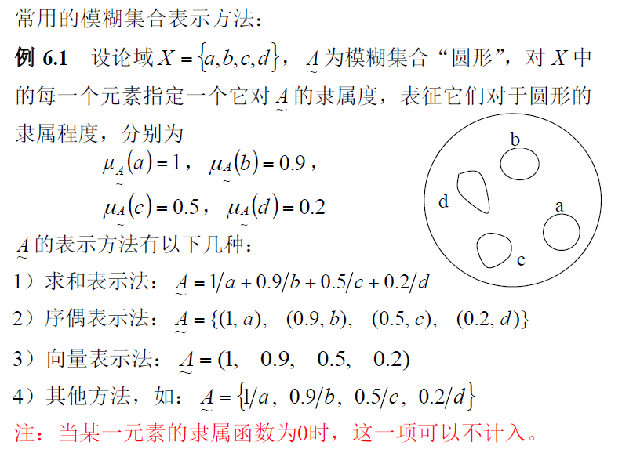

# 6 模糊模式识别

## 6.2 模糊集合

### 6.2.1 模糊集合的定义

​	给定论域X上的一个模糊子集A（书上的定义有个下划波浪线），是指：对于任意$x\in X$，都确定了一个数$\mu_A(x)$，称$\mu_A(x)$为x对A的**隶属度**，且$\mu_A(x)\in [0,1]$

​	映射$\mu_A(x): X\rightarrow [0,1],\ x\ a\ \mu_A(x)$，叫做A的**隶属函数，或从属函数**。

说明：

- 经典集合+隶属函数$\Rightarrow $模糊集合。一般用字母表示经典集合，用大写字母下加“~”号表示模糊集合。

- 隶属函数$\mu_A(x)$用于刻画模糊集合A中的元素对A的隶属程度（隶属度），其值越大，x隶属于模糊集合A的程度就越高。

- 当$\mu_A(x)$的值域[0,1]变为集合{0,1}时，模糊集合退化为经典集合。

- 当x为多变量，即$x=\{x_1,x_2,...,x_n\}$时，隶属函数通常定义为
  $$
  \mu_A(x)=\mu_{A(1)}(x_1)*\mu_{A(2)}(x_2)*...*\mu_{A(n)}(x_n) \\
  A(1),A(2),...,A(n)对应于各变量的模糊子集
  $$

### 6.2.2 相关概念

- **核**：模糊集合A的核为：(A是模糊集合)
  $$
  Ker\; A=\{X|\mu_A(x)=1\}
  $$
  即：是隶属度为1的元素组成的经典集合

  **正规模糊集：**模糊集合的核是非空的；

  **非正规模糊集：**模糊集合的核是空的。

- **支集**：模糊集合A的支集为：
  $$
  Supp\ A =\{X|\mu_A(x)>0\}
  $$
  即：是隶属度大于0的元素组成的经典集合。

- **模糊集合A的边界**：$(Supp\ A-Ker\ A)$称为模糊集合A的边界。
- **模糊幂集**
  - 模糊集合A的模糊子集组成的集合$F(A)$称为**“模糊幂集”**。
  - 模糊集合的幂集可以为无穷集合

### 6.2.3 模糊集合的表示

#### 求和表示法

- 适用于离散域论域
  $$
  设X=\{x_1,x_2,...,x_n\}为论域，A为X上的一个模糊集合。 \\
  A=\sum^n_{i=1}\mu_A(x_i)/x_i
  $$

#### 积分表示法

- 适用于任何种类的论域，特别是连续论域
  $$
  A=\int _X(\mu_A(x)/x)
  $$

### 6.2.4 隶属函数的确定

常用形式：

- S型函数：从0到1单调增长。
- $\pi$型函数：中间高两边低的函数。

几种隶属函数的构造与确定方法：

1. 简单正规模糊集合隶属函数的构成
   - 简单正规模糊集合A：含有且只含有一点$x_0$使$\mu_A(x_0)=1$
   - 隶属函数的构成：

$$
已知：A的核为x_0;x_0的两边分别有点x_1和x_2,使得\mu_A(x_1)=0,\\ 
\mu_A(x_2)=0,当x_1<x<x_2时，\mu_A(x)>0。论域为实数域。
$$

2. 模糊统计法
   $$
   x_0对A的隶属频率=\frac{x_0\in A的次数}{n} \\
   随着n的增大，隶属频率呈现稳定性，所在的稳定值叫隶属度。\\
   \mu_A(x_0)=lim\frac{x_0\in A的次数}{n}
   $$

3. 二元对比排序法

   - 择优比较法

   - 优先关系定序法

     设对象$x_1,x_2,...,x_n$，按某种特性排除优劣次序。定义$c_{ij}$表示$x_i$比$x_j$优越的成分，称作$x_i$对$x_j$的优先选择比，要求：
     $$
     \begin{aligned}
     &1. c_{ii}=0,0\le c_{ij}\le 1; \\
     &2. c_{ij}+c_{ji}=1.
     \end{aligned}
     $$
     得优先关系矩阵$C=(c_{ij})$

     取阈值$\lambda\in[0,1]$，得到截矩阵$C_{\lambda}=(c_{ij}^\lambda)$，其中
     $$
     c_{ij}^\lambda=
     \left\{
     \begin{aligned}
     1,c_{ij}\ge\lambda \\
     0,c_{ij}\le \lambda
     \end{aligned}
     \right.
     $$
     令$\lambda$从1逐渐下降到0，若首次出现截矩阵中的**第i行元素，除对角线元素外均为1**，则称$x_i$对其他元素的优越成分一致地超过$\lambda$，称其为**第一优越元素**。除去第一优越元素，得新的优先关系矩阵，同理得第二优越元素，直到将全体元素排序完毕。

4. 推理法

5. 专家评分法

### 6.2.5 模糊集合的运算

#### 基本运算

两个模糊子集间的运算：**逐点对隶属函数作相应的运算**，得到新的隶属函数。此过程中，论域保持不变。

定义以下几个集合关系：

1. 两个模糊子集相等：
   $$
   若\forall x\in X，均有\mu_A(x)=\mu_B(x)，则称A=B
   $$

2. 包含：
   $$
   若\forall x\in X，均有\mu_A(x)\le\mu_B(x)，则称B包含A（A\subseteq B）
   $$

3. 补集：
   $$
   若\forall x\in X，均有\mu_{\overline{A}}(x)=1-\mu_A(x)，则称\overline{A}是A的补集
   $$

4. 空集：
   $$
   若\forall x\in X，均有\mu_A(x)=0，则称A为空集
   $$

5. 全集：
   $$
   若\forall x\in X，均有\mu_A(x)=1，则称A为全集，记作\Omega
   $$

6. 并集：
   $$
   若\forall x\in X，均有\mu_C(x)=max(\mu_A(x),\mu_B(x))，则称C为A与B的并集
   $$

7. 交集：
   $$
   若\forall x\in X，均有\mu_C(x)=min(\mu_A(x),\mu_B(x))，则称C为A与B的交集
   $$

#### 运算的基本性质

1. 自反律：$A\subseteq A$

2. 反对称律：$若A\subseteq B,B\subseteq A，则A=B$

3. 交换律

4. 结合律

5. 分配律

6. 传递律

7. 幂等律：$A\cup A=A,\quad A\cap A=A$

8. 吸收律：$(A\cap B)\cup A=A,(A\cup B)\cap A=A$

9. 徳·摩根律（对偶律）

10. 双重否定律（对合律）

11. 定常律：

    $A\cup \Omega=\Omega,\quad A\cap \Omega=A$

    $A\cup \emptyset=A,\quad A\cap \emptyset=\emptyset$

12. **一般的互补律不成立**：$A\cup \overline{A}\ne \Omega,\quad A\cap \overline{A}\ne \empty$

### 6.2.5 模糊集合与普通集合的相互转化

- **截集**：

  设给定模糊集合A，论域X，对任意$\lambda\in[0,1]$，称，
  $$
  \textbf{普通集合}A_\lambda=\{x|x\in X,\mu_A(x)\ge \lambda\}
  $$
  为A的$\lambda$截集（隶属度大于$\lambda$的成员集合）

- 截集的三个性质：

  - $(A\cup B)_\lambda=A_\lambda\cup B_\lambda$
  - $(A\cap B)_\lambda=A_\lambda\cap B_\lambda$
  - $若\lambda,\mu\in[0,1],且\lambda\le \mu,则A_\mu\subseteq A_\lambda$

## 6.3 模糊关系与模糊矩阵

### 6.3.1 模糊关系定义

设X,Y是两个论域，称$X\times Y$的一个模糊子集R为从X到Y的一个模糊关系，记作：
$$
X\xrightarrow{R}Y
$$
模糊关系R的隶属函数$\mu_R$为
$$
\mu_R:X\times Y\rightarrow [0\ \ 1]
$$
$\mu_R(x_0,y_0)$：是$(x_0,y_0)$具有关系R的程度

### 6.3.2 模糊关系的表示

1. 用模糊矩阵表示：
   - 对于矩阵$R=(r_{ij})_{n\times m}$，若其所有元素满足$r_{ij}\in[0,1]$，则称R为模糊矩阵，其中$r_{ij}=\mu_R(x_i,y_j)$

2. 用有向图表示
   - 有向图的路径标值表示隶属度

### 6.3.3 模糊关系的建立

步骤：

1. 正规化

   - 极值标准化公式：
     $$
     x=\frac{x'-x'_{min}}{x'_{max}-x'_{min}} \\
     当x'=x'_{max}时，x=1；\\
     当x'=x'_{min}时，x=0； \\
     其他，取[0,1]之间的值。
     $$

2. 计算$r_{ij}$，确定模糊关系R的矩阵R。

   计算$r_{ij}$的常用方法：

   - 欧氏距离法
     $$
     r_{ij}=\sqrt{\frac{1}{m}\sum^m_{k=1}(x_{ik}-x_{jk})^2} \\
     x_{ik},x_{jk}：分别为第i个对象和第j个对象的第k个因子的值。 \\
     m:因子个数
     $$

   - 内积法
     $$
     r_{ij}=
     \left\{
     \begin{aligned}
     1,\quad 当i=j \\
     \sum^m_{k=1}\frac{x_{ik}·x_{jk}}{M},\quad 当i\ne j
     \end{aligned}
     \right. \\
     M:正数，满足
     M\ge max\sum^m_{k=1}(x_{ik}·x_{jk})
     $$

   - 相关系数法
     $$
     r_{ij}=\frac{\sum^m_{k=1}|x_{ik}-\overline{x_i}||x_{jk}-\overline{x_j}|}{\sqrt{\sum^m_{k=1}{x_{ik}-\overline{x_i}^2}}·\sqrt{\sum^m_{k=1}{x_{jk}-\overline{x_j}^2}}} \\
     其中，\overline{x_i}=\frac{1}{m}\sum^m_{k=1} {x_{ik}},\quad \overline{x_j}=\frac{1}{m}\sum^m_{k=1}{x_{jk}}
     $$

   - 最大最小法
     $$
     r_{ij}=\frac{\sum^m_{k=1}min(x_{ik},x_{jk})}{\sum^m_{k=1}max(x_{ik},x_{jk})}
     $$

   - 主观评定法

### 6.3.4 模糊关系和模糊矩阵的运算

#### 并、交、补运算

- R与S的并运算记为$R\cup S$，隶属函数为$\mu_{R\cup S}(x,y)=\mu_R(x,y)\vee \mu_S(x,y)$（取大值）
- R与S的交运算记为$R\cap S$，隶属函数为$\mu_{R\cap S}(x,y)=\mu_R(x,y)\wedge \mu_S(x,y)$（取小值）
- R的补运算记为$\overline{R}$，隶属函数定义为$\mu_\overline{R}(x,y)=1-\mu_R(x,y)$

#### 模糊关系的倒置与模糊矩阵的转置

- 模糊关系的倒置
  $$
  设R\in X\times Y,则R的倒置R^T\in Y\times X是指 \\
  \mu_{R^T}(y,x)=\mu_R(x,y)
  $$

- 模糊矩阵的转置（同一关系的不同表达）
  $$
  设R=(r_{ij})_{n\times m}，则称R^T=(r_{ij}^T)_{m\times n}是R的转置矩阵，其中\\
  r_{ij}^T=r_{ji},(1\le i\le m,1\le j\le n)
  $$

#### 截矩阵与截关系

$$
对任意\lambda \in [0,1]，记为R_{\lambda}=(r_{ij}^\lambda)，其中r_{ij}^\lambda=
\left\{
\begin{aligned}
1,r_{ij}\ge \lambda \\
0,r_{ij}\le \lambda

\end{aligned}
\right. \\
称R_\lambda为R的\lambda截矩阵，它所对应的关系叫R的截关系。
$$

#### 模糊关系合成与模糊矩阵合成

$$
设论域X、Y、Z，Q和R为两个模糊关系，且Q\in X\times Y,R\in Y\times Z，\\
定义Q对R的合成为X到Z的一个模糊关系Q\circ R，它具有隶属函数 \\
\mu_{Q\circ R}(x,z)=\vee(\mu_Q(x,y)\wedge \mu_R(y,z)) \\
(类似于矩阵相乘，\vee相当于+，\wedge相当于*) \\
(先取小，再取大)
$$

### 6.3.5 模糊关系的三大性质

#### 自反性

$$
对\forall x\in X若存在\mu_R(x,x)=1，则称R满足自反性。其相应矩阵R称自反模糊矩阵。
$$

#### 对称性

$$
对\forall(x,y)\in X\times X,若存在\mu_R(x,y)=\mu_R(y,x),则称R满足对称性。\\
其相应矩阵R称对称模糊矩阵，满足R^T=R
$$

#### 传递性

$$
对\forall(x,y),(y,z),(x,z)\in X\times X,若存在： \\
\mu_R(x,y)\ge \lambda,\mu_R(y,z)\ge \lambda时，\mu_R(x,z)\ge\lambda成立，\\
则称R满足传递性。其相应矩阵R称为传递模糊矩阵。满足\\
R(x,z)\supseteq R(x,y)\circ R(y,z)
$$

#### 模糊等价关系和模糊相似关系

- 若R具有**自反性**和**对称性**，则称R为**模糊相似关系**。

  若R具有**自反性、对称性和传递性**，则称R为**模糊等价关系**。

- 在应用模糊关系分类时，必须保证模糊关系是等价的。这时可利用截矩阵直接进行分类。

## 6.4 模糊模式分类的直接方法和间接方法

### 6.4.1 直接方法——隶属原则

- 直接计算样品的隶属度，根据**隶属度最大**原则进行分类。

### 6.4.2 间接方法——择近原则

#### 模糊集合间的距离

$$
设论域X=\{x_1,x_2,...,x_n\}，A、B为X中的模糊集合，p为正实数，则定义\\
d_M(X,B)=(\sum^n_{i=1}|\mu_A(x_i)-\mu_B(x_i)|^p)^{1/p} \\
为模糊集合A与B的\textbf{明可夫斯基距离}。
$$

- 当p=1时，称为**海明距离，或线性距离**，记为$d_H(A,B)$
  $$
  d_H(A,B)=\sum^n_{i=1}|\mu_A(x_i)-\mu_B(x_i)|
  $$

- 当p=2时，称为**欧几里得距离** ，记为$d_E(A,B)$,
  $$
  d_E(A,B)=\sqrt{\sum^n_{i=1}|\mu_A(x_i)-\mu_B(x_i)|^2}
  $$

#### 贴近度

$$
\begin{aligned}
&令A,B,C为论域X中的模糊集合，若映射\\
&\sigma:X\times X\rightarrow[0,1] \\
&具有性质：\\
&1. \sigma(A,A)=1;\\
&2. \sigma(A,B)=\sigma(B,A) \\
&3. 对任意的x\in X,由\mu_A(x)\le \mu_B(x)\le \mu_C(x)或\mu_A(x)\ge \mu_B(x)\ge
\mu_C(x)\\
&可得\sigma(A,C)\le\sigma(B,C),则称\sigma(A,B)为A与B的贴近度。(即保证越贴近，\sigma 越大)
\end{aligned}
$$

- 两种常用贴近度：

  1. **距离贴近度**
     $$
     \sigma(A,B)=1-C[d(A,B)]^\alpha \\
     C和\alpha :适当选择的参数；\\
     d(A,B)：不同的距离。
     $$
     当d(A,B)为海明距离时，即为**海明贴近度**，定义为
     $$
     \sigma_H(A,B)=1-\frac{1}{n}\sum^n_{i=1}|\mu_A(x_i)-\mu_B(x_i)|
     $$
     n：集合中元素的个数。

  2. **格贴近度**
     $$
     \sigma(A,B)=\frac{1}{2}[A·B+(1-A\odot B)]
     $$
     其中，A·B称为A与B的内积，A⊙B称为A与B的外积。
     $$
     内外积定义：\\
     A·B=\vee[\mu_A(x_i)\wedge \mu_B(x_i)] （先选小的，再选大的）\\
     A\odot B=\wedge [\mu_A(x_i)\vee \mu_B(x_i)]（先选大的，再选小的）
     $$

#### 择近原则

$$
设论域X中有n个已知类别模糊子集A_1,A_2,...,A_n,若有i\in\{1,2,...,n\}使得 \\
\sigma(B,A_i)=max\sigma(B,A_j)，或\\
d(B,A_i)=mind(B,A_j) \\
则称相对于A_1,A_2,...,A_{i-1},A_{i+1},...,A_n而言（没有A_n），B与A_i最接近，B归入A_i模式类。
$$

（即**贴近度最大**或**距离最小**，则为该类）