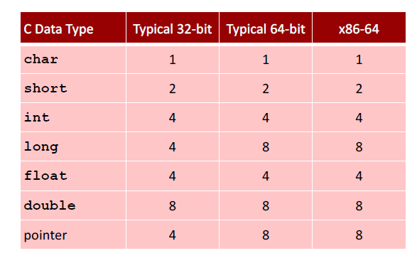
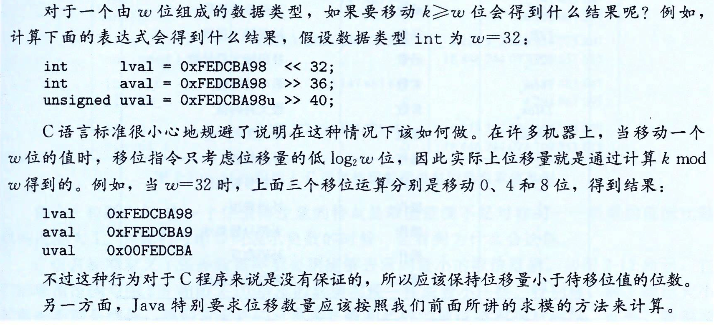
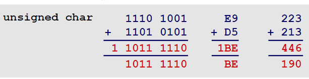
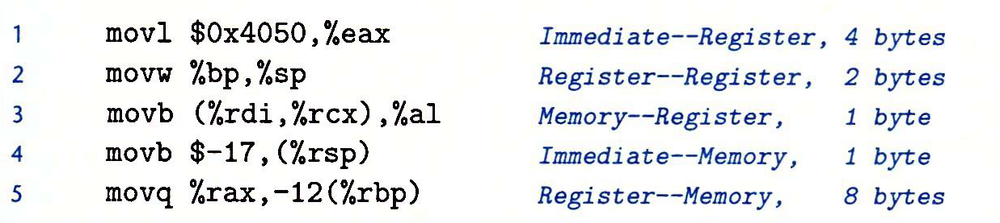

# 02 bits-ints-part1

## 2.1 信息存储

### 2.1.1 十六进制表示法

- 表示
- 与二进制、十进制之间的转换

### 2.1.2 字数据大小

- 每台计算机都有一个字长，指明指针数据的标称大小
  - 对于一个字长为$w$位的及其而言，虚拟地址的范围为$0\sim 2^w-1$
  - 32位字长机器，64位字长机器




### 2.1.3 寻址和字节顺序

（03-bits-ints-part2 P.32）

- 多字节对象被存储为连续的字节序列，对象的地址为所使用字节中最小的地址

  - 如：假设一个类型为int（32位表示）的变量x的地址为0x100，即&x=0x100，那么x的4个字节将被存储在内存的0x100, 0x101,0x102, 0x103

- 排列一个对象的字节的两个通用的规则：

  - 大端法：在内存中，按照从最低有效字节到最高有效字节的顺序存储对象

    - 假设int变量x，位于地址0x100，十六进制为0x01234567：

    

    - 使用大端的处理器：Sun（Oracle SPARC），PPC Mac，Internet

  - 小端法：在内存中，按照从最高有效字节到最低有效字节的顺序存储对象

    

    - 使用小端的处理器：x86，在Android、iOS和Linux上运行的ARM处理器

  - 许多新的微处理器是双端法：即可以把它们配置成作为大端或小端的机器运行。

### 2.1.4 表示字符串

（03-bits-ints-part2 P.42）

- C语言中字符串被编码为一个以null（其值为0）字符结尾的字符数组，每个字符都由标准编码来表示，最常见是ASCII字符码。
  - 0对应的ascii码为：0x30
  - 数字i的ascii码为：0x30+i
  - 终止字节：0x00

### 2.1.5 表示代码

（03-bits-ints-part2 P.43）

- 不同的机器类型使用不同的且不兼容的指令和编码方式
- 二进制代码是不兼容的，很少能在不同机器和操作系统组合之间移植

### 2.1.6 布尔代数

- 布尔代数运算：and（&）、or（|）、not（~）、Xor（^）


### 2.1.8 C语言逻辑运算

- 逻辑运算认为所有非零的参数都表示TRUE，参数0表示FALSE，返回1或0


- 逻辑运算和对应的位级运算的另一个区别是：如果对第一个参数求值就可以确定表达式的结果，那么逻辑运算符就不会对第二个参数求值。
  - 表达式a&&5/a不会造成被0除，p&&p++不会导致间接引用空指针

### 2.1.9 C语言移位运算

- 移位运算是从左到右可结合的
  - x<<j<<k等价于：(x<<j)<<k
- 左移：向左移动k位，丢弃最高的k位，并在右端补k个0
- 右移：分为逻辑右移和算术右移
  - 逻辑右移：在左端补k个0
  - 算术右移：在左端补k个最高有效位的值（有符号整数数据很有用）


- C语言没有明确定义对有符号数使用哪种类型的右移，但几乎所有的编译器/机器组合都对有符号数使用算术右移
- 对无符号数，右移必须是逻辑的



- 当$k\le0 $位时，左右移位只看k的二进制的最后5位（32位系统），如：

  ```C++
  int a = 15;
  int b = a<<-1;
  int c = a<<-2;
  
  /*
  输出：
  a = 000000000000000000000000000001111
  b = 100000000000000000000000000000000（-1的最后五位为11111，所以左移31位）
  c = 110000000000000000000000000000000（-2的最后五位为11110，所以左移30位）
  */
  ```


- 加法（减法）优先级比移位运算高


## 2.2 整数表示

### 2.2.1 整型数据类型

- 32位及其上各类型整型数的取值范围：


### 2.2.2 无符号数编码

### 2.2.3 有符号数编码

- 补码编码
- 求反加一，或者可以如下理解：


- 取值范围：
  - 无符号数：
    - UMin = 0 （00...00）
    - UMax = $2^w-1$（111....11）
  - 有符号数：
    - TMin = $-2^{w-1}$（100...0）
    - Tmax = $2^{w-1}-1$（011...1）
  - 互相之间的关系
    - |TMin| = TMax+1
    - UMax = 2*TMax+1

### 2.2.4 有符号数和无符号数之间的转换


### 2.2.5 C语言中的有符号数与无符号数

- 大多数数字默认为是有符号的，要创建无符号常量，必须加上后缀字符‘U’或‘u’（如：12345U）

- 显式类型转换：

  ```C++
  int tx,ty;
  unsigned ux,uy;
  
  tx = (int) ux;
  uy = (unsigned) ty;
  ```

- 隐式类型转换：

  ```C++
  int tx,ty;
  unsigned ux,uy;
  
  tx=ux;
  uy=ty;
  ```

- 若一个表达式中既有无符号数又有符号数，则C语言会隐式地将有符号参数强制类型转换为无符号数，并假设这两个数都是非负的。


- ```c++
  int min = -1;
  unsigned int m = 1;
  // min > m
  ```

- 无符号数比有符号数更容易造成错误：

  ```C++
  unsigned i;
  for(i= cnt-2;i>=0;i--)
      a[i]+=a[i+1];
  //i是无符号数，当i=0时，再减一就会变成最大值，所以该循环是死循环
  ```

（03-bits-ints-part2 P.28）

- 使用无符号数进行计数：

  ```C++
  unsigned i;
  for (i = cnt-2; i < cnt; i--)
  	a[i] += a[i+1];
  ```

  更好的表示：

  ```C++
  size_t i;
  for (i = cnt-2; i < cnt; i--)
  	a[i] += a[i+1];
  ```

  - `size_t`被定义为无符号数，且长度=字长
  - 即使cnt=UMax，也可以正常运行


### 2.2.6 扩展一个数字的位展示（Sign Extension）

- 一个常见的运算是在不同字长的整数之间转换，同时又保持数值不变。
- 将无符号数转换为一个更大的数据类型，只要简单地在表示的开头添加0，这称为**零扩展**。
- 将有符号数转换为一个更大的数据类型，可以执行一个**符号扩展**，即在表示中添加最高有效位的值。


### 2.2.7 截断数字（Truncation）

- 减少表示一个数字的位数
- 规则：丢弃多余的最高位。

```c++
int x = 53191;
short sx = (short)x; // -12345
int y = sx; // -12345
```

- 当把x强制类型转换为short时，将32位int截断为16位short int；当把它强制类型转换回int，符号扩展把高16位设置为1，从而生成-12345的32位补码表示。


## 2.3 整数运算

### 2.3.1 无符号加法

$$
对满足0\le x,y< 2^w的x和y有：\\
x+y=
\left\{
\begin{aligned}
&x+y,x+y<2^w \qquad &&正常\\
&x+y-2^w,2^w\le x+y<2^{w+1}\qquad &&溢出
\end{aligned}
\right.
$$



- 检测无符号数加法中的溢出：

  

- 无符号数求反：

  


### 2.3.2 有符号加法


- 例子：


- x+y超过TMax时，说发生了**正溢出**

  x+y小于TMin时，说发生了**负溢出**

- 检测有符号加法中的溢出：

  


### 2.3.3 有符号数的非


- 即对于TMin，等于它本身，对于非Tmin的数，求反加一

### 2.3.4 无符号乘法


- 其中，
  $$
  ^u_wy 表示无符号数y，仅取低w位
  $$

- 该式子表示，两个数相乘，若大于w位，则截断，仅取低w位


### 2.3.5 有符号乘法


- 即计算乘积模$2^w$，再把无符号数转换为补码


### 2.3.6 乘以常数

- 整数乘法需要的时钟周期要多余加减法、位级运算和移位
- 可以试着用移位和加法运算的组合来代替乘以常数因子的乘法

#### 乘以2的幂

- 无符号乘法：

$$
一个无符号数乘以2^k，等于该数字左移k位。（k\ge0）
$$

- 有符号乘法：
  $$
  一个有符号数乘以2^k，等于该数字左移k位。（k\ge0）
  $$


- 许多C语言编译器试图以移位、加法和减法的组合来消除很多整数乘以常数的情况
  $$
  x*14 =>(x<<3)+(x<<2)+(x<<1) \\
  14=2^3+2^2+2^1
  $$


### 2.3.7 除以2的幂

- 除以2的幂可以用右移来实现

- 无符号除法：

  

  其中，$\lfloor x/2^k\rfloor$表示向下取整

- 有符号除法：（向下舍入）

  

- 有符号除法：（向上舍入）结果与C语言中除法的处理一致

  


## 习题


- 对于 x>>3 == x/8是错的：当x为-1时，x/8=0，x>>3并不等于0，(x+(1<<8)-1)>>8 == 0


# 3 程序的机器级表示

（历史，不知道怎么弄……）

## 3.2 程序编码

- gcc命令调用了一整套的程序，将源代码转化成可执行代码：
  - C**预处理器**扩展源代码，插入所有用#include指定的文件，并扩展所有用#define声明指定的宏
  - **编译器**产生源文件的汇编代码（.s）
  - **汇编器**将汇编代码转化为二进制目标代码文件（.o，机器代码的一种形式，包含所有指令的二进制表示，但没有填入全局值的地址）
  - **链接器**将两个目标代码文件与实现库函数（如printf）的代码合并，产生最终可执行代码文件


### 3.2.1 机器级代码

- 指令集体系结构或指令集架构（ISA）：定义机器级程序的格式和行为，它定义了处理器状态、指令的格式以及每条指令对状态的影响
- ISA例子：
  - Intel：x86，IA32，Itanium，x86-64
  - ARM：用在几乎所有的手机上

### 3.2.2 代码示例

有C语言编写的文件sum.c：

- `gcc -Og -S sum.c`：产生汇编文件`sum.s`，不做其他工作
- `gcc -Og -c sum.c`：产生目标代码文件`sum.o`，二进制格式，无法直接查看
  - 反汇编器：`objdump -d sum.o`
- `gcc -Og -o sum sum.c`：生成可执行文件`sum`
  - 反汇编：`objdump -d sum`


## 3.4 访问信息

- 一个x86-64的CPU包含一组16个存储64位值的**通用目的寄存器**，用来存储整数数据和指针


### 3.4.1 操作数指示符

- 大多数指令有一个或多个操作数，指示出执行一个操作中要使用的源数据值，以及放置结果的目的位置。
- 不同的操作数被分为三种类型：
  - **立即数**：表示常数值（$+C表示法表示的整数）
    - 例子：\$0x400, \$-533
    - 1、2或4字节
  - **寄存器**：表示某个寄存器的内容
    - 例子：%rax，%r13
  - **内存引用**：会根据计算出来的地址访问某个内存位置
    - 例子：(%rax)
- 不同的寻址模式：


- $Imm(r_b,r_i,s)$表示的是最常用形式。$Imm:立即数偏移；r_b:基址寄存器；r_i:变址寄存器；s：比例因子（必须是1、2、4或8）$
- 例子：


### 3.4.2 数据传送指令

#### MOV类


- mov后跟的第一个是源操作数，第二个是目的操作数
- 源操作数指定的值是一个立即数，存储在寄存器中或内存中
- 目的操作数指定一个位置，要么是一个寄存器，要么是一个内存地址
  - x86-64规定，传送指令的两个操作数不能都指向内存位置，将一个值从一个内存位置复制到另一个内存位置需要两条指令（加载到寄存器，写入目的位置）
- MOV指令中源和目的类型的五种可能的组合：




### 3.5.1 加载有效地址

- 指令`leaq`加载有效地址，是`movq`的变形

  `leaq S,D`：$D\leftarrow \&S$

- 指令形式是从内存读数据到寄存器，但实际上它根本没引用内存，它的第一个操作数看上去是一个内存引用，但该指令并不是从指定的位置读入数据，而是将有效地址写入到目的操作数

- 目的操作数必须是一个寄存器

- 使用：

  - 没有内存引用地计算地址
  - 计算算术表达式


**一些算术操作：**


- 大多数指令不区分有符号和无符号数（仅右移区分）
- imulq是有符号全乘法


## 3.6 控制

### 3.6.1 条件码

- CPU还维护着一组单个位的**条件码寄存器**，它们描述了最近的算术或逻辑操作的属性
- 常用条件码：
  - CF：进位标志。最近的操作使最高为产生了进位，可用来检查无符号操作的溢出
  - ZF：零符号。最近的操作得出的结果为0
  - SF：符号标志。最近的操作得到的结果为负数
  - OF：溢出标志。最近的操作导致一个补码溢出——正溢出或负溢出
- `leaq`指令不改变任何条件码，因为它是用来进行地址计算的
- CMP和TEST指令只设置条件码而不改变任何其他寄存器。


### 3.6.2 访问条件码

- 条件码通常不会直接读取，常用的使用方法有三种：
  - 可以根据条件码的某种组合，将一个字节设置为0或1
  - 可以条件跳转到程序的某个其他的部分
  - 可以有条件地传送数据
- SET指令设置条件码：


- `compq`指令的比较顺序：

  

- `movzbl`不仅会把%eax的高3个字节清零，还会把整个寄存器%rax的高4个字节都清零。

### 3.6.3 跳转指令


### 3.6.5 用条件控制来实现条件分支

- C允许使用`goto`语句

  - 通过标签来无条件跳转

- 例子：

  - C代码：

    ```C
    val = Test ? Then_Expr : Else_Expr;
    ```

  - Goto代码：

    ```c
    	ntest = !Test;
    	if(ntest) goto Else;
    	val = Then_Expr;
    Else:
    	val = Else_Expr;
    Done:
    ....
    ```


### 3.6.6 用条件传送来实现条件分支

- 使用数据的条件转移：计算一个条件操作的两种结果，然后再根据条件是否满足来从中选取一个。若该策略可行，就可以用一条简单的条件传送指令来实现它
- 基于条件数据传送的代码会比基于条件控制转移的代码性能要好
  - 分支容易对于流水线机制产生扰乱
  - 条件传送并不要求控制转移，处理器无需预测测试的结果就可以执行条件传送


- 条件传送指令：


- 当每一个分支需要大量的计算时，条件传送就无法提高代码的效率。


### 3.6.7 循环

#### do-while循环


#### while循环

- 第一种翻译方法：


- 第二种翻译方法：


#### for循环

- for循环→while循环


- for循环→do-while循环


### 3.6.8 switch语句

- 使用**跳转表**的数据结构使得实现更加高效
  - 跳转表是一个数组，表项i是一个代码段的地址，该代码段实现当开关索引值等于i时程序应采取的动作
  - 与多个if-else语句相比的优点：执行开关语句的时间与开关情况的数量无关


- 几种特殊情况的switch：

  - 无break：

  

  - 某个case无内容：

    

## 3.7 过程

- 过程的机制：（假设过程P调用过程Q）
  - 传递控制：在进入过程Q的时候，程序计数器必须被设置为Q的代码的起始地址，然后在返回时，要把程序计数器设置为过程P中调用Q后面那条指令的地址
  - 传递数据：P必须能够向Q提供一个或多个参数，Q必须能够向P返回一个值
  - 分配和释放内存：在开始时，Q可能需要为局部变量分配空间，而在返回前，必须释放这些存储空间

### 3.7.1 运行时栈

- 使用栈数据结构来进行内存管理

- 栈和程序寄存器存放着传递控制和数据、分配内存所需要的信息

  - 当P调用Q时，控制和数据信息添加到栈尾；当P返回时，这些信息会释放掉

  

- 当x86-64过程需要的存储空间超过寄存器能存放的大小时，就会在栈上分配空间，这个部分称为过程的**栈帧**

- `pushq Src`：

  - 从Src中取出操作数
  - 将%rsp减8（栈大小）
  - 在%rsp地址处写入操作数

- `popq Dest`：

  - 读出%rsp指向地址的值
  - %rsp加8
  - 将值存在Dest处（必须是一个寄存器）

### 3.7.2 转移控制

- `call`和`ret`指令：


- `call`会把地址A（为返回地址，是紧跟在call指令后的那条指令的地址）压入栈中，并将PC设置为Q的起始地址。
- `ret`指令会从栈中弹出地址A，并把PC设置为A
- 